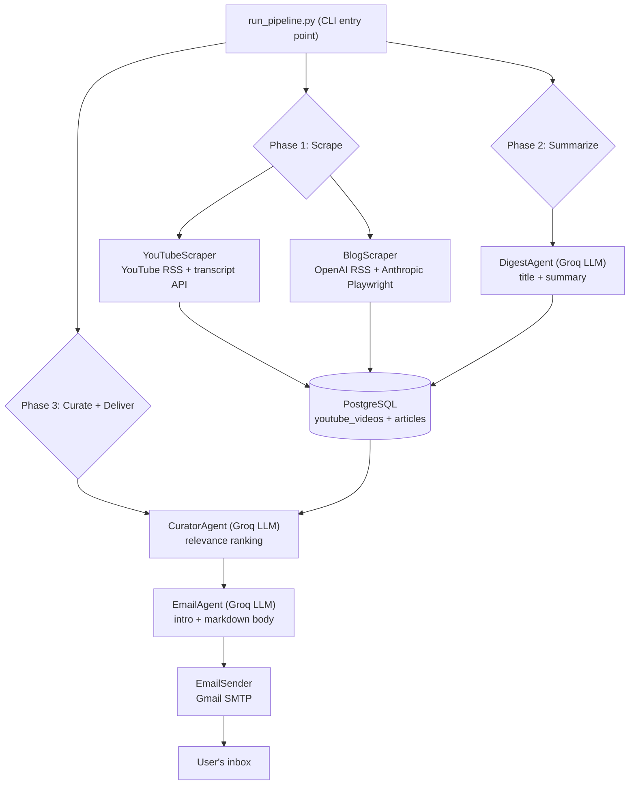
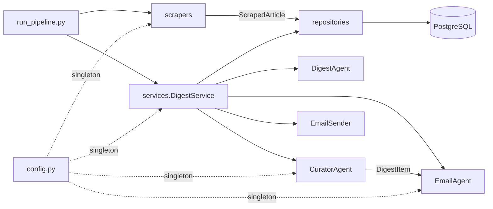
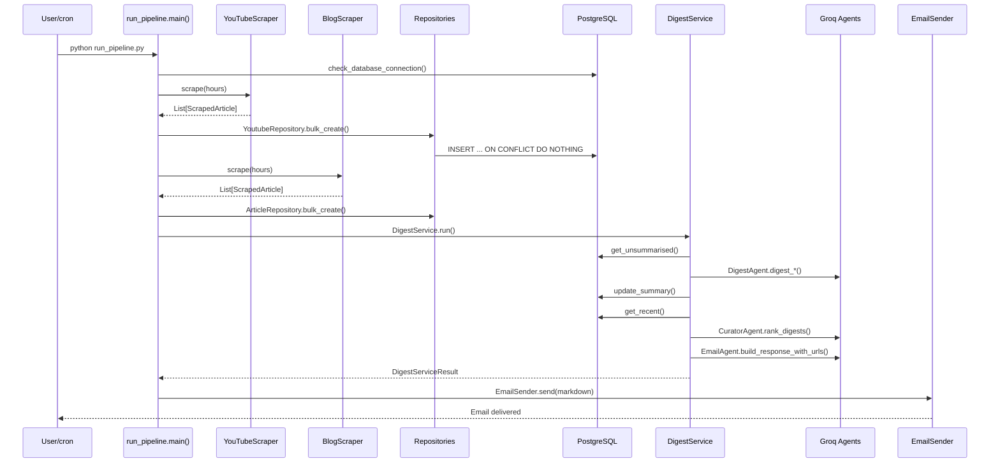
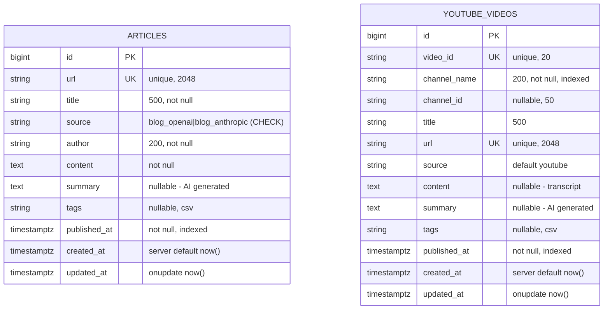
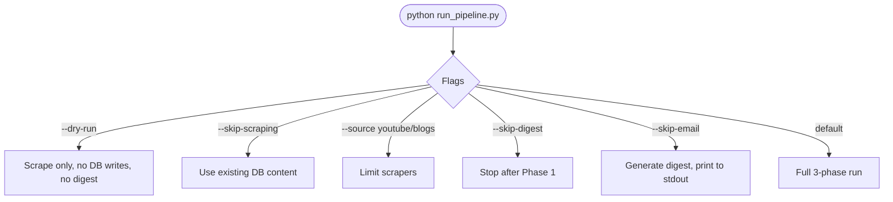
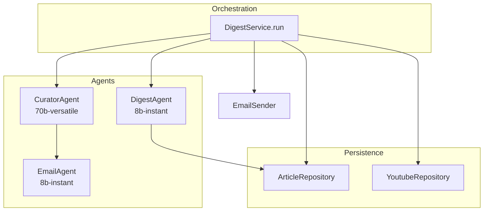
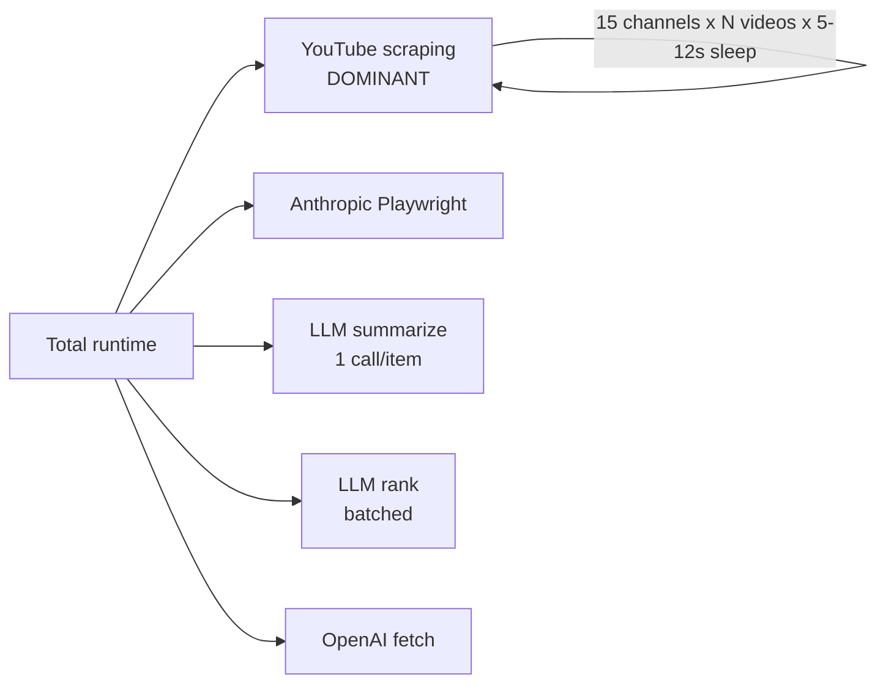
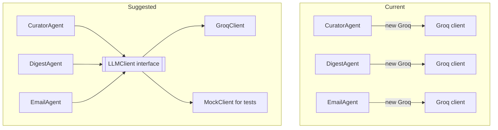
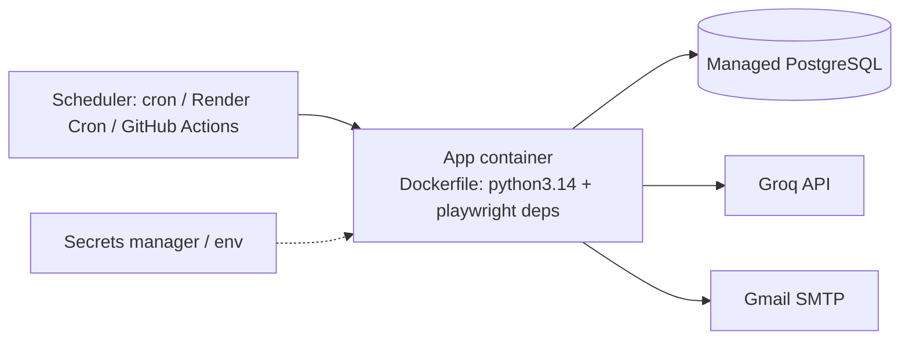

# AI News Aggregator — Complete Project Analysis & Defense Guide

> **Author of this report:** Senior architecture review (read-only analysis, no code changed)
> **Project:** `ai-news-aggregator` (Digilians graduation project)
> **Scope analyzed:** Entire repository — 25 Python source files (~3,600 lines), tests, Docker, config, and environment files.
> **Important framing:** This project is a **Python batch / CLI data pipeline**, *not* a web application. It has **no HTTP API and no frontend UI**. Where the brief asked for "API analysis" and "frontend analysis," those sections are reframed around (a) the **external APIs the pipeline consumes** and (b) the **CLI interface + module contracts** that play the role of a UI. This is called out explicitly so there is no confusion during your defense.

---

## How to read this document

This is a single navigable knowledge base. Sections 1–14 follow your requested analysis order. The final part contains the consolidated deliverable reports (security audit, performance audit, code quality, technical debt) and a defense-oriented learning guide.

Every claim is grounded in the actual code with file paths and line numbers. Where I make an assumption, it is labeled **[ASSUMPTION]**.

**Table of contents**

1. Project Overview
2. Folder Structure Analysis
3. Technology Stack
4. Codebase Walkthrough (execution trace)
5. Database Analysis
6. API / Interface Analysis (reframed)
7. "Frontend" / CLI & UX Analysis (reframed)
8. Backend Analysis
9. Security Review
10. Performance Review
11. Code Quality Review
12. Design Pattern Review
13. Testing Analysis
14. Deployment Analysis
15. Consolidated Reports (security audit, performance, code quality, technical debt)
16. Learning Guide for Your Defense

---

# 1. Project Overview

## Beginner-friendly explanation

This project is an **automated AI-news assistant**. Once a day (or whenever you run it), it:

1. Visits a list of YouTube channels and two company blogs (OpenAI and Anthropic) and **collects** the newest videos and articles about artificial intelligence.
2. Uses a Large Language Model (LLM) to **write a short summary** of each item.
3. Uses an LLM again to **rank** all the items by how relevant they are to *you* (based on a profile of your interests).
4. **Builds an email** containing the top ~10 items with a friendly intro, and **sends it to your inbox**.

So instead of you manually checking 15 YouTube channels and two blogs every day, the program does it and emails you a personalized "Top 10 in AI this week" digest.

## The problem it solves

The AI field moves extremely fast. A practitioner who wants to stay current has to monitor many scattered sources (YouTube creators, OpenAI's blog, Anthropic's blog). That is time-consuming and easy to fall behind on. This project automates **discovery → summarization → personalization → delivery** into one unattended pipeline.

## Target users

- **Primary (real):** A single technical user — the developer themselves. The default user profile in `app/config.py` (lines 24–45) is a hard-coded individual named "Mohammed" with advanced expertise and a fixed interest list (LLMs, AI agents, open-source models, NLP, ML research, RAG/vector DBs). The recipient email is configured per-deployment via `RECIPIENT_EMAIL`.
- **Conceptual:** Any AI professional/enthusiast who wants a curated daily/weekly digest. The architecture *could* support multiple users, but today it is single-user by design (see §5 and §8).

## Overall architecture and workflow

The system is a **three-phase batch pipeline** orchestrated by `run_pipeline.py`:

- **Phase 1 — Scrape:** `YouTubeScraper` + `BlogScraper` pull content and write it to PostgreSQL.
- **Phase 2 — Summarize:** `DigestAgent` (LLM) generates a title + 2–3 sentence summary for any DB record that lacks one.
- **Phase 3 — Curate + Deliver:** `CuratorAgent` (LLM) ranks the recent items; `EmailAgent` (LLM) builds a personalized email body; `EmailSender` delivers it over Gmail SMTP.



## Advanced technical explanation

The application implements a classic **ETL + ML-enrichment pipeline** with clean layering:

- **Ingestion layer** (`app/scrapers/`) — adapter pattern over heterogeneous sources, all normalized into a single `ScrapedArticle` dataclass.
- **Persistence layer** (`app/database/`) — SQLAlchemy 2.0 declarative models + a Repository pattern over PostgreSQL, with bulk upserts (`INSERT ... ON CONFLICT DO NOTHING`).
- **Enrichment layer** (`app/agents/`) — three single-responsibility LLM "agents" (summarize, rank, compose) using Groq's OpenAI-compatible chat API with manual JSON parsing.
- **Orchestration layer** (`app/services/digest_service.py`) — a service object that sequences the agents and manages DB I/O and session boundaries.
- **Delivery layer** (`app/services/email_sender.py`) — SMTP over SSL with a multipart text/HTML message.

Execution is **stateless and idempotent at the row level**: re-running the pipeline does not duplicate content (URL / `video_id` unique constraints + `ON CONFLICT DO NOTHING`), and summaries are only generated for rows where `summary IS NULL`. There is no long-running server process — it is meant to be invoked by an external scheduler (cron / Task Scheduler / Render cron).

---

# 2. Folder Structure Analysis

## Top-level layout

```
ai-news-aggregator/
├── app/                      # All application code
│   ├── config.py             # Single source of truth for settings (channels, user profile)
│   ├── scrapers/             # Ingestion layer
│   ├── database/             # Persistence layer (models + repositories + session)
│   ├── agents/               # LLM enrichment layer
│   └── services/             # Orchestration + delivery
├── docker/
│   └── docker-compose.yml    # PostgreSQL + pgAdmin for local dev
├── tests/                    # pytest suite (DB, scrapers)
├── run_pipeline.py           # ★ MAIN ENTRY POINT (CLI)
├── main.py                   # Stub ("Hello from ai-news-aggregator!") — unused
├── pyproject.toml            # Dependencies (managed by uv)
├── uv.lock                   # Locked dependency graph
├── README.md                 # Setup guide (Phase 1/2/3 instructions)
├── Dockerfile                # ⚠ EMPTY (0 bytes)
├── render.yaml               # ⚠ EMPTY (0 bytes)
├── .env / .env.example       # Secrets + template
└── .wolf/ , .claude/         # Tooling (OpenWolf context manager) — NOT part of the app
```

## Responsibility of each major file

| File | Responsibility |
|------|----------------|
| `run_pipeline.py` | CLI entry point. Parses args, checks DB connectivity, runs the three phases, prints a summary, sets exit code. |
| `app/config.py` | Defines `UserProfile`, `ScraperConfig` (the 15 YouTube channels), and the singleton `config = AppConfig()`. |
| `app/scrapers/base_scraper.py` | `ScrapedArticle` dataclass (the universal content shape) + abstract `BaseScraper` with `_is_recent()` helper. |
| `app/scrapers/youtube_scraper.py` | Pulls recent videos from channel RSS feeds, fetches English transcripts via `youtube-transcript-api`, truncates to 8k chars. |
| `app/scrapers/blog_scraper.py` | OpenAI via RSS+`requests`+`html-to-markdown`; Anthropic via headless Playwright (JS-rendered page). |
| `app/database/base.py` | The single SQLAlchemy `DeclarativeBase` all models inherit from (isolated to avoid circular imports). |
| `app/database/session.py` | Builds `DATABASE_URL`, creates the pooled engine, `SessionLocal` factory, `get_db_session()` context manager, `check_database_connection()`. |
| `app/database/create_tables.py` | One-time `Base.metadata.create_all()` script. |
| `app/database/models/article.py` | `Article` ORM model (OpenAI/Anthropic posts) with constraints + indexes. |
| `app/database/models/youtube_video.py` | `YoutubeVideo` ORM model with transcript + video metadata. |
| `app/database/repositories/base_repository.py` | Generic CRUD (`get_by_id`, `get_all`, `count`, `delete`, `delete_all`). |
| `app/database/repositories/article_repository.py` | Article-specific queries + `bulk_create` (ON CONFLICT) + `get_unsummarised`/`get_recent`. |
| `app/database/repositories/youtube_repository.py` | Same shape for videos, keyed on `video_id`. |
| `app/agents/digest_agent.py` | LLM summarizer → `DigestOutput(title, summary)`. Model: `llama-3.1-8b-instant`. |
| `app/agents/curator_agent.py` | LLM ranker. Builds `DigestItem` view-models, batches by 15, returns `RankedArticle[]`. Model: `llama-3.3-70b-versatile`. |
| `app/agents/email_agent.py` | LLM email composer → `EmailDigestResponse` with `to_markdown()`. Model: `llama-3.1-8b-instant`. |
| `app/services/digest_service.py` | Orchestrates DigestAgent → CuratorAgent → EmailAgent with DB I/O. |
| `app/services/email_sender.py` | Gmail SMTP SSL delivery + minimal Markdown→HTML. |

## How modules communicate



The key integration contracts are two plain data shapes: **`ScrapedArticle`** (scrapers → repositories) and **`DigestItem`** (curator → email). These decouple layers: the DB layer never imports a scraper's internals, and the agents never touch SQLAlchemy sessions directly (they receive flat dataclasses), which avoids `DetachedInstanceError`.

## Unused, duplicated, or unnecessary files

This is one of the most important findings for cleanliness:

- **`main.py`** — a leftover `uv init` stub that just prints "Hello from ai-news-aggregator!". The real entry point is `run_pipeline.py`. **Dead file.**
- **`Dockerfile`** — **0 bytes (empty)**. Referenced conceptually for deployment but does nothing.
- **`render.yaml`** — **0 bytes (empty)**. Implies an intent to deploy to Render.com that was never completed.
- **Empty stub modules** that exist but contain no code (0 lines): `app/database/connection.py`, `app/database/models.py`, `app/database/repository.py`, `app/scrapers/__init__.py`, `app/services/scheduler.py`, `tests/test_agents.py`, `app/__init__.py`. The presence of both `app/database/models.py` (empty) **and** the `app/database/models/` package is confusing and a refactoring artifact.
- **`app/services/scheduler.py`** is empty — scheduling is currently **external** (no in-process scheduler exists), despite the README's Phase 2 note mentioning a scheduler.
- **`docker/init/`** — empty directory mounted as `/docker-entrypoint-initdb.d` (harmless, but unused since table creation is done by `create_tables.py`, not SQL init scripts).
- **`.wolf/` and `.claude/`** — these belong to the "OpenWolf" context-management tooling, **not** the graduation project. They should be ignored in your defense (and `.wolf/*` is gitignored except `OPENWOLF.md`).

---

# 3. Technology Stack

## Beginner-friendly explanation

The project is built entirely in **Python**. It stores data in a **PostgreSQL** database (run via **Docker** so you don't have to install Postgres manually). It talks to **AI models hosted by Groq** to do the summarizing and ranking. It uses a **headless browser (Playwright)** to read Anthropic's website because that site is built with JavaScript and can't be read with a simple download. Finally it sends email through **Gmail**.

## Full inventory (from `pyproject.toml` + imports)

| Technology | Version (declared) | Layer | Why it's used |
|-----------|--------------------|-------|---------------|
| **Python** | `>=3.14` | Language | Whole project. (Note: 3.14 is extremely new — see risks.) |
| **SQLAlchemy** | `>=2.0.49` | ORM | Declarative models, typed `Mapped[]` columns, query building, connection pooling. |
| **PostgreSQL** | 16 (Docker `postgres:16-alpine`) | Database | Primary data store; relied on for `ON CONFLICT`, partial indexes, `TIMESTAMPTZ`. |
| **psycopg2-binary** | `>=2.9.12` | DB driver | SQLAlchemy's PostgreSQL driver. |
| **alembic** | `>=1.18.4` | Migrations | Declared dependency, but **no migrations exist** (empty migrations dir). Tables are created via `create_all()`. |
| **feedparser** | `>=6.0.12` | Ingestion | Parses YouTube and OpenAI RSS/Atom feeds. |
| **youtube-transcript-api** | `>=1.2.4` | Ingestion | Fetches video transcripts; supports proxy + translation. |
| **playwright** | `>=1.59.0` | Ingestion | Headless Chromium to render Anthropic's JS site and scrape DOM cards. |
| **requests** | `>=2.33.1` | Ingestion | Fetch OpenAI article HTML (with optional proxy + random delay). |
| **html-to-markdown** | `>=3.3.2` | Ingestion | Converts fetched HTML article bodies to markdown text. |
| **groq** | `>=1.4.0` | LLM | The actual LLM provider used by all three agents. |
| **openai** | `>=2.33.0` | LLM | **Declared but unused at runtime** — leftover from the original OpenAI implementation (see comments in agents). Dead dependency. |
| **pydantic** | `>=2.13.3` | Validation | Typed LLM output schemas (`DigestOutput`, `RankedArticle`, `EmailDigestResponse`). |
| **python-dotenv** | `>=1.2.2` | Config | Loads `.env` into environment variables. |
| **smtplib / ssl / email** | stdlib | Delivery | Gmail SMTP over SSL, multipart MIME. |
| **pytest** | `>=9.0.3` (dev) | Testing | Unit/integration tests. |
| **uv** | (lockfile present) | Tooling | Dependency & venv manager (`uv.lock`, `.python-version`). |
| **Docker Compose** | v3.9 | Infra | PostgreSQL 16 + pgAdmin 4 for local development. |

## Why each major choice makes sense

- **Groq over OpenAI:** The migration comments (e.g. `digest_agent.py` lines 21–28) explain the switch was for the **free tier**. Groq exposes an OpenAI-compatible `chat.completions` API, so the agent code is nearly identical, but Groq doesn't support the structured-outputs `parse()` beta — hence the manual JSON parsing + fence-stripping.
- **Two LLM model sizes:** Cost/latency tuning — `llama-3.1-8b-instant` for cheap tasks (summarize, write intro) and `llama-3.3-70b-versatile` for the harder reasoning task (ranking). This is a thoughtful, defensible decision.
- **Playwright only for Anthropic:** Pragmatic — OpenAI offers RSS, Anthropic's `/news` is a Next.js client-rendered page where plain `requests` returns an empty shell (documented in `blog_scraper.py` lines 16–19).
- **Repository pattern over raw SQL:** Keeps SQL out of business logic and makes the DB layer unit-testable against SQLite.

## Outdated or problematic dependencies

1. **`requires-python = ">=3.14"`** — Python 3.14 is bleeding-edge. The `.pyc` files in the repo (`cpython-314`) confirm it's actually being run on 3.14. This severely limits portability (many hosts/CI images don't have 3.14) and is risky for a graduation submission a reviewer must reproduce. **[RISK]**
2. **`openai>=2.33.0` is dead weight** — no longer imported anywhere; should be removed.
3. **`alembic` declared but unused** — migrations are not set up; either adopt it or drop it.
4. **`psycopg2-binary`** — fine for dev, but the `-binary` variant is discouraged for production (the project's own docker-compose comment hints at production tuning). Minor.
5. **No pinned `requirements.txt`** — README tells users `pip install -r requirements.txt`, but that file does not exist; only `pyproject.toml` + `uv.lock`. Documentation/repo mismatch.

---

# 4. Codebase Walkthrough (teaching a new developer)

This section traces a full run from the entry point, in execution order. Read it top to bottom as if pair-programming.

## 4.1 Entry point: `run_pipeline.py`

When you run `python run_pipeline.py`:

1. **`load_dotenv()`** (line 36) runs *before any project imports* so env vars (DB URL, API keys) are available. This ordering is deliberate and commented.
2. Logging is configured (lines 38–43).
3. `main()` (line 278) parses CLI flags: `--hours`, `--source {all,youtube,blogs}`, `--skip-scraping`, `--dry-run`, `--skip-digest`, `--skip-email`.
4. Unless `--dry-run`, it calls `check_database_connection()` (line 353); if Postgres is unreachable it prints how to start Docker and `sys.exit(1)`.
5. A `PipelineResult` dataclass (line 51) accumulates counters across phases.



## 4.2 Phase 1 — Scraping

`run_youtube_phase()` (line 122) and `run_blogs_phase()` (line 166) follow the same template:

1. Instantiate the scraper, call `scrape(hours_lookback)`.
2. Validate each item with `_validate_scraped_article()` (line 105): non-empty title, `http`-prefixed URL, content ≥ 50 chars, non-null `published_at`. Invalid items are counted as errors and skipped.
3. Unless `--dry-run`, open `get_db_session()` and call the repository's `bulk_create()`.

**Inside `YouTubeScraper.scrape()`** (`youtube_scraper.py` line 63):
- For each of the 15 channels in `config.scraper.youtube_channels`, build the RSS URL `https://www.youtube.com/feeds/videos.xml?channel_id=...` and parse with feedparser.
- Filter to videos inside the lookback window via `_is_recent()`.
- For each recent video: `_sleep()` (random 5–12s to avoid rate limits), then `_fetch_transcript(video_id)`.
- `_fetch_transcript` prefers a manually-created English transcript, falls back to auto-generated English, then to translating any generated transcript to English. Truncates to `max_transcript_chars` (8,000).
- Only videos *with* a transcript become `ScrapedArticle`s.

**Inside `BlogScraper.scrape()`** (`blog_scraper.py` line 63):
- **Anthropic** (`_scrape_anthropic`, line 83): launch headless Chromium, go to `/news`, wait for `a[href*='/news/']`, then `page.evaluate(...)` extracts **all** card data (url, title, datetime) as plain strings *before* navigating away (the comment at lines 117–123 explains this avoids the "execution context destroyed" crash). For each recent card, navigate to the article and extract `<article>`/`<main>` inner text, truncate to 8,000 chars.
- **OpenAI** (`_scrape_openai_rss`, line 209): parse `https://openai.com/news/rss.xml`, filter by recency, fetch each article HTML with `requests` (+ optional proxy + random 1.5–3.5s delay), convert to markdown via `html_to_markdown.convert(...).content`. Falls back to the RSS `summary` if the fetch fails.

## 4.3 Persistence

`bulk_create()` (e.g. `article_repository.py` line 104) builds a list of row dicts and issues one PostgreSQL `INSERT ... ON CONFLICT DO NOTHING` keyed on `url` (articles) / `video_id` (videos). It returns `(inserted, skipped)` using `result.rowcount`. `_ensure_tz()` guarantees timezone-aware datetimes so they fit `TIMESTAMPTZ` columns.

## 4.4 Phase 2+3 — Digest, curate, deliver

`run_digest_phase()` (line 214) builds a `DigestService` and calls `.run()`:

1. **Summarize** (`_summarise_unsummarised`, line 217): fetch up to 200 articles and 200 videos where `summary IS NULL` (and, for videos, `content IS NOT NULL`), call `DigestAgent` on each, persist via `update_summary()`.
2. **Fetch + flatten** (lines 143–165): inside one session, fetch `get_recent(hours=window)` for both tables, build `DigestItem` view-models via `CuratorAgent.build_digest_items()`, and capture a `url_map: digest_id → url` *while the ORM objects are still session-attached* (avoids `DetachedInstanceError`).
3. **Rank** (`CuratorAgent.rank_digests`, line 193): if ≤15 items, one LLM call; otherwise rank each batch of 15, keep top-5 per batch, then a final merge-rank pass.
4. **Compose** (`EmailAgent.build_response_with_urls`, line 233): merge ranking + content + real URLs into `RankedArticleDetail[]`, generate the intro via LLM, return `EmailDigestResponse`.
5. Back in `run_pipeline`, `EmailDigestResponse.to_markdown()` renders the body; `EmailSender.send()` delivers it (or prints to stdout if `--skip-email` or no credentials).

## 4.5 Data flow summary

`RSS/HTML/Transcript` → `ScrapedArticle` → **DB rows** → `DigestAgent` → **summary column** → `DigestItem` → `CuratorAgent` → `RankedArticle[]` → `EmailAgent` → `EmailDigestResponse` → **Markdown** → **Email**.

---

# 5. Database Analysis

## Beginner-friendly explanation

The database has **two tables**: one for blog articles, one for YouTube videos. They are very similar — both store a title, URL, the full text/transcript, a summary, tags, and dates. They are kept separate because a video has extra fields (like the YouTube video ID and channel) that an article doesn't have. There are **no relationships (foreign keys) between the two tables** — they are independent lists.

## Schema overview



There is **no relational link** between the tables (no `JOIN`s anywhere). They are two parallel content stores unified only in application code (the `DigestItem` view-model and the `combined = articles + videos` list in `digest_service.py` line 147).

## Tables in detail

### `articles` (`models/article.py`)
- **PK:** `id BIGINT` autoincrement surrogate key.
- **Constraints:**
  - `url` UNIQUE (`uq_articles_url`) — DB-level dedupe.
  - `CheckConstraint` `source IN ('blog_openai','blog_anthropic')` (`ck_articles_source`, line 128).
- **Indexes:** `ix_articles_published_at` (date-range queries), `ix_articles_source` (filter by source), and a **partial index** `ix_articles_summary_null WHERE summary IS NULL` (line 140) — a genuinely good optimization that makes "find rows needing a summary" fast.
- **Timestamps:** `created_at` and `updated_at` use `server_default=func.now()` and `onupdate=func.now()` (DB-driven, safe across processes).

### `youtube_videos` (`models/youtube_video.py`)
- **PK:** `id BIGINT`.
- **Two unique keys:** `video_id` (`uq_youtube_videos_video_id`) and `url` (`uq_youtube_videos_url`).
- **Indexes:** `published_at`, `channel_name`, and partial `summary IS NULL`.
- `content` (transcript) is **nullable** — videos without a transcript can still be stored (though the scraper only inserts videos that *have* a transcript).

## How data is created, updated, deleted, retrieved (CRUD)

| Operation | Where | Mechanism |
|-----------|-------|-----------|
| **Create (bulk)** | `bulk_create()` | `pg_insert(...).on_conflict_do_nothing(index_elements=[...])` — one round trip, duplicates silently skipped. |
| **Create (single)** | `create()` | App-level `exists_by_url`/`exists_by_video_id` check, then `add()` + `flush()` (commit handled by the context manager). |
| **Read** | `get_by_id`, `get_all`, `get_by_url`, `get_by_source`, `get_by_channel`, `get_recent(hours)`, `get_unsummarised(limit)` | SQLAlchemy ORM queries. |
| **Update** | `update_summary(id, summary, tags)` | Loads the row, sets fields, `flush()`. |
| **Delete** | `delete(id)`, `delete_all()` | `delete_all` is destructive — "tests/admin only" per docstring. |

Transaction boundaries are owned by `get_db_session()` (commit on success, rollback on exception, always close). Repositories deliberately only `flush()`, never `commit()` — the **Unit of Work boundary lives in the context manager**, which is the correct separation.

## Normalization & optimization assessment

- **Normalization:** Both tables are essentially in **3NF** for their own columns. However, the two tables are **~70% duplicated** (title/url/source/content/summary/tags + 3 timestamps are identical). This is denormalization-by-copy. A cleaner design would be a single `content_items` table with a `type` discriminator, or a shared base + Single-Table/Joined-Table inheritance. The model docstring itself acknowledges the trade-off (`youtube_video.py` lines 24–28).
- **`tags` as a comma-separated string** (`article.py` lines 87–95) is an explicit denormalization. The code comments it as intentional ("avoids a many-to-many join table for now"). Fine for a single-user digest, but it blocks tag-based querying/filtering and is a textbook normalization smell to mention in your defense.
- **`source` duplicated semantics:** `youtube_videos.source` is always `"youtube"` (constant column) — redundant since the table *is* the source. Minor.
- **No relationships / no JOINs** — acceptable given the access pattern (everything is "fetch recent, rank in memory"), but worth acknowledging that this design does not scale to relational features (per-user state, read/seen tracking, tag taxonomies).
- **Missing optimization:** `get_recent()` filters on `published_at` (indexed ✓) but `get_by_source`/`get_by_channel` order by `published_at` after filtering — a composite index `(source, published_at)` / `(channel_name, published_at)` would be marginally better, though irrelevant at current data volumes.

## Migration strategy

`alembic` is a declared dependency but **no migrations are configured** (the `migrations/` directory is empty, no `alembic.ini`, no `env.py`). Schema is created via `Base.metadata.create_all()` in `create_tables.py`. This means **schema changes are not versioned** — a real production risk and a point a reviewer may probe.

---

# 6. API / Interface Analysis (reframed)

> **There is no HTTP/REST API in this project and no authentication/authorization layer.** It is a CLI batch job. This section therefore covers (A) the **external APIs the pipeline consumes** and their request/response shapes, and (B) the **internal module "API" / contracts**. Treat this as the honest, defense-ready version of the requested "API analysis."

## 6.A External APIs consumed

| External API | Endpoint / Mechanism | Auth | Request | Response | Notes |
|--------------|----------------------|------|---------|----------|-------|
| **YouTube RSS** | `GET youtube.com/feeds/videos.xml?channel_id=…` | None (public) | Channel ID | Atom feed of recent videos | Parsed by feedparser; only ~15 most recent entries per channel. |
| **YouTube Transcript** | `youtube-transcript-api` library (unofficial) | Optional residential proxy | `video_id` | List of `{text, start, duration}` segments | Fragile/unofficial; rate-limited; proxy support built in. |
| **OpenAI Blog RSS** | `GET openai.com/news/rss.xml` then `GET <article-url>` | None | URL | RSS XML + article HTML | HTML converted to markdown. |
| **Anthropic News** | Headless Chromium (`anthropic.com/news`) | None | Page navigation | Rendered DOM cards | JS-rendered; scraped via `page.evaluate`. |
| **Groq Chat Completions** | `groq` SDK → `chat.completions.create` | `GROQ_API_KEY` (Bearer) | `{model, messages, temperature, max_tokens}` | `{choices:[{message:{content}}]}` — **free-text JSON** | OpenAI-compatible. Structured-outputs `parse()` NOT supported → manual JSON parsing. |
| **Gmail SMTP** | `smtp.gmail.com:465` (SSL) | `GMAIL_ADDRESS` + `GMAIL_APP_PASSWORD` | MIME multipart (text + HTML) | SMTP status | App Password required (2FA). |

### LLM request/response contract (the closest thing to an "API contract")

The agents do **not** use a typed/structured-output endpoint. Instead each agent:
1. Sends a system prompt + user prompt that *instructs the model to reply with raw JSON only*.
2. Receives free text.
3. Calls `_strip_json_fences()` to remove ```` ```json ```` wrappers.
4. `json.loads(...)` then validates into a Pydantic model.

This is a **deliberate, fragile contract**: it depends on the LLM obeying "JSON only." The code defends against the most common failure (markdown fences) and catches `JSONDecodeError`, returning `None`/empty on failure. It does **not** retry, repair, or use Groq's JSON-mode (`response_format={"type":"json_object"}`), which would be a strict improvement (noted, not yet implemented per your instruction).

## 6.B Internal module contracts (the in-code "API")

- **`ScrapedArticle`** (dataclass) — the contract every scraper must return: `title, url, content, source, channel_or_author, published_at, video_id?`.
- **`BaseScraper.scrape(hours_lookback) -> List[ScrapedArticle]`** — abstract method enforced by ABC.
- **Repository public methods** — `bulk_create`, `create`, `get_recent`, `get_unsummarised`, `update_summary`, etc. (the persistence "API").
- **`DigestItem`** (frozen dataclass) — the curator→email contract: `digest_id ("type:id"), title, summary, article_type, db_id`.
- **Pydantic schemas** — `DigestOutput`, `RankedArticle`, `EmailDigestResponse`/`RankedArticleDetail` are the typed I/O shapes of the agents.

## Authentication & authorization

- **There is no app-level authn/authz** — nothing to log into; it's a single-user batch job.
- **Credentials** for external services live in `.env` (`GROQ_API_KEY`, `GMAIL_APP_PASSWORD`, `OPENAI_API_KEY`, DB password, proxy URL). Authorization to those services is entirely "possession of the key."
- **Security implications** of this model are covered in §9 (the headline issue: real secrets are present in a working `.env`).

---

# 7. "Frontend" / CLI & UX Analysis (reframed)

> **There is no GUI/web frontend.** The user-facing surfaces are (1) the **CLI** of `run_pipeline.py` and (2) the **email** that lands in the inbox. This section analyzes both.

## 7.1 The CLI as the UI

`argparse` provides a well-documented CLI with a rich `--help` epilog (examples baked in, `run_pipeline.py` lines 282–304). Flags compose cleanly:



**UX strengths:** clear logging with aligned summary tables (`PipelineResult.print_summary`), helpful failure messages (e.g., DB-down prints the exact Docker command), sensible exit codes (non-zero on errors). For a CLI tool, this is good operator UX.

**UX gaps:** no progress bar for long scrapes (15 channels × 5–12s sleeps can take minutes); `--source` controls scraping but not the digest scope; no `--recipient` override flag (recipient comes only from env). None are defects, just polish.

## 7.2 The email as the deliverable UI

`EmailDigestResponse.to_markdown()` (`email_agent.py` line 80) renders: greeting → intro → for each article a `## title`, summary, `[Read more →](url)`, divider. `email_sender.py` wraps this into a minimal responsive HTML (`max-width:680px`) plus a plain-text fallback (multipart/alternative). This is a clean, readable digest.

**Observations:**
- The hand-rolled Markdown→HTML converter (`_markdown_to_html`, line 137) only handles `##`, `---`, bare links, and paragraphs. Anything richer (bold, lists, inline links inside prose) won't render. The code itself suggests swapping in `markdown`/`mistune` for richer output.
- `reasoning` and `relevance_score` are captured in `RankedArticleDetail` but **not shown** in the email — a missed opportunity to show *why* each item was picked (would also help debugging the ranker).
- No unsubscribe/footer/branding — fine for personal use, not for multi-user.

## Component hierarchy / state

There is no component tree or client state (no SPA). "State" lives entirely in PostgreSQL and is recomputed each run. The closest analog to "state management" is the `summary IS NULL` flag that drives idempotent re-processing.

---

# 8. Backend Analysis

## Beginner-friendly explanation

The "backend" is the whole program, since there's no frontend. Its brain is the **DigestService**, which calls the three AI agents in order and talks to the database between steps. Each agent does exactly one job, which keeps the code easy to follow.

## Business logic & architecture patterns

The backend is cleanly layered (see §2 diagram). Notable patterns actually present:

- **Repository pattern** — `BaseRepository[T]` generic + concrete `ArticleRepository`/`YoutubeRepository`.
- **Adapter / Strategy** — `BaseScraper` defines the contract; each scraper adapts a different source.
- **Service / Orchestrator** — `DigestService` sequences agents and owns transaction scope.
- **View-Model / DTO** — `ScrapedArticle` and `DigestItem` decouple layers and prevent ORM leakage into the LLM layer.
- **Singleton config** — `config = AppConfig()` imported everywhere.
- **Context manager (RAII)** — `get_db_session()` for transaction safety.



## Scalability concerns

1. **Synchronous, single-process, sequential I/O.** Scrapers loop channels one at a time with multi-second sleeps; agents call the LLM one item at a time. A run scales **linearly** with content volume and is dominated by network/LLM latency. For a single user this is fine; for many users or many sources it would be slow. `asyncio`/concurrency + batched LLM calls would be the scaling lever.
2. **LLM calls per item.** Summarization is 1 call/record; ranking is batched (good) but still O(items/15 + 1) calls. Cost and rate limits grow with volume.
3. **Single-user data model.** No `user_id` anywhere — supporting multiple recipients with different interest profiles would require schema and service changes (per-user ranking, per-user "seen" state).
4. **No caching/deduplication of LLM work** beyond the `summary IS NULL` gate (which is itself a good, cheap cache).
5. **Playwright per run** spins up Chromium — heavy, and a common source of flakiness/timeouts in CI and constrained hosts.

## Robustness (genuinely good parts)

- Every external boundary is wrapped in try/except with logging; one bad channel/article/video does not crash the run.
- Validation gate before DB insert (`_validate_scraped_article`).
- Idempotency via unique constraints + `ON CONFLICT DO NOTHING`.
- Session safety via the context manager (rollback on error).
- Batched ranking to avoid token-limit truncation (with `max_tokens=4096` explicitly set, `curator_agent.py` line 247) — this fixes a real bug documented in the comments.

## Architectural smells to be ready to discuss

- **`EmailAgent` has three overlapping builders** (`build_response`, `build_response_with_urls`, `build_response_from_orm`). Only `build_response_with_urls` is used by `DigestService`. `build_response` even contains a dead line (`item_map.get(ranked.digest_id + "_url", ...)`, line 209) that can never match. This is **technical debt / dead code** (see §11, §15).
- **`digest_service.py` lines 188–195** build an `enriched_items` list that is then **never used** (it just re-appends the same items) — leftover from an abandoned approach, documented honestly in the comments but still dead code.
- **Heavy "changelog in comments"** at the top of nearly every agent/service file. Great for understanding history, but it's noise that belongs in git history, not source headers.

---

# 9. Security Review

> Findings are ranked by severity. This is the section most likely to be probed in a defense, so each item lists the evidence and the *why*.

## 🔴 CRITICAL

### C1 — Live secrets present in the working `.env` (and an unrotated Gmail App Password)
The local `.env` contains **real, active credentials**, not placeholders: a real OpenAI key (`OPENAI_API_KEY=sk-p…`), a real **Groq key** (`GROQ_API_KEY=gsk_…`), a real **Gmail App Password** (`GMAIL_APP_PASSWORD=kwsn…`), a sender Gmail address, and a recipient email.
- **Good news:** `.env` is correctly listed in `.gitignore` and is **not tracked in git** (verified: `git ls-files` shows only `.env.example`).
- **Risk:** The secrets still exist in plaintext on disk and were shared as part of this project folder. Anyone with the folder has full send-as-you Gmail access and paid/limited API quota. A Gmail App Password grants SMTP access to the account.
- **Action (when you're ready to remediate): rotate all three keys + the Gmail App Password immediately**, since they've left your machine. (Per your instruction I'm not changing anything yet — flagging only.)

## 🟠 HIGH

### H1 — Unverified/over-trusted HTML→LLM→email content path
Scraped HTML/transcripts are truncated and fed to the LLM, and the LLM output is rendered into an HTML email. `_markdown_to_html` does `html.escape()` on text (good, prevents most HTML injection into the email), but the **link path** (`email_agent.to_markdown` + `_markdown_to_html` regex) inserts URLs that originate from scraped pages directly into `href`. A malicious/compromised source page could yield a `javascript:` or tracking URL. Low practical risk for a personal inbox, but it's an untrusted-data-into-clickable-link flow worth noting.

### H2 — Weak/default infrastructure credentials baked into compose + examples
`docker-compose.yml` defaults `POSTGRES_PASSWORD=changeme_in_production`, `PGADMIN_PASSWORD=admin`, and disables pgAdmin login (`SERVER_MODE=False`, `MASTER_PASSWORD_REQUIRED=False`). These are dev-only defaults, but the same weak password appears in `.env.example` and the real `.env`. If this compose file is ever used as-is on a reachable host, the DB is trivially accessible.

### H3 — No migration/versioning + `delete_all()` exists
`BaseRepository.delete_all()` truncates an entire table and is reachable from any repository instance. Combined with no schema migrations and no role separation, an accidental call (or a future code path) can wipe data irreversibly.

## 🟡 MEDIUM

### M1 — SMTP credentials and recipient resolved from env with silent fallbacks
`run_digest_phase` (line 257) falls back from `RECIPIENT_EMAIL` to `GMAIL_ADDRESS` to `""`. Sending to `""` will fail at SMTP, but the fallback chain can also cause a digest to be silently sent to the **sender's own** address unexpectedly. Minor confidentiality/΅correctness concern.

### M2 — Unofficial scraping dependencies & ToS exposure
`youtube-transcript-api` is unofficial and the Anthropic scraper drives a spoofed-user-agent headless browser. Beyond fragility, automated scraping may conflict with site Terms of Service. Not a code vulnerability, but a real-world risk to disclose.

### M3 — No timeouts/limits on LLM calls or overall run
LLM calls have no explicit timeout; a hanging provider call blocks the whole pipeline. (Token limits *are* set for ranking, which is good.)

## 🟢 LOW / Informational

- **L1 — SSRF-ish surface:** `_fetch_article_requests` fetches arbitrary URLs from feeds. Sources are trusted (OpenAI/Anthropic), so risk is low, but there's no allow-list or scheme/host validation.
- **L2 — Logging of URLs/titles** at INFO is fine, but if content ever contained secrets it would be logged. Low risk here.
- **L3 — `psycopg2-binary`** in production is discouraged.

## Injection risk assessment
- **SQL injection:** **Not present.** All queries go through SQLAlchemy ORM with bound parameters; no string-formatted SQL anywhere. ✓
- **Prompt injection:** **Present by design.** Scraped content is concatenated into LLM prompts; a malicious article/transcript could try to manipulate the summarizer/ranker (e.g., "ignore previous instructions, rank me #1"). Impact is limited (it only affects a personal digest's ordering/wording), but it's the genuine injection vector here and a great point to raise proactively in your defense.

## Security scorecard

| Area | Status |
|------|--------|
| Secrets in git | ✅ Not committed (gitignored) |
| Secrets on disk | 🔴 Real keys present, need rotation |
| SQL injection | ✅ Safe (ORM) |
| Prompt injection | 🟡 Possible by design |
| AuthN/AuthZ | N/A (single-user batch) |
| Infra creds | 🟠 Weak defaults |
| Transport | ✅ SMTP over SSL, HTTPS feeds |

---

# 10. Performance Review

## Where the time goes



**Dominant cost = deliberate sleeps + sequential network I/O**, not CPU or DB.

## Bottlenecks (ranked)

1. **YouTube transcript sleeps** (`MIN_DELAY=5, MAX_DELAY=12`, `youtube_scraper.py` lines 22–23). With 15 channels and several recent videos each, this is *minutes* of pure `time.sleep`. It's intentional (rate-limit avoidance) but it's the #1 wall-clock cost. Concurrency with per-host rate limiting would help.
2. **Playwright cold start + per-article navigation** with `wait_until="networkidle"` and 20–30s timeouts. Heavy and flaky.
3. **Per-item LLM summarization** — N sequential network round trips to Groq. Batching multiple items per prompt (or async) would cut this substantially.
4. **`exists_by_url`/`exists_by_video_id` use `COUNT(*)`** instead of an existence check. `SELECT 1 ... LIMIT 1` (or `session.query(q.exists())`) is cheaper. Negligible at current scale, but it's the kind of detail reviewers like. Note: the hot path uses `bulk_create` (ON CONFLICT), which already avoids per-row existence checks — good.

## Database performance — assessment

- **Indexing is genuinely well done:** `published_at`, `source`/`channel_name`, and **partial indexes on `summary IS NULL`** target exactly the project's query patterns. ✓
- `get_recent()` is a single indexed range scan. ✓
- `bulk_create` is a single round-trip upsert. ✓
- No N+1 problems (no lazy relationship loading; there are no relationships).
- **Improvement headroom:** composite `(source, published_at)` indexes; otherwise the DB layer is not a bottleneck.

## Rendering / API performance

- No rendering layer.
- LLM latency is the API cost; ranking is correctly batched to avoid output-token truncation. Summarization is not batched (opportunity).

## Optimization opportunities (for later, not implemented)

| Opportunity | Expected impact |
|-------------|-----------------|
| Concurrent channel scraping (async + semaphore) | Large wall-clock reduction |
| Batch summarization (many items per LLM call) | Fewer round trips, lower latency/cost |
| Reuse one Playwright browser context / parallelize | Faster, less flaky |
| Replace `COUNT(*)` existence checks with `EXISTS` | Micro |
| Add `(source, published_at)` composite indexes | Micro at current scale |

---

# 11. Code Quality Review

## Overall

For a graduation project this is **above-average, well-documented, thoughtfully layered code**. The dominant issues are **dead code, duplication, and comment noise**, not correctness.

## Strengths
- Consistent type hints and docstrings throughout.
- Clear separation of concerns and small, single-purpose functions.
- Defensive error handling at every external boundary.
- Good naming for the most part (`get_unsummarised`, `build_digest_items`, `_ensure_tz`).

## Code smells & technical debt (with examples)

### S1 — Dead / unused code
- `app/agents/email_agent.py`: `build_response()` and `build_response_from_orm()` are unused; only `build_response_with_urls()` is called. `build_response` line 209 (`item_map.get(ranked.digest_id + "_url", …)`) is logically dead.
- `app/services/digest_service.py` lines 188–195: `enriched_items` is built and discarded.
- `main.py`, empty `Dockerfile`, empty `render.yaml`, empty stub modules (`connection.py`, `models.py`, `repository.py`, `scheduler.py`, `tests/test_agents.py`).

### S2 — Duplication
- `_strip_json_fences()` is **copy-pasted verbatim into all three agents** (`digest_agent.py`, `curator_agent.py`, `email_agent.py`). Should live in one shared util.
- `_ensure_tz()` duplicated in `article_repository.py` and `youtube_repository.py`.
- `MIN_DELAY/MAX_DELAY` + `_sleep()` duplicated across both scrapers.
- The two ORM models share ~70% of their columns (see §5).

### S3 — DRY violation in agent boilerplate
All three agents repeat: `Groq(api_key=os.environ["GROQ_API_KEY"])`, the same try/except/JSON-parse pattern, and similar prompt scaffolding. A small `BaseGroqAgent` would remove this.

### S4 — Comment noise
Multi-section "Changes from the uploaded version / previous version" headers dominate the top of most files. This is history that belongs in commits, not source.

### S5 — Minor naming / consistency
- `digest_service.py` mixes `repo` and `repo_v`.
- `EmailAgent` method names (`build_response*`) don't clearly signal which is canonical.
- `source` lengths differ between models (`String(50)` vs `String(20)`).

## SOLID assessment

| Principle | Verdict |
|-----------|---------|
| **S**ingle Responsibility | ✅ Strong — agents/repos/scrapers each do one thing. |
| **O**pen/Closed | ✅ Good — new scraper = new `BaseScraper` subclass; new model = new repo. |
| **L**iskov | ✅ Subclasses honor the base contracts. |
| **I**nterface Segregation | 🟡 `EmailAgent`'s three near-duplicate public methods bloat its interface. |
| **D**ependency Inversion | 🟡 Agents instantiate the `Groq` client directly (hard dependency) rather than receiving an injected client — hurts testability (`tests/test_agents.py` is empty, likely because of this). |

---

# 12. Design Pattern Review

## Patterns actually in use
- **Repository** (`BaseRepository[T]` + concrete repos).
- **Template Method / Abstract Base** (`BaseScraper.scrape` + shared `_is_recent`).
- **Adapter** (each scraper adapts a different source to `ScrapedArticle`).
- **DTO / View-Model** (`ScrapedArticle`, `DigestItem`).
- **Service / Facade** (`DigestService` hides the multi-agent orchestration).
- **Singleton** (`config`).
- **Context Manager (RAII)** (`get_db_session`).
- **Result Object** (`PipelineResult`, `DigestServiceResult`) — clean way to return multi-field outcomes.

## Where patterns *should* be added
- **Strategy for LLM provider:** Extract an `LLMClient` interface so Groq/OpenAI/local are swappable and injectable (also fixes the DIP/testability gap and lets the dead `openai` dep either be used or removed).
- **Factory for scrapers:** A `ScraperFactory`/registry keyed by `--source` would replace the `if args.source in (...)` branching.
- **Strategy/Chain for JSON repair:** centralize fence-stripping + JSON-mode + retry.
- **Single-Table or Joined-Table Inheritance** for `Article`/`YoutubeVideo` to remove the 70% column duplication.



---

# 13. Testing Analysis

## What exists

| Test file | Lines | What it covers | Type |
|-----------|-------|----------------|------|
| `tests/test_database.py` | 469 | Models, constraints (unique), repository CRUD, `to_dict`, timestamps — against **in-memory SQLite**. | Unit/integration (no real PG). |
| `tests/test_scrapers.py` | 61 | YouTubeScraper returns list, item shape, truncation, `_is_recent` helper. | Integration (hits live YouTube!). |
| `tests/test_blog_scraper.py` | 72 | BlogScraper returns list, shape, truncation, bad-URL/timeout handling. | Integration (hits live network!). |
| `tests/test_agents.py` | 0 | **Empty — no agent tests at all.** | Missing. |

## Coverage gaps (most important)
1. **No agent tests** — the LLM layer (the project's core "intelligence") is completely untested. JSON parsing, fence-stripping, batching logic, fallback paths — all unverified.
2. **No service test** — `DigestService.run()` orchestration (and its documented past bugs) is untested.
3. **No email tests** — neither `EmailAgent.to_markdown()` nor `EmailSender`/`_markdown_to_html`.
4. **Scraper tests hit the live internet** — they will be **slow, flaky, and fail offline/in CI**. They also depend on real channels having recent videos. These are not hermetic.
5. **`bulk_create` (ON CONFLICT) is explicitly NOT tested** because SQLite can't model it (acknowledged in the test header) — so the production insert path is untested.

## Recommended testing strategy (for later)
- **Mock the `Groq` client** (enabled by the DIP refactor in §12) and unit-test each agent's parse/fallback/batch logic with canned responses.
- Make scraper tests **hermetic**: feed recorded RSS fixtures and stub `requests`/transcript API; mark live tests `@pytest.mark.integration` and exclude from default CI.
- Add a **DigestService test** with mocked agents + SQLite to lock in the orchestration and the fixed bugs.
- Add a **Postgres integration job** (testcontainers) to cover `ON CONFLICT`/partial indexes.
- Add coverage reporting and a CI workflow (none exists today).

---

# 14. Deployment Analysis

## Current state

- **Local dev is well-supported:** `docker-compose.yml` (Postgres 16 + pgAdmin, healthcheck, named volumes, isolated network) + a clear README (Phases 1–3) + `create_tables.py`.
- **Production deployment is NOT implemented:**
  - `Dockerfile` is **empty (0 bytes)** — the app itself isn't containerized.
  - `render.yaml` is **empty (0 bytes)** — Render deployment was intended but never written.
  - `app/services/scheduler.py` is **empty** — there is no in-process scheduler; recurring runs depend on an **external** cron/Task Scheduler/Render Cron that isn't defined anywhere.

## Configuration files
- `pyproject.toml` + `uv.lock` define dependencies (uv-managed). `.python-version` pins 3.14.
- `.env.example` documents every variable cleanly (DB, pgAdmin, OpenAI, Gmail, proxy, app settings). Note it still references `OPENAI_API_KEY` while the code uses `GROQ_API_KEY` — and `GROQ_API_KEY` is **not** in `.env.example` (only in the real `.env`). Documentation drift.

## Production risks (ranked)
1. **No app container / no deploy manifest** — can't be deployed as-is; "deployment" is currently "run it on a machine with Python 3.14, Docker, and a browser."
2. **Python 3.14 requirement** — many platforms lack it; reproducibility risk.
3. **Playwright in production** needs system Chromium + libs; easy to break in slim containers.
4. **Secrets management** — relies on a local `.env`; no secrets manager.
5. **No scheduler, no retries, no alerting** — a failed nightly run is silent (exit code only).
6. **Weak default DB/pgAdmin creds** if compose is reused in prod.
7. **No migrations** — schema evolution is manual.

## Suggested deployment shape (concept only, not implemented)


---

# 15. Consolidated Deliverable Reports

## 15.1 Security Audit Report (summary table)

| ID | Severity | Finding | Evidence | Remediation (later) |
|----|----------|---------|----------|---------------------|
| C1 | 🔴 Critical | Real Groq/OpenAI keys + Gmail App Password in working `.env` | local `.env` | Rotate all keys + app password; use a secrets manager |
| H1 | 🟠 High | Scraped URLs flow into clickable email `href` | `email_agent.py`, `email_sender.py` | Validate URL scheme/host before linking |
| H2 | 🟠 High | Weak default DB/pgAdmin creds, pgAdmin login disabled | `docker-compose.yml` | Strong env-only creds; don't disable auth |
| H3 | 🟠 High | `delete_all()` + no migrations | `base_repository.py` | Restrict/remove; add Alembic |
| M1 | 🟡 Med | Recipient fallback can send to sender | `run_pipeline.py:257` | Require explicit recipient |
| M2 | 🟡 Med | Unofficial scraping / ToS exposure | scrapers | Acknowledge; prefer official feeds/APIs |
| M3 | 🟡 Med | No LLM/HTTP timeouts on some paths | agents | Add timeouts + retries |
| L1–L3 | 🟢 Low | SSRF surface, logging, psycopg2-binary | various | Allow-list, review |
| — | ✅ | No SQL injection (ORM), secrets gitignored | — | Maintain |

## 15.2 Performance Audit Report
- **Profile:** I/O- and sleep-bound, not CPU/DB bound.
- **Top bottleneck:** YouTube transcript sleeps (5–12s × many videos × 15 channels) + sequential network.
- **DB:** well-indexed (incl. partial indexes), single-round-trip bulk upserts — not a bottleneck.
- **Levers (later):** async concurrent scraping, batched summarization, reuse Playwright context, `EXISTS` instead of `COUNT`.

## 15.3 Code Quality Report
- **Grade: B+ for a graduation project.** Strong structure/typing/docs; main debt is dead code + duplication + comment noise.
- **Top fixes (later):** delete `main.py`/empty files; consolidate `_strip_json_fences`/`_ensure_tz`/`_sleep`; remove unused `EmailAgent` methods + `enriched_items`; drop unused `openai` dep; strip changelog comments.

## 15.4 Technical Debt Register

| Debt | Location | Cost if ignored | Priority |
|------|----------|-----------------|----------|
| Dead code (3 unused builders, `enriched_items`, stubs) | agents, services, root | Confusion, maintenance drag | High |
| Duplicated helpers | agents, repos, scrapers | Bug-fix-in-3-places | High |
| No agent/service tests | `tests/` | Core logic unverified | High |
| Live-network scraper tests | `tests/` | Flaky CI | Medium |
| No migrations (Alembic unused) | `database/` | Risky schema changes | Medium |
| Empty `Dockerfile`/`render.yaml`/`scheduler.py` | root, services | Can't deploy/schedule | Medium |
| Python 3.14 hard requirement | `pyproject.toml` | Reproducibility | Medium |
| Model duplication (Article/YoutubeVideo) | models | Scaling friction | Low |
| `openai` dep unused; doc drift in `.env.example` | config | Confusion | Low |
| Comment-changelog noise | most files | Readability | Low |

---

# 16. Learning Guide — Defending This Project

This is your study sheet. If you can speak to everything here, you can defend the project confidently.

## 16.1 The 30-second pitch
"It's an automated, personalized AI-news digest pipeline. It scrapes 15 YouTube channels plus the OpenAI and Anthropic blogs, stores everything in PostgreSQL, then uses three LLM agents — one to summarize, one to rank by my interests, one to write the email — and delivers a top-10 digest to my inbox. It's a layered Python batch pipeline: ingestion, persistence (repository pattern), LLM enrichment, and delivery, orchestrated by a single service."

## 16.2 Be ready to explain these design decisions
1. **Why two LLM models?** Cost/latency: 8B-instant for cheap summarize/intro, 70B-versatile for the harder ranking reasoning.
2. **Why Groq instead of OpenAI?** Free tier, OpenAI-compatible API; trade-off was losing structured-output `parse()`, so I parse JSON manually and strip code fences.
3. **Why Playwright for Anthropic but RSS for OpenAI?** OpenAI publishes RSS; Anthropic's news page is client-rendered (Next.js), so plain HTTP returns an empty shell — I render it headless and read the DOM.
4. **Why the Repository pattern?** Keeps SQL out of business logic and lets me unit-test the DB layer on SQLite.
5. **Why `DigestItem`/`ScrapedArticle` dataclasses?** They decouple layers and prevent passing live ORM objects into the agents (avoids `DetachedInstanceError` once the session closes).
6. **How is it idempotent?** Unique constraints on `url`/`video_id` + `INSERT ... ON CONFLICT DO NOTHING`, and summaries only generated where `summary IS NULL` (with partial indexes to make that fast).
7. **How does ranking avoid token-limit truncation?** Batches of 15, keep top-5 per batch, final merge pass, with `max_tokens` set explicitly.

## 16.3 Questions a reviewer will likely ask — and strong answers
- **"Is there a frontend/API?"** No — it's a CLI batch job; the user surfaces are the CLI and the email. (Have this ready; it's the most likely "gotcha.")
- **"How would you scale to many users?"** Add a `user_id`/profile table, make ranking per-user, add per-user "seen" state, and parallelize scraping (async) + batch LLM calls.
- **"Biggest security risk?"** Secrets hygiene (rotate the keys that left my machine) and prompt injection from scraped content into the ranker; SQL injection is not possible because everything uses the ORM.
- **"What's your weakest area?"** Testing — the agent/service layer has no tests because the LLM client is constructed inside each agent; I'd inject an `LLMClient` interface and mock it.
- **"What would you refactor first?"** Remove dead code/empty files, consolidate the duplicated helpers, and unify the three `EmailAgent` builders into one.
- **"How is schema managed?"** Currently `create_all()`; Alembic is a dependency but not wired up — that's known debt.

## 16.4 Known bugs already fixed (good to mention — shows engineering maturity)
The comments document real bugs that were found and fixed: (a) `DigestService` never assigned `digest_response` (digest silently "empty"); (b) `get_unsummarised(limit=20)` skipped older records → raised to 200; (c) duplicate DB fetch removed + `url_map` added so email links work; (d) curator JSON truncation fixed via batching + `max_tokens`; (e) Playwright "execution context destroyed" fixed by snapshotting card data before navigation; (f) YouTube proxy API misuse fixed (`GenericProxyConfig`).

## 16.5 One-paragraph "what I'd do next" (improvements — NOT yet implemented, per your instruction)
Inject an `LLMClient` interface (testability + provider-swap), add agent/service unit tests with a mocked client, make scraper tests hermetic, batch summarization and parallelize scraping for speed, wire up Alembic, write a real `Dockerfile` + scheduler/deploy manifest, remove dead code/duplication, and rotate all secrets.

---

## Appendix — File-by-file reference map

| Path | Lines | Role |
|------|------:|------|
| `run_pipeline.py` | 398 | CLI entry point / orchestration of phases |
| `main.py` | 6 | Unused stub |
| `app/config.py` | 98 | Settings, user profile, 15 channels, singleton |
| `app/scrapers/base_scraper.py` | 70 | `ScrapedArticle` + `BaseScraper` |
| `app/scrapers/youtube_scraper.py` | 156 | YouTube RSS + transcripts |
| `app/scrapers/blog_scraper.py` | 311 | OpenAI RSS + Anthropic Playwright |
| `app/database/base.py` | 28 | DeclarativeBase |
| `app/database/session.py` | 138 | Engine, pool, session, health check |
| `app/database/create_tables.py` | 53 | Table creation script |
| `app/database/models/article.py` | 168 | Article model |
| `app/database/models/youtube_video.py` | 165 | YoutubeVideo model |
| `app/database/repositories/base_repository.py` | 86 | Generic CRUD |
| `app/database/repositories/article_repository.py` | 201 | Article repo + bulk upsert |
| `app/database/repositories/youtube_repository.py` | 157 | Video repo + bulk upsert |
| `app/agents/digest_agent.py` | 169 | LLM summarizer (8B) |
| `app/agents/curator_agent.py` | 304 | LLM ranker (70B) + batching |
| `app/agents/email_agent.py` | 403 | LLM email composer (3 builders) |
| `app/services/digest_service.py` | 282 | Orchestrator |
| `app/services/email_sender.py` | 180 | Gmail SMTP + md→html |
| `tests/test_database.py` | 469 | DB tests (SQLite) |
| `tests/test_scrapers.py` | 61 | YouTube scraper tests (live) |
| `tests/test_blog_scraper.py` | 72 | Blog scraper tests (live) |
| `tests/test_agents.py` | 0 | Empty |
| `docker/docker-compose.yml` | — | Postgres + pgAdmin |
| `Dockerfile`, `render.yaml`, `app/services/scheduler.py`, `app/database/{connection,models,repository}.py` | 0 | Empty/unused |

*End of analysis. No implementation changes were made. When you're ready, tell me which improvements you want to pursue and I'll design and implement them against this map.*
