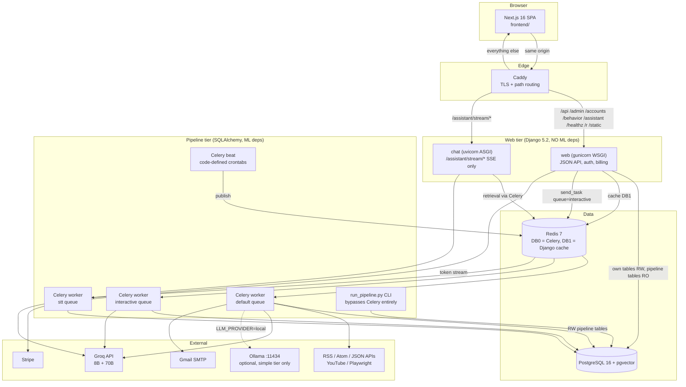
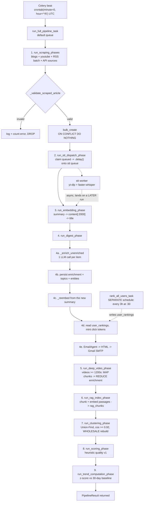
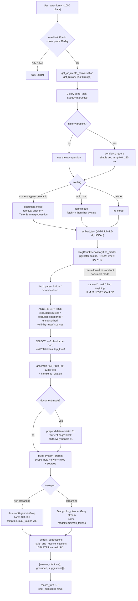
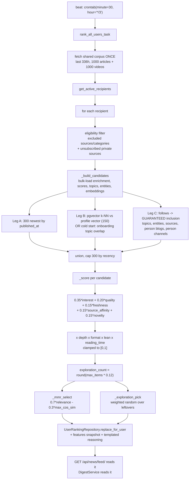
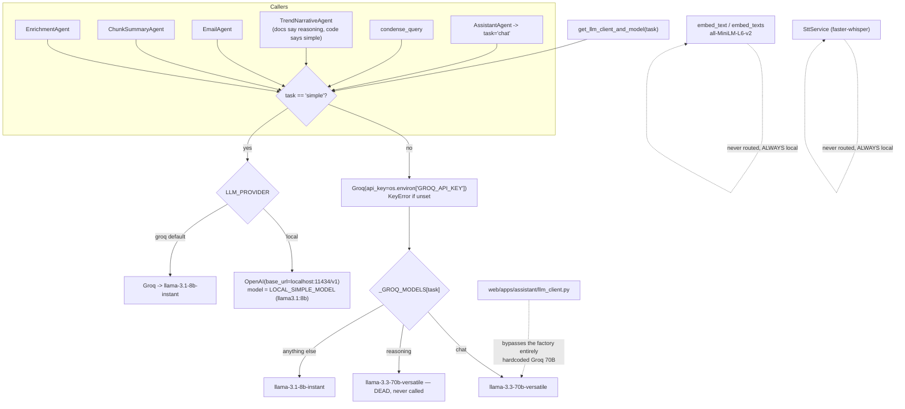
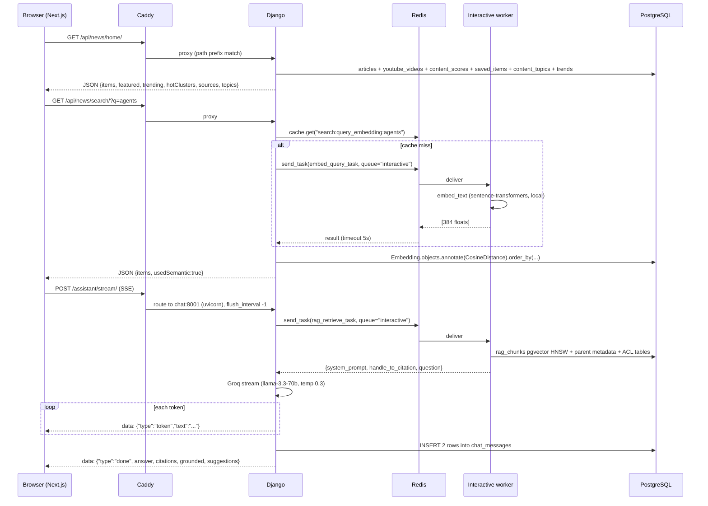

# AI Compass / AI News Aggregator — Deep Dive & Viva Preparation

> **How this document was produced.** Every claim below was derived by reading the
> actual repository: `run_pipeline.py`, `app/**`, `web/**`, `frontend/**`, `docker/**`,
> `alembic/**`, `tests/**`, `.env.example`, and `README.md`. Where the documentation
> and the implementation disagree, the disagreement is called out explicitly with a
> **⚠️ DOC vs CODE** marker. Where something is *not* implemented, that is stated
> plainly rather than assumed.
>
> Repository state at time of writing: branch `main`, HEAD `41ab2b3`, plus two
> uncommitted modifications (`app/celery_app.py`, `docker/docker-compose.yml`) which
> are described in §2.9.

---

## Table of Contents

| § | Section |
|---|---|
| 0 | [The system in one page](#0-the-system-in-one-page) |
| 1 | [End-to-end flow (derived from code)](#1-end-to-end-flow-derived-from-code) |
| 2 | [Startup & what keeps it running](#2-startup--what-keeps-it-running) |
| 3 | [The 6-hour pipeline, traced exactly](#3-the-6-hour-pipeline-traced-exactly) |
| 4 | [Scraping & ingestion](#4-scraping--ingestion) |
| 5 | [Duplicate detection — the full truth](#5-duplicate-detection--the-full-truth) |
| 6 | [Database design](#6-database-design) |
| 7 | [Summarization](#7-summarization) |
| 8 | [Enrichment / content intelligence](#8-enrichment--content-intelligence) |
| 9 | [Embeddings](#9-embeddings) |
| 10 | [Clustering](#10-clustering) |
| 11 | [Ranking / curation](#11-ranking--curation) |
| 12 | [User personalization](#12-user-personalization) |
| 13 | [RAG & chatbot](#13-rag--chatbot) |
| 14 | [What exactly is embedded for RAG](#14-what-exactly-is-embedded-for-rag) |
| 15 | [RAG temperature](#15-rag-temperature) |
| 16 | [Ideal questions for this RAG system](#16-ideal-questions-for-this-rag-system) |
| 17 | [Local vs Groq model routing](#17-local-vs-groq-model-routing) |
| 18 | [Model selection](#18-model-selection) |
| 19 | [Prompts](#19-prompts) |
| 20 | [Failure handling](#20-failure-handling) |
| 21 | [Frontend → backend → database](#21-frontend--backend--database) |
| 22 | [Security](#22-security) |
| 23 | [Performance & scalability](#23-performance--scalability) |
| 24 | [Cost](#24-cost) |
| 25 | [File-by-file map](#25-file-by-file-map) |
| 26 | [Line-by-line code walkthroughs](#26-line-by-line-code-walkthroughs) |
| 27 | [Architecture diagrams](#27-architecture-diagrams) |
| 28 | [Viva / defense questions](#28-viva--defense-questions) |
| 29 | [Very hard professor questions](#29-very-hard-professor-questions) |
| 30 | [Red flags & weaknesses](#30-red-flags--weaknesses) |
| 31 | [Know this by heart](#31-know-this-by-heart) |
| 32 | [30-minute cheat sheet](#32-30-minute-cheat-sheet) |

---

## 0. The system in one page

**What it is.** A personalized AI-news platform. It ingests AI-related content from
~11 registered sources (blogs, arXiv, GitHub releases, Reddit, government feeds,
Crunchbase, Hugging Face, YouTube), enriches every item with one structured LLM call,
embeds it locally, clusters near-duplicate stories across sources, scores content
quality, ranks a personalized feed per user without an LLM, emails a digest, and
serves a Next.js SPA plus a citation-grounded RAG chatbot.

**Two codebases, one database.** This is the single most important architectural fact.

| | Pipeline | Web |
|---|---|---|
| Directory | `app/`, `run_pipeline.py` | `web/` (Django 5.2), `frontend/` (Next.js 16) |
| ORM | SQLAlchemy 2.x (`app/database/base.py::Base`) | Django ORM |
| Migrations | Alembic (`alembic/versions/`) | Django migrations |
| Python | 3.14 (`Dockerfile`) | 3.13 (`web/Dockerfile`) |
| Venv | root `.venv` (uv) | `web/.venv` (pip) |
| ML deps | yes (sentence-transformers, faster-whisper, playwright) | **none** |
| Owns tables | `articles`, `youtube_videos`, `embeddings`, `rag_chunks`, `sources`, `content_*`, `user_rankings`, `user_affinities`, `user_profile_vectors`, `trends`, `trend_reports`, `stt_jobs`, `digest_*`, `entities`, `person_entities`, `taxonomy_topics` | `users`, `user_profiles`, `personas`, `interests`, `user_interests`, `user_digest_settings`, `user_exclusions`, `user_events`, `saved_items`, `user_follows`, `user_source_subscriptions`, `stripe_customers`, `chat_conversations`, `chat_messages` |

Each side **reads** the other's tables through read-only mirrors
(`web/apps/catalog/models.py` with `managed = False`; `app/database/models/django_readmodels.py`
with a separate `DjangoBase`), and **never writes** across the boundary. Enforced by
`web/config/routers.py::PipelineRouter.allow_migrate` and `alembic/env.py`'s
`include_object` filter.

**Where the AI actually lives:**

| Job | Where it runs | Model |
|---|---|---|
| Embeddings (corpus, queries, RAG passages, user profile vectors) | **Local**, in-process | `all-MiniLM-L6-v2`, 384-dim |
| Enrichment (summary + structured fields) | Groq (default) *or* local Ollama | `llama-3.1-8b-instant` / `llama3.1:8b` |
| Chunk summaries (long video chapters) | same "simple" tier | same |
| Weekly trend narrative | same "simple" tier | same |
| Email introduction | same "simple" tier | same |
| RAG query condensation | same "simple" tier | same |
| **RAG chat answer** | **Groq only** | `llama-3.3-70b-versatile` |
| STT (caption-less videos) | **Local**, CPU | `faster-whisper distil-large-v3` |
| **Ranking** | **No LLM at all** | deterministic weighted linear model |
| **Clustering** | **No LLM at all** | Union-Find over pgvector k-NN |
| **Trend detection** | **No LLM at all** | z-score vs 30-day baseline |

---

## 1. End-to-end flow (derived from code)

The flow the assignment brief guessed is *close* but not what the code does. Here is the
real one, in the exact order `app/tasks/pipeline_tasks.py::run_full_pipeline_task`
executes it (lines 101–114):

```
Celery Beat (crontab minute=0, hour=*/6, UTC)
  └─> run_full_pipeline_task
        1. run_scraping_phases("all", hours=144, dry_run=False, result)
             • BlogScraper (hardcoded/legacy) -> articles
             • YouTubeScraper (registry row key="youtube") -> youtube_videos
             • all adapter_type="rss" registry rows FLATTENED into ONE RssFeedScraper
             • each adapter_type="api" row -> its own scraper via HANDLER_BUILDERS
             • per item: _validate_scraped_article() then repo.bulk_create()
                          (INSERT ... ON CONFLICT DO NOTHING)
        2. run_stt_dispatch_phase        -> claims queued stt_jobs, .delay() onto "stt" queue
        3. run_embedding_phase           -> embeds anything with no embeddings row
        4. run_digest_phase              -> DigestService.run():
                                              a) _enrich_unenriched()  <-- THE LLM CALL
                                              b) per recipient: read user_rankings
                                              c) mint digest click tokens
                                              d) EmailAgent -> HTML -> EmailSender.send()
        5. run_deep_video_phase          -> map/reduce chaptering for videos >= 1200s
        6. run_rag_index_phase           -> chunk + embed passages into rag_chunks
        7. run_clustering_phase          -> wholesale rebuild content_clusters
        8. run_scoring_phase             -> heuristic quality score per item
        9. run_trend_computation_phase   -> z-score burst detection into trends
```

**Ranking is NOT in this chain.** It runs on its own beat entry every 3 hours
(`app.tasks.ranking_tasks.rank_all_users_task`, crontab `minute=30, hour="*/3"`).
The digest phase only *reads* what ranking last wrote.

Per-stage summary table:

| Stage | File | Entry point | Input | Output | Tables written | Model/API | Sync/async | Local/remote |
|---|---|---|---|---|---|---|---|---|
| Source resolution | `app/database/repositories/source_repository.py` | `SourceRepository.get_active()` | — | `Source` rows | — | — | sync | local DB |
| Scraping | `app/scrapers/*.py` | `BaseScraper.scrape(hours_lookback)` | hours | `List[ScrapedArticle]` | — | HTTP/RSS/Playwright | sync | remote HTTP |
| Validation | `run_pipeline.py:204` | `_validate_scraped_article` | `ScrapedArticle` | `List[str]` errors | — | — | sync | local |
| Insert | `article_repository.py:105` / `youtube_repository.py:94` | `bulk_create` | valid items | `(inserted, skipped)` | `articles` / `youtube_videos` / `stt_jobs` | — | sync | local DB |
| STT dispatch | `run_pipeline.py:522` | `run_stt_dispatch_phase` | queued `stt_jobs` | Celery messages | `stt_jobs` | — | **async fan-out** | local |
| STT | `app/services/stt_service.py` | `SttService.transcribe_youtube_video` | video_id | segments | `youtube_videos`, `stt_jobs` | faster-whisper | async | **local CPU** |
| Item embedding | `run_pipeline.py:560` | `run_embedding_phase` | summary/content/title | 384-float vector | `embeddings` | all-MiniLM-L6-v2 | sync | **local** |
| Enrichment | `app/agents/enrichment_agent.py` | `EnrichmentAgent.enrich_article/_video` | title + content[:10 000] | `EnrichmentOutput` | `articles.summary`, `content_enrichment`, `content_topics`, `content_entities`, `embeddings` | Groq 8B or Ollama | sync (per item) | **remote by default** |
| Digest/email | `app/services/digest_service.py` + `app/agents/email_agent.py` | `DigestService.run()` | rankings | `EmailDigestResponse` | `digest_click_tokens`, `digest_log` | Groq 8B (intro only) | sync | remote SMTP |
| Deep video | `run_pipeline.py:1176` | `run_deep_video_phase` | `transcript_segments` | chapters | `content_chunks` + re-enrichment | Groq 8B | sync | remote |
| RAG index | `run_pipeline.py:604` | `run_rag_index_phase` | content/transcript | passages + vectors | `rag_chunks` | all-MiniLM-L6-v2 | sync | **local** |
| Clustering | `run_pipeline.py:704` | `run_clustering_phase` | `embeddings` | components | `content_clusters`, `content_cluster_members` | pgvector cosine | sync | local DB |
| Scoring | `run_pipeline.py:806` | `run_scoring_phase` | enrichment/entities/topics/age | score + features | `content_scores` | — | sync | local |
| Trends | `run_pipeline.py:886` | `run_trend_computation_phase` | topic/entity mentions | z-scores | `trends` | — | sync | local |
| Ranking | `app/services/ranking_service.py` | `RankingService.rank_for_user` | corpus + user signals | ranked list | `user_rankings` | — (no LLM) | separate 3h schedule | local |
| Feed serving | `web/apps/news/api_views.py` | `FeedAPIView` | HTTP GET | JSON | — | — | sync | local |
| RAG chat | `app/services/rag_service.py` | `answer_question` | question | answer + citations | `chat_messages` (Django side) | MiniLM + Groq 70B | sync over Celery | mixed |

---

## 2. Startup & what keeps it running

### 2.1 What actually starts each process

There is **no single "start the app" command**. Five to seven independent processes make
up the system.

| Process | Started by (dev) | Started by (prod) | Required for |
|---|---|---|---|
| PostgreSQL 16 + pgvector | `docker compose -f docker/docker-compose.yml up -d` (service `db`, image `pgvector/pgvector:pg16`) | **Not in prod compose** — production uses external managed Postgres (Neon), see `docker/docker-compose.prod.yml` header | everything |
| Redis 7 | same compose file, service `redis` | `docker-compose.prod.yml` service `redis` | Celery broker/results + Django cache |
| Django | `web/.venv/Scripts/python.exe manage.py runserver 127.0.0.1:8000` (manual) | `docker-compose.prod.yml` service `web` (gunicorn) | the whole web/API surface |
| Next.js frontend | `cd frontend && npm run dev` (port 3000) | service `frontend` (standalone Node server) | the SPA UI |
| Celery worker (default queue) | `python -m celery -A app.celery_app:celery_app worker --pool=solo` | service `worker-default` (image `CMD`) | the 6-hourly pipeline, ranking, affinities |
| Celery worker (`interactive`) | same command + `-Q interactive -n interactive-worker@%h` | service `worker-interactive` | semantic search, RAG chat, add-a-source |
| Celery worker (`stt`) | same + `-Q stt -n stt-worker@%h` | service `worker-stt` | speech-to-text |
| Celery **beat** | `python -m celery -A app.celery_app:celery_app beat` | service `beat` | *all* schedules |
| Caddy (TLS + routing) | — (dev uses Next rewrites) | service `caddy` | HTTPS + path routing |

### 2.2 Difference between the components (likely exam question)

- **Django web server** — handles HTTP. Owns user accounts, sessions, the JSON API,
  billing, the chat endpoints. Has **zero ML dependencies**; when it needs an embedding
  or a RAG answer, it sends a Celery message and waits for the result.
- **Celery worker** — a long-running process that pulls task messages off a Redis queue
  and executes them. It is *not* a scheduler; it only executes. Workers do **not**
  hot-reload code — after editing `app/tasks/*`, you must restart them.
- **Celery beat** — a *scheduler only*. It publishes a task message onto Redis when a
  crontab fires. It never executes anything. If beat dies, nothing scheduled runs, but
  everything you trigger manually still works.
- **Redis** — the message broker (queue) *and* result backend for Celery on
  logical DB **0**, and Django's cache backend on logical DB **1**. That split is
  deliberate (`web/config/settings/base.py:93-106`): `REDIS_URL` (DB 1) is Django's
  cache; `CELERY_BROKER_URL` (DB 0) is Celery's broker. Mixing them was a real past bug.
- **PostgreSQL** — the single source of truth, with the `vector` extension for
  similarity search.
- **Frontend (Next.js)** — pure UI. It never touches Postgres or Redis; it only calls
  Django's JSON API on the same origin.
- **Scheduled jobs** — code-defined crontabs in `app/celery_app.py::beat_schedule`.
  There is no `django-celery-beat`, no DB-backed schedule table, no OS cron.

### 2.3 The exact 6-hour schedule

`app/celery_app.py:98-139`:

```python
celery_app.conf.beat_schedule = {
    "run-full-pipeline-every-6-hours": {
        "task": "app.tasks.pipeline_tasks.run_full_pipeline_task",
        "schedule": crontab(minute=0, hour="*/6"),          # 00:00, 06:00, 12:00, 18:00 UTC
    },
    "aggregate-affinities-nightly":     crontab(minute=0,  hour=3),
    "compute-profile-vectors-nightly":  crontab(minute=15, hour=3),
    "rank-all-users-every-3-hours":     crontab(minute=30, hour="*/3"),
    "revalidate-user-sources-monthly":  crontab(minute=0,  hour=4, day_of_month=1),
    "generate-weekly-trend-report":     crontab(minute=0,  hour=6, day_of_week=1),
}
celery_app.conf.timezone = "UTC"
celery_app.conf.enable_utc = True
```

- **Where the 6-hour schedule is defined:** `app/celery_app.py`, in Python, in the
  application image. It ships with the code — no database row, no UI.
- **Which process fires it:** Celery **beat**.
- **Which process executes it:** the Celery **worker consuming the default queue**
  (`celery`). `run_full_pipeline_task` has no `task_routes` entry, so it goes to the
  default queue.
- **Does the pipeline require manual execution?** No — provided beat *and* a
  default-queue worker are both running. `python run_pipeline.py` remains a fully
  functional standalone CLI that bypasses Celery and Redis entirely and calls the same
  phase functions directly.

### 2.4 The visibility-timeout fix (uncommitted, and a great story to tell)

`app/celery_app.py:57-66` (currently an uncommitted change):

```python
celery_app.conf.broker_transport_options = {"visibility_timeout": 6 * 60 * 60}
```

Redis's default Celery visibility timeout is 3600 s. A full pipeline run measured
**~88 minutes**, so Redis assumed the worker had died and **re-delivered the same task**,
causing the pipeline to loop back-to-back around the clock instead of running every 6 h
(the same task id succeeded four times in one morning). Raising the timeout to exactly
6 h means a run can never outlive its own next scheduled dispatch.

### 2.5 After a machine restart

- Docker services with `restart: unless-stopped` (`db`, `redis`, `worker-default`,
  `worker-stt`, `beat`, `pgadmin`) come back automatically **if Docker Desktop itself
  starts on boot**.
- Anything started by hand in a terminal (Django `runserver`, `npm run dev`, host-run
  Celery workers) does **not** come back.
- Celery beat has no persistent "missed run" catch-up in this configuration: a schedule
  that would have fired while everything was down is simply skipped. The next `*/6` slot
  runs normally, and because every phase is idempotent/incremental (`get_unenriched`,
  `exists_for`, `is_indexed_at`), the backlog is absorbed automatically.

### 2.6 After `docker compose restart`

Postgres data survives (named volume `postgres_data`), Redis survives (`redis_data`,
appendonly), the Hugging Face model cache survives (`hf_cache`). In-flight Celery tasks
are lost but will be re-delivered by Redis unless already acked.

### 2.7 Minimum set of services for the system to "work"

| Goal | Needs |
|---|---|
| Browse the SPA with existing data | Postgres + Django + frontend |
| Semantic search / RAG chat / add-a-source | + Redis + **interactive** worker |
| Automatic content refresh | + beat + **default** worker |
| Speech-to-text for caption-less videos | + **stt** worker |
| Digest emails | + `GMAIL_ADDRESS`/`GMAIL_APP_PASSWORD` |
| Enrichment | + `GROQ_API_KEY` (or Ollama on `:11434` with `LLM_PROVIDER=local`) |

### 2.8 ⚠️ DOC vs CODE — the dev compose file has no interactive worker

`docker/docker-compose.yml` (dev) defines `db`, `redis`, `worker-default`, `worker-stt`,
`beat`, `pgadmin`. It does **not** define `worker-interactive`, and it does not define
`web` or `frontend`. `docker/docker-compose.prod.yml` *does* define
`worker-interactive`, `web`, `chat`, `frontend`, `caddy`.

**Consequence:** if you run only the dev compose file and nothing on the host, semantic
search silently degrades to keyword search, "add a source" times out, and RAG chat
returns HTTP 503. The README covers this by telling you to run the interactive worker
by hand (Terminal 3), but the dev compose file itself does not.

### 2.9 Uncommitted changes in the working tree

1. `app/celery_app.py` — the `visibility_timeout` fix described in §2.4.
2. `docker/docker-compose.yml` — added `env_file: ../.env` to `worker-default`,
   `worker-stt`, and `beat`. Reason (from the diff comment): Compose's `${VAR}`
   interpolation only reads `docker/.env`, so `GROQ_API_KEY`/`GMAIL_*` resolved to `""`
   and scheduled digests were built and then discarded with "Email credentials not
   configured".
3. `docs/diagrams/` — untracked directory containing `system_design.drawio/png`,
   `pipeline_schema.dbml/mmd/png`, `django_schema.dbml/mmd/png`.

---

## 3. The 6-hour pipeline, traced exactly

### 3.1 Phase 1 — `run_scraping_phases` (`run_pipeline.py:421-519`)

**Input:** `source_filter="all"`, `hours=DEFAULT_HOURS` (env `HOURS_LOOKBACK`, default
`144` = 6 days), `dry_run=False`, a `PipelineResult` accumulator.

Step by step:

1. `run_blogs_phase` — always runs for `"all"`. Instantiates `BlogScraper()` directly.
   **BlogScraper is deliberately NOT in the Source Registry** — it is hardcoded/legacy.
2. `run_youtube_phase` — reads the registry row with `key="youtube"`, builds
   `YouTubeScraper(channels=cfg["channels"], max_transcript_chars=cfg.get(...))`, and
   passes `repo_cls=YoutubeRepository` so it writes to `youtube_videos`, not `articles`.
   If the row is missing or inactive it logs an error and increments `youtube_errors`.
3. Opens one session, calls `SourceRepository.get_active()`, and runs
   `_validate_source_handlers(active)`: **any active, non-`rss` row whose `handler`
   is not a key of `HANDLER_BUILDERS` raises `RuntimeError` and aborts the whole run**,
   naming the offending key. Deliberately fail-loud.
4. Filters out `key == "youtube"` (already handled).
5. `_due_for_scraping()` — the **fetch-frequency floor**. It returns `True`
   unconditionally for `visibility != "user"`. Only `visibility="user"` rows are gated:
   skipped unless `now - last_run_at >= timedelta(hours=schedule_hours)`. So
   **`schedule_hours` is metadata-only for the 11 curated rows** and load-bearing only
   for user-submitted sources.
6. Splits the remaining rows: `adapter_type == "rss"` rows have their `config["feeds"]`
   lists **flattened into ONE combined list** and handed to a single
   `RssFeedScraper(source_name="rss_sources", feeds=combined_feeds)`. This is essential:
   Reddit's `delay_after_seconds: 65` pacing only works with sequential iteration inside
   one `scrape()` call. Instantiating one scraper per row would race them and trigger 429s.
7. Every non-RSS row gets `HANDLER_BUILDERS[handler](config)` and its own
   `_run_article_phase` call. A user-submitted row with `handler == "youtube"` is
   given `repo_cls=YoutubeRepository` (a documented bugfix, `run_pipeline.py:500-512`).
8. After the run, `SourceRepository.mark_run(source_id, success=...)` is called for every
   attempted row (skipped entirely when `dry_run`).

`HANDLER_BUILDERS` (`run_pipeline.py:365-375`) has exactly five entries:
`arxiv`, `github_release`, `youtube`, `federal_register`, `huggingface`.

### 3.2 `_run_article_phase` — the shared scrape/validate/insert runner

`run_pipeline.py:225-314`. Four blocks:

```python
try:
    items = scraper.scrape(hours_lookback=hours)
except Exception:
    logger.error(...); result.*_errors += 1; return False       # scraper crash = phase failure
```

```python
for item in items:
    errors = _validate_scraped_article(item)
    if errors: log + errors += 1                                 # per-item failure ≠ phase failure
    else: valid_items.append(item)
```

```python
if dry_run: log "would insert N"; return True
if not valid_items: return True
```

```python
try:
    with get_db_session() as db:
        inserted, skipped = repo_cls(db).bulk_create(valid_items)
except Exception:
    logger.error(...); result.*_errors += 1; return False        # DB failure = phase failure
```

The return value is **only** used to set `success=` on `SourceRepository.mark_run()`.

### 3.3 Validation rules (`_validate_scraped_article`, `run_pipeline.py:204-218`)

An item is rejected if **any** of these hold:

| Rule | Reason |
|---|---|
| `not item.title.strip()` | "missing title" |
| `not item.url.startswith("http")` | "invalid url" |
| `len(item.content.strip()) < 50` **unless** it is a YouTube stub | "content too short (< 50 chars)" |
| `item.published_at is None` | "missing published_at" |

The YouTube exemption is important:
`is_youtube_stub = getattr(item, "video_id", None) and not item.content`. A caption-less
video is inserted with empty content **on purpose** so the STT fallback has a row to
attach a transcript to later.

**Invalid items are logged and dropped. They never enter the database and never stop the run.**

### 3.4 Phase 2 — STT dispatch (`run_pipeline.py:522-557`)

Runs in its **own** `get_db_session()`, *after* scraping's transactions have committed
— dispatching from inside that transaction would risk the STT worker looking up a row
before it is visible. It claims up to 20 `stt_jobs` rows (`queued` → `running`), then
calls `transcribe_video_task.delay(content_id=...)` per job. It never waits.

### 3.5 Phase 3 — item embedding (`run_pipeline.py:560-601`)

```python
for article in ArticleRepository(db).get_all(limit=1000):
    if emb_repo.exists_for("article", article.id):
        continue
    text = article.summary or (article.content or "")[:2000] or article.title
    emb_repo.upsert("article", article.id, embed_text(text))
```

Three things to memorise:
- The **text preference order is `summary` → `content[:2000]` → `title`**.
- The `exists_for` short-circuit makes this incremental — an item is embedded once.
- `get_all(limit=1000)` (from `BaseRepository`, ordered `created_at DESC`) means only
  the **1000 most recently created** articles and videos are ever examined here.
  See §30 — this is a real scaling cliff.

### 3.6 Phase 4 — digest (`run_pipeline.py:1019-1117` + `app/services/digest_service.py`)

`DigestService.run()`:

**Step 1 — `_enrich_unenriched()`.** This is where the per-item LLM call happens.
`ArticleRepository.get_unenriched(limit=None)` returns articles with **no
`content_enrichment` row** (`~Article.id.in_(enriched_ids)`), ordered newest first,
**unbounded** (`_SUMMARISE_BATCH_LIMIT = None`). For each item:

```python
output = agent.enrich_article(article)          # 1 LLM call
if output is None: continue                     # failure => skip this item, keep going
repo.update_summary(article.id, output.summary) # writes articles.summary + tags
self._persist_enrichment(db, "article", id, output)   # content_enrichment + topics + entities
self._reembed(db, "article", id, output.summary)       # OVERWRITES the embedding
```

**Step 2** — `get_active_recipients(db)` + `get_source_categories(db)`, one query each.

**Step 3** — per recipient: `_load_or_compute_ranking`.
- Steady state: read `user_rankings` rows for `recipient.user_id`, rehydrate them into
  real ORM objects, build `RankedArticle` view models. **No ranking is computed.**
- Cold start only (a user with zero `user_rankings` rows): fetch the last
  `hours_window` (default 144 h) of content and call
  `RankingService(db).rank_for_user(...)` on demand, then persist it. This is the
  **only** code path where digest building triggers ranking.

**Step 4** — `DigestClickTokenRepository.mint_for_recipient(...)` mints one
`digest_click_tokens` row per item that will actually appear in the email
(`ranked[:recipient.max_items]`), and rewrites that item's URL to
`{DJANGO_BASE_URL}/r/<token>/`. `content_meta` is **shallow-copied per recipient** so one
recipient's tracking URL never leaks into another's email.

**Step 5** — `EmailAgent(recipient.profile).build_response_with_urls(...)` — one Groq
call at `temperature=0.7` that produces *only* the greeting + 2–3 sentence intro. The
article bodies are the already-stored summaries; the LLM never rewrites them.

**Step 6** (back in `run_digest_phase`) — `render_email_html`, then `EmailSender.send()`
per recipient over Gmail SMTP. On success, `DigestLogRepository.log_sent(user_id)`
writes a `digest_log` row.

Degradation ladder in `run_digest_phase`:
- `--skip-email` → print HTML to stdout.
- `EmailSender.is_configured == False` → print HTML to stdout, no crash.
- recipient has no email → warn and skip.
- send fails → warn, continue with the next recipient.

### 3.7 Phase 5 — deep video (`run_pipeline.py:1176-1297`)

Candidates: `duration_seconds >= LONG_VIDEO_THRESHOLD_SECONDS (1200)`, has
`transcript_segments`, and has **no** `content_chunks` rows yet.

- **MAP:** `_build_transcript_chunks(segments)` groups segments into ~600 s chunks
  (`CHUNK_TARGET_SECONDS`), never splitting a segment; a trailing sliver under
  `CHUNK_TRAILING_MERGE_SECONDS = 90` merges into the previous chunk. Each chunk goes to
  `ChunkSummaryAgent.generate(title, chunk_text)` → `{chapter_title, summary}`.
  A failed chunk is skipped; if **all** chunks fail, the video is counted as an error and
  skipped.
- **REDUCE:** the chunk summaries (prefixed with `[Ns-Ms]`) are concatenated and fed to
  the *existing* `EnrichmentAgent.generate(..., article_type="chaptered YouTube video")`.
  This incidentally fixes a real gap: `EnrichmentAgent` truncates at `content[:10_000]`,
  so a 2-hour video's normal single-pass enrichment only ever saw its first ~10 k chars.
- Persistence reuses `DigestService._persist_enrichment` and `._reembed` — so a long
  video's embedding is upgraded to reflect the better summary.

### 3.8 Phase 6 — RAG index (`run_pipeline.py:604-701`)

Batched at 500, ceiling 20 000 items per content type. Per item:

```python
if rag_repo.is_indexed_at(ct, id, RAG_INDEX_VERSION): skipped += 1; continue
passages = chunk_article(article.content) or [Passage(article.summary)]
vectors  = embed_texts([p.text for p in passages])          # batch encode
rag_repo.replace_for_content(ct, id, passages, vectors, RAG_INDEX_VERSION)
```

Videos prefer `chunk_transcript(video.transcript_segments)` (timestamp-anchored), falling
back to `chunk_article(video.content)`, then the summary. `RAG_INDEX_VERSION = "v1"` —
bumping it forces a full corpus re-chunk on the next run.

### 3.9 Phase 7 — clustering, Phase 8 — scoring, Phase 9 — trends

Covered in full in §10 and §11 and below.

**Scoring formula** (`run_pipeline.py:867-873`), `SCORE_VERSION = "v1"`:

```
score = 0.30 * (1 if content_enrichment row exists else 0)
      + 0.20 * min(1, log1p(len(content)) / log1p(5000))
      + 0.15 * min(1, entity_count / 5)
      + 0.15 * min(1, topic_count / 3)
      + 0.20 * exp(-max(age_days, 0) / 14)
```

Every input is snapshotted into `content_scores.features` (including `"popularity": None`,
a reserved key — the popularity re-fetch job was never built).

**Trend detection** (`run_pipeline.py:886-1012`), pure SQL + `statistics`:

```
MIN_MENTIONS_TODAY = 3
MIN_BASELINE_DAYS_WITH_DATA = 5      # of the trailing 30 days
MIN_STDDEV_FLOOR = 1.0
Z_THRESHOLD = 2.0
BASELINE_WINDOW_DAYS = 30

z = (today_count - baseline_mean) / max(baseline_stddev, 1.0)
is_trending = z >= 2.0
```

The baseline is read back from already-persisted `trends` rows — **never recomputed**.
A brand-new topic/entity structurally cannot trend on day 1 (it has no history), which
is the explicit guard against false positives on low-volume topics. When the guards fail,
`z_score` is written as `NULL` rather than a fabricated number.

### 3.10 Concrete trace: one fake article's journey

> **Article:** "OpenAI releases GPT-5.5 with native tool use", published today,
> from `news.crunchbase.com/sections/ai/feed/`.

1. **06:00 UTC** — beat publishes `run_full_pipeline_task` to Redis DB 0, default queue.
2. Default worker picks it up. `run_scraping_phases("all", 144, False, result)`.
3. The `funding_crunchbase` row (`adapter_type="rss"`) contributes its one feed dict to
   `combined_feeds` alongside Reddit's 4, UK gov's 1, and NIST's 1 → **7 feeds, one
   `RssFeedScraper` instance**.
4. `RssFeedScraper.scrape(144)`: `feedparser.parse(url)` → for our entry,
   `_parse_published` reads `published_parsed` → aware UTC datetime; `_is_recent(pub, 144)`
   → `True`; `_extract_body` prefers `content[0].value`, falls back to `summary`;
   `_clean_text` strips tags and collapses whitespace; truncated to
   `max_content_chars` (default 8000). No `filter_keywords` on this feed, so no keyword gate.
   → `ScrapedArticle(title=..., url=..., content=..., source="funding_crunchbase",
   channel_or_author="Crunchbase News — AI", published_at=..., video_id=None)`.
5. `_validate_scraped_article` → `[]` (title ok, https url, 1 800 chars, published_at set).
6. `ArticleRepository.bulk_create([...])` executes one
   `INSERT INTO articles (...) VALUES (...) ON CONFLICT (url) DO NOTHING`.
   `rowcount == 1` → `inserted=1, skipped=0`. **Row id 7 421 exists.**
   The FK `fk_articles_source` validates `source='funding_crunchbase'` against `sources.key`.
7. STT dispatch: no queued jobs relate to it.
8. `run_embedding_phase`: `exists_for("article", 7421)` → `False`.
   `summary` is `NULL`, so `text = content[:2000]`. `embed_text(text)` loads MiniLM
   (already cached) → 384 normalized floats → `INSERT ... ON CONFLICT (content_type,
   content_id) DO UPDATE` into `embeddings`.
9. `run_digest_phase` → `_enrich_unenriched`: `get_unenriched()` includes id 7 421 (no
   `content_enrichment` row). `EnrichmentAgent.enrich_article` sends one Groq
   `llama-3.1-8b-instant` chat completion at `temperature=0.5` with the system prompt
   (categories + the live topic slug vocabulary) and
   `"Analyze this blog article:\nTitle: ...\nContent: <first 10 000 chars>"`.
   Response JSON is fence-stripped, `content_category` coerced to `"other"` if invalid,
   entities filtered to `{name, type∈4}`, `technical_depth` clamped to 1–5, then validated
   by Pydantic `EnrichmentOutput`, then topics filtered against `allowed_topics`.
10. Persist: `articles.summary` set; `content_enrichment` upserted
    (`content_category="product-launch"`, `technical_depth=3`, `key_points[]`,
    `technical_details`, `business_angle`, `why_it_matters`, `enrichment_version="v1"`);
    `content_topics` wholesale-replaced (e.g. `model-releases`, `llms`);
    `content_entities` wholesale-replaced (OpenAI/company, GPT-5.5/model).
11. `_reembed` immediately **overwrites** the embedding using the *summary* text.
12. Digest: only reaches the email if the user's stored ranking already contains it, i.e.
    typically on the next 3-hourly ranking pass, not this run.
13. `run_rag_index_phase`: `is_indexed_at("article", 7421, "v1")` → `False`.
    `chunk_article(content)` → say 4 passages of ~180 tokens with 40-token overlap, each
    carrying `char_start`/`char_end`. `embed_texts([...])` batch-encodes all 4.
    `replace_for_content` deletes any old rows and inserts 4 `rag_chunks` rows, then
    **commits per item**.
14. `run_clustering_phase`: id 7 421's embedding participates in the global rebuild. If
    another outlet's article about the same launch has cosine ≥ 0.92, they are unioned into
    one component and become a `content_clusters` row with two `content_cluster_members`.
15. `run_scoring_phase`: `has_enrichment=True (0.30)`, `length_score≈0.88 (0.176)`,
    `entity_count=6→min(1,1.2)=1.0 (0.15)`, `topic_count=2→0.667 (0.10)`,
    `freshness=exp(0)=1.0 (0.20)` → **score ≈ 0.926**, upserted into `content_scores`.
16. `run_trend_computation_phase`: bumps today's `mention_count` for topic
    `model-releases` and for entity `OpenAI`; z-scores recomputed against their 30-day baselines.
17. **07:30 UTC** — `rank_all_users_task` runs. For each user, id 7 421 enters the
    candidate pool via the recency leg (and possibly the profile-vector leg), gets scored,
    survives MMR, and lands in `user_rankings` with a `features` snapshot and a templated
    `reasoning` string.
18. The user opens the SPA → `GET /api/news/feed/` → `UserRanking.objects.filter(user_id=...)
    .order_by("rank")` → the article appears with its "Recommended because…" explanation.
19. The user asks the chatbot "what did OpenAI announce?" → §13.

---

## 4. Scraping & ingestion

### 4.1 The Source Registry

`sources` (`app/database/models/source.py`) is the DB-driven replacement for hardcoded
config. Columns that matter: `key` (unique, and the FK target for `articles.source`),
`name`, `category` (CHECK-constrained to 7 values), `adapter_type` (CHECK: `rss|api|search|scrape`),
`handler`, `config` (JSONB), `schedule_hours`, `is_active`, `visibility`
(CHECK: `global|user`), `feed_url` (unique — the canonicalization key), `validation_status`,
`validation_score`, `validated_at`, `last_run_at`, `last_success_at`.

`app/database/seed_sources.py` seeds **11 rows** (idempotent upsert by key):

| key | category | adapter | handler | config highlights |
|---|---|---|---|---|
| `blog_openai` | media | rss | — | **inert** — registry row for FK integrity only |
| `blog_anthropic` | media | rss | — | **inert** — registry row for FK integrity only |
| `arxiv` | research | api | `arxiv` | `categories: [cs.AI, cs.CL, cs.LG]` |
| `github_release` | open_source | api | `github_release` | 6 repos (transformers, langchain, vllm, ollama, llama_index, autogen) |
| `youtube` | media | api | `youtube` | **15 channels**, `max_transcript_chars` omitted = no truncation |
| `reddit` | developer_communities | rss | — | 4 subreddits, `delay_after_seconds: 65` each |
| `government_us` | government | api | `federal_register` | `terms: [artificial intelligence, machine learning]` |
| `government_uk` | government | rss | — | gov.uk Atom search feed |
| `government_nist` | government | rss | — | NIST RSS + `filter_keywords` |
| `funding_crunchbase` | funding | rss | — | Crunchbase AI section |
| `huggingface_model` | product_model_databases | api | `huggingface` | `fetch_limit: 100` |

> ⚠️ **DOC vs CODE:** several comments (and the README) refer to "the 9 admin-seeded
> sources". `SEED_SOURCES` actually contains **11** entries — the two blog rows were
> added later purely so `articles.source` FK checks pass, and they are documented as
> never being dispatched (no `config["feeds"]`, `adapter_type="rss"` so
> `_validate_source_handlers` doesn't reject their `handler=None`).

### 4.2 Per-scraper behaviour

| Scraper | Transport | Notes |
|---|---|---|
| `BlogScraper` | OpenAI: `feedparser` + `requests`; Anthropic: **Playwright headless Chromium** | Anthropic's `/news` is a JS-rendered Next.js page — plain `requests` gets an empty shell. All card data (href/title/date) is snapshotted with `page.evaluate()` **before** navigating, because `ElementHandle`s die on navigation. `MAX_ARTICLE_CHARS = 8000`. Extracts `og:image` via regex. Random 1.5–3.5 s delay. |
| `YouTubeScraper` | Channel RSS `youtube.com/feeds/videos.xml?channel_id=` + `youtube-transcript-api` | Transcript preference: manually-created English → auto-generated English → any generated, translated to English. **5–12 s random delay between transcript fetches.** Optional `RESIDENTIAL_PROXY_URL` via `GenericProxyConfig`. On any transcript failure returns `("", [])` → a caption-less stub. |
| `RssFeedScraper` | `feedparser` | Generic and config-driven. `published_parsed` → `updated_parsed` fallback (GitHub Atom has no `published`). Body: `content[0].value` → `summary`. HTML stripped, whitespace collapsed. Optional `filter_keywords` (word-boundary, case-insensitive over title+body), `headers`, `delay_after_seconds`, `max_content_chars` (default 8000). **One feed's exception never kills the others** (`try/except` inside the loop). |
| `ArxivScraper` | `rss.arxiv.org/rss/{category}` | `content` = the abstract (deliberately not the PDF). Strips the `(arXiv:...)` title suffix. Truncates at 8000. |
| `GitHubReleaseScraper` | releases Atom feed per repo | |
| `FederalRegisterScraper` | Federal Register **JSON API** | Their RSS is bot-walled. |
| `HuggingFaceScraper` | `huggingface.co/api/models?sort=createdAt` | No RSS exists. Over-fetches (`fetch_limit=100`) and **keeps only models declaring a recognized `library_name`** — `sort=createdAt` is a firehose of low-effort test uploads. `content` is *synthesized* from structured fields (library/pipeline/tags/likes/downloads), not prose. |

### 4.3 Metadata collected

`ScrapedArticle` (`app/scrapers/base_scraper.py:16-32`) is the single shared shape:

```python
title, url, content, source, channel_or_author, published_at,
video_id=None, image_url=None, channel_id=None, transcript_segments=None
```

| Field | Articles | Videos |
|---|---|---|
| Title | ✅ | ✅ |
| URL | ✅ (unique) | ✅ (unique) |
| Description/body | full text or abstract, truncated at 8000 | full transcript, **untruncated** (M7 change) |
| Thumbnail | `image_url` from `og:image` (OpenAI/Anthropic only — **0 % of Article rows have one in practice**, per a comment in `api_views.py:213-224`) | derived at render time from `video_id` (`app/utils/youtube.py::youtube_thumbnail_url`) |
| Author / channel | `channel_or_author` → `articles.author` / `youtube_videos.channel_name` | + `channel_id` |
| Publication date | ✅ (aware UTC enforced by `_ensure_tz`) | ✅ |
| Transcript | — | `content` + `transcript_segments` JSONB `[{start, duration, text}]` |
| Duration | — | derived from the last segment's `start + duration` |
| Category/topic | **not collected at scrape time** — assigned later by `EnrichmentAgent` | same |

---

## 5. Duplicate detection — the full truth

### 5.1 Direct answer to "does a new article enter Postgres immediately?"

**No — but not because of an application-level check either.** The insert is attempted
immediately, and PostgreSQL itself decides. `ArticleRepository.bulk_create`
(`app/database/repositories/article_repository.py:105-150`):

```python
stmt = pg_insert(Article).values(rows).on_conflict_do_nothing(index_elements=["url"])
result   = self.db.execute(stmt)
inserted = result.rowcount
skipped  = len(rows) - inserted
```

One round trip, one statement. Duplicates are **silently absorbed by the unique index on
`articles.url`**. `skipped` is a derived number, not a per-row decision.

`YoutubeRepository.bulk_create` is the same shape but conflicts on `video_id`, and adds
`.returning(YoutubeVideo.id, YoutubeVideo.content)` so it can queue STT for every
newly-inserted row with no content.

There *is* a pre-check path — `ArticleRepository.create()` calls `exists_by_url()` first,
and `YoutubeRepository.create()` calls `exists_by_video_id()` — but **the pipeline never
uses `create()`**. It is only exercised by tests. So in production, dedup is 100 % a
database constraint.

### 5.2 Every dedup mechanism that actually exists

| Mechanism | Implemented? | Where |
|---|---|---|
| Exact URL uniqueness (articles) | ✅ | `Article.__table_args__` `UniqueConstraint("url", name="uq_articles_url")` + `unique=True` on the column |
| `video_id` uniqueness (videos) | ✅ | `uq_youtube_videos_video_id` |
| URL uniqueness (videos) | ✅ | `uq_youtube_videos_url` (a second, independent constraint) |
| Application-level `exists_by_url` / `exists_by_video_id` | ✅ but **unused by the pipeline** | `article_repository.py:37`, `youtube_repository.py:34` |
| Source + external ID | ❌ | no `(source, external_id)` key exists anywhere |
| Title / normalized-title matching | ❌ | never implemented |
| Content hash / SimHash / MinHash | ❌ | never implemented |
| Feed-URL canonicalization for *sources* | ✅ | `sources.feed_url` unique + `SourceRepository.get_by_feed_url()` in `source_submission_tasks.py` — this dedups **sources**, not articles |
| Embedding similarity | ✅ **but only for grouping, never for suppression** | `run_clustering_phase` |
| One embedding per item | ✅ | `uq_embedding_content` on `(content_type, content_id)` |
| One cluster membership per item | ✅ | `uq_content_cluster_member` on `(content_type, content_id)` |

### 5.3 The canonical exam scenario

> CNN publishes "OpenAI releases model X". Another blog publishes the same story.

**Answer: (C) — both rows are stored, and clustering groups them.** There is no
canonical-article selection, no merge, no suppression.

Precisely:
1. Different URLs → both pass the unique index → **two rows in `articles`**.
2. Both get enriched independently (**two LLM calls**, two `content_enrichment` rows).
3. Both get their own embedding.
4. `run_clustering_phase` computes cosine similarity between their summary embeddings.
   If it is **≥ 0.92**, Union-Find unions them into one component → one `content_clusters`
   row, two `content_cluster_members` rows.
5. The UI uses that cluster for "Related", "Part of a story with N related items"
   (`get_cluster_member_count`), the full-story page (`get_full_story`), and the Home
   "hot clusters" strip (`get_hot_clusters`).
6. Ranking does **not** deduplicate by cluster. It relies on **MMR diversification**
   (`MMR_LAMBDA = 0.7`) which penalises a candidate by its maximum cosine similarity to
   already-selected items — so two near-identical items rarely both make the top-N, but
   nothing forbids it.

### 5.4 The distinctions a professor will ask about

| Case | System behaviour |
|---|---|
| **Exact duplicate** (same URL, re-scraped) | Rejected by the DB unique index. Counted as `skipped`. Zero cost. |
| **Same story, different sources** | Both stored. Clustered *if* cosine ≥ 0.92 on the summary embeddings. |
| **Same story, different title** | Titles are irrelevant — only the embedding matters, and the embedding is of the **summary**, not the title. Different headlines for identical content still cluster. |
| **Same story, different wording** | Depends entirely on whether the two independently-LLM-generated summaries land within 0.92 cosine. 0.92 is a *tight* threshold; genuine paraphrases frequently fall below it and are **not** clustered. |
| **Updated version of an article at the same URL** | The `ON CONFLICT DO NOTHING` means the **old content is kept forever**. Updates are never ingested. This is a real correctness gap — see §30. |
| **Same article at `?utm_source=…`** | A different URL string ⇒ a **second row**. There is no URL canonicalization (no query-string stripping, no `rel=canonical` resolution). |

### 5.5 Why the threshold is 0.92 (a great story to tell)

From `run_pipeline.py:730-748`, verbatim reasoning:

- 0.85 was tried first and produced a **60-item "mega-cluster"** of unrelated Hugging Face
  model uploads, bridged transitively through a handful of genuinely ~0.95-similar pairs
  even though most pairs in the cluster were only ~0.55–0.69 similar. That is textbook
  **single-linkage chaining**.
- 0.92 still left a smaller but real mega-cluster from the same source.
- Root cause (confirmed live): `huggingface_model` articles are heavily templated
  ("A new model has been published on the Hugging Face Hub, offering…"), so the
  boilerplate dominates the embedding.
- Fix: `EXCLUDED_ARTICLE_SOURCES = {"huggingface_model"}` — that source is excluded from
  story clustering entirely, and the threshold stays at 0.92.

---

## 6. Database design

### 6.1 Pipeline-owned tables (SQLAlchemy, Alembic)

| Table | Purpose | PK | Key columns | Constraints / indexes |
|---|---|---|---|---|
| `articles` | every non-YouTube item | `id` BIGSERIAL | `title`, `url`, `source`, `author`, `content`, `summary`, `tags`, `image_url`, `published_at` | **`uq_articles_url`**; **FK `source → sources.key`**; `ix_articles_published_at`; `ix_articles_source`; partial `ix_articles_summary_null WHERE summary IS NULL` |
| `youtube_videos` | videos + transcripts | `id` | `video_id`, `channel_name`, `channel_id`, `title`, `url`, `content`, `summary`, `transcript_segments` JSONB, `duration_seconds` | `uq_youtube_videos_video_id`; `uq_youtube_videos_url`; two indexes + a partial summary-null index |
| `sources` | Source Registry | `id` | `key` UQ, `category`, `adapter_type`, `handler`, `config` JSONB, `visibility`, `feed_url` UQ, `validation_*`, `last_run_at` | 4 CHECKs, 4 indexes |
| `embeddings` | **one** vector per item | `id` | `content_type`, `content_id`, `embedding vector(384)`, `model_name` | **`uq_embedding_content(content_type, content_id)`**; `ix_embeddings_content`. **No ANN index** — see §23 |
| `rag_chunks` | **many** passage vectors per item | `id` | `content_type`, `content_id`, `chunk_index`, `text`, `char_start/end`, `start/end_seconds`, `token_count`, `embedding vector(384)`, `index_version` | `uq_rag_chunks_content_index`; **`ix_rag_chunks_embedding_hnsw` (HNSW, `vector_cosine_ops`)** |
| `content_enrichment` | 1 row per item, LLM structured output | `id` | `content_category`, `technical_depth`, `key_points` JSONB, `technical_details`, `business_angle`, `why_it_matters`, `enrichment_version` | `uq_content_enrichment`; CHECK on category (8 values) and depth (1–5) |
| `taxonomy_topics` | controlled vocabulary (~27 rows) | `id` | `slug` UQ, `name`, `category`, `sort_order`, `is_active` | |
| `content_topics` | item ↔ topic join | `id` | `content_type`, `content_id`, **FK `taxonomy_topic_id`**, `confidence` | `uq_content_topic`; 2 indexes |
| `entities` | deduped named entities | `id` | `name`, `entity_type` | `uq_entity_name_type`; CHECK on 4 types. **No canonicalization** — "OpenAI" ≠ "Open AI" |
| `content_entities` | item ↔ entity join | `id` | `content_type`, `content_id`, **FK `entity_id`**, `mention_context` | `uq_content_entity`; 2 indexes |
| `content_clusters` | a bucket identity only | `id` | timestamps only | churns every run |
| `content_cluster_members` | membership | `id` | `content_type`, `content_id`, **FK `cluster_id`**, `similarity_to_centroid` | **`uq_content_cluster_member`** — one cluster per item max |
| `content_scores` | quality score + feature snapshot | `id` | `score`, `score_version`, `features` JSONB | `uq_content_score` |
| `content_chunks` | video chapters | `id` | `chunk_index`, `start/end_seconds`, `chapter_title`, `chunk_summary`, `summary_version` | `uq_content_chunks_content_index` |
| `stt_jobs` | STT lifecycle | `id` | `status`, `transcript_source`, `whisper_model`, `error_message`, `retry_count` | `uq_stt_jobs_content`; 2 CHECKs |
| `user_rankings` | **output** of ranking | `id` | `user_id`, `content_type`, `content_id`, `rank`, `relevance_score`, `reasoning`, `score_version`, `features` JSONB | `uq_user_ranking_content(user_id, ct, cid)`; `ix_user_rankings_user_rank` |
| `user_affinities` | decayed scalar weights | `id` | `user_id`, `dimension`, `key`, `weight` | `uq_user_affinity_dimension_key`; CHECK `dimension IN (topic, source, entity)` |
| `user_profile_vectors` | one taste vector per user | `id` | `user_id` UQ, `vector(384)`, `sample_size` | `uq_user_profile_vector_user` |
| `person_entities` | a person's scrapeable footprint | `id` | **FK `entity_id`**, `footprint_type`, **FK `source_id`**, `external_identifier` | `uq_person_entity_footprint`; CHECK on 4 footprint types |
| `trends` | daily burst time-series | `id` | `dimension`, `key`, `date`, `mention_count`, `baseline_mean/stddev`, `z_score` (nullable), `is_trending` | `uq_trends_dimension_key_date`; 2 indexes; CHECK `dimension IN (topic, entity)` |
| `trend_reports` | weekly Pro narrative | `id` | `week_start_date` UQ, `narrative` JSONB, `raw_narrative` JSONB, `narrative_version`, `llm_model` | |
| `digest_click_tokens` | tracked redirect tokens | `id` | `token` UQ, `user_id`, `content_type`, `content_id` | insert-only, never upserted |
| `digest_log` | one row per email sent | `id` | `user_id`, `sent_at` | `ix_digest_log_user_id` |

### 6.2 Django-owned tables

`users` (custom `AbstractUser`, email login, `plan`, `plan_expires_at`, `email_verified`),
`user_profiles`, `personas`, `interests` (with a soft FK to `catalog.TaxonomyTopic`),
`user_interests`, `user_digest_settings`, `user_exclusions`, `user_source_subscriptions`,
`user_events`, `saved_items`, `user_follows`, `stripe_customers`, `chat_conversations`,
`chat_messages`.

### 6.3 The cross-ORM convention (a guaranteed exam question)

**Every reference that crosses the ORM boundary is a plain column matched by convention,
not a database foreign key** — because the two ORMs have separate metadata registries and
neither can emit a valid FK into the other's table.

| Reference | Type | Convention |
|---|---|---|
| `user_rankings.user_id` → `users.id` | BIGINT, no FK | plain reference |
| `user_affinities.user_id`, `user_profile_vectors.user_id`, `digest_log.user_id`, `digest_click_tokens.user_id` | same | same |
| `user_exclusions.value` → `sources.key` or a category slug | VARCHAR | string convention |
| `user_follows.target_key` | VARCHAR | `Source.key` \| `TaxonomyTopic.slug` \| `str(Entity.id)` depending on `target_type` |
| `user_affinities.key` | VARCHAR | same three-way convention |
| `trends.key` | VARCHAR | `TaxonomyTopic.slug` or `str(Entity.id)` |
| `interests.taxonomy_topic_id` | Django FK with **`db_constraint=False`** | soft FK into a pipeline table |
| `user_source_subscriptions.source_id` | Django FK `db_constraint=False` | soft FK into `sources` |

The **one** real FK worth remembering is **`articles.source → sources.key`**
(`fk_articles_source`). It was introduced in M10 specifically because a hardcoded
`CheckConstraint` whitelist would have permanently blocked every dynamically-created
user-submitted source from ever inserting an article.

### 6.4 Who writes what

| Table | Writer |
|---|---|
| `articles`, `youtube_videos` | scrapers via `bulk_create`; `summary` updated by enrichment; `content`/`transcript_segments` also updated by STT |
| `embeddings` | `run_embedding_phase` + `DigestService._reembed` |
| `rag_chunks` | `run_rag_index_phase` only |
| `content_enrichment`/`content_topics`/`content_entities` | `DigestService._persist_enrichment` (and `run_deep_video_phase` for long videos) |
| `content_clusters`/`_members` | `run_clustering_phase` — **wholesale DELETE + rebuild** |
| `content_scores` | `run_scoring_phase` |
| `content_chunks` | `run_deep_video_phase` |
| `trends` | `run_trend_computation_phase` |
| `trend_reports` | `generate_weekly_trend_report_task` (Mondays) |
| `stt_jobs` | `YoutubeRepository._queue_stt`, `run_stt_dispatch_phase`, `transcribe_video_task` |
| `user_rankings` | `rank_all_users_task` (every 3 h) + the cold-start path in `DigestService` |
| `user_affinities` | `aggregate_affinities_task` (nightly 03:00) |
| `user_profile_vectors` | `compute_profile_vectors_task` (nightly 03:15) |
| `digest_click_tokens`, `digest_log` | `run_digest_phase` |
| `sources` | `seed_sources.py`, `source_submission_tasks`, `source_revalidation_tasks`, `mark_run` |
| all Django tables | Django request handlers only |

**Replace-don't-accumulate** is a repeated convention: `ContentClusterRepository.replace_all`,
`ContentTopicRepository.replace_for_content`, `ContentEntityRepository.replace_for_content`,
`RagChunkRepository.replace_for_content`, `UserRankingRepository.replace_for_user`,
`UserAffinityRepository.replace_dimension_for_user`.

### 6.5 Schema management split

- Pipeline tables: **Alembic**. 11 migration files, baseline `baa659940419`.
  `app/database/create_tables.py` runs `Base.metadata.create_all()` **and then
  `alembic stamp head`**, so a fresh dev DB and a migrated DB converge on the same state.
  It also runs `CREATE EXTENSION IF NOT EXISTS vector`.
- Django tables: **Django migrations**, blocked from touching pipeline tables by
  `PipelineRouter.allow_migrate` returning `False` for `app_label == "catalog"`.

---

## 7. Summarization

### 7.1 There is no standalone summarizer

The old `DigestAgent` (title + summary only) was **deleted**. Summarization is now one
field of `EnrichmentAgent`'s single structured call. That is Architecture Principle 4:
*one enrichment call per item*.

| Question | Answer |
|---|---|
| Which model? | `LLM_PROVIDER=groq` (default) → **`llama-3.1-8b-instant`** on Groq. `LLM_PROVIDER=local` → **`llama3.1:8b`** on Ollama (`http://localhost:11434/v1`, OpenAI-compatible). |
| Why this model? | It's the cheap "simple" tier. Summarization + light classification does not need a 70B model; the 8B tier is fast and free-tier-friendly on Groq, and has a drop-in local equivalent so the whole enrichment path can run at zero API cost. |
| Temperature | **0.5** (`enrichment_agent.py:244`) |
| `max_tokens` | **not set** — the provider default applies |
| Input | `f"Analyze this {article_type}:\nTitle: {title}\nContent: {content[:10_000]}\n\nRespond ONLY with the JSON object described in the system prompt."` |
| Article input | `article.content` — the **full scraped body**, truncated at 10 000 chars |
| Video input | `video.content` — the **full transcript text**, truncated at 10 000 chars |
| Long-video input | the concatenated **chunk summaries** (map/reduce), which sidesteps the 10 k truncation |
| Description-only? | never — `content` is always what's sent |
| Output storage | `articles.summary` / `youtube_videos.summary` (plus the 5 structured fields in `content_enrichment`) |

### 7.2 What happens if summarization fails

`EnrichmentAgent._generate` returns `None` on: rate-limit exhaustion (after 4 retries),
any other exception during the call, `json.JSONDecodeError`, or a Pydantic validation
error. `DigestService._enrich_unenriched` then does:

```python
if output is None:
    logger.warning("no enrichment generated for article id=%d", article.id)
    continue           # skip this item; the loop continues
```

**Nothing is written.** The item keeps `summary IS NULL` and has no `content_enrichment`
row, so `get_unenriched()` picks it up again on the **next pipeline run** — a natural,
free retry with no bookkeeping.

**Retry policy:** `MAX_RATE_LIMIT_RETRIES = 4`, `BASE_BACKOFF_SECONDS = 5.0`, exponential
`5 → 10 → 20 → 40` s. Crucially, this retries **only** on `GroqRateLimitError` /
`OpenAIRateLimitError`. Any other exception returns `None` immediately — deliberate,
because retrying a malformed-JSON response with the same prompt is unlikely to help.

**The original article is always preserved.** `content` is never overwritten by
summarization; `summary` is an additional nullable column.

### 7.3 Who downstream uses the summary vs. the original

| Consumer | Uses | Why |
|---|---|---|
| Item embedding (`embeddings`) | **summary preferred**, `content[:2000]` fallback, title last | shorter and denser; MiniLM truncates at 256 word-piece tokens anyway, so a 2000-char body would be mostly discarded |
| `_reembed` after enrichment | **summary only** | keeps the vector consistent with the newest summary |
| Clustering | the summary embedding, transitively | dedup should compare *stories*, not writing style |
| Ranking candidate generation (profile-vector k-NN) | the same `embeddings` rows | |
| Ranking quality feature | `len(content)` (the **original**) | article length is a proxy for substance; a summary's length says nothing |
| Digest email body | **summary** | that's the product |
| **RAG retrieval** | **the ORIGINAL body / transcript, chunked** — summary is only a fallback when chunking yields nothing | you cannot quote or timestamp what isn't in the index |
| RAG "current page" fallback block | **both** — title + summary + `content[:9000]` | see §13.6 |
| Trend narrative prompt | `title` + `summary[:280]` | cheap and enough to ground a one-line claim |

**That asymmetry is the single most defensible design point in the whole system, and you
should be ready to say it out loud:** *item-level* vectors embed the summary because they
serve dedup/similarity/candidate-generation, where a canonical compressed representation
is exactly what you want; *passage-level* RAG vectors embed the original text because
retrieval must return quotable, citable, timestamp-anchored evidence.

---

## 8. Enrichment / content intelligence

### 8.1 The output schema (`app/agents/enrichment_agent.py:66-79`)

```python
class EnrichmentOutput(BaseModel):
    title: str
    summary: str
    content_category: Literal["research","product-launch","tutorial","opinion",
                              "funding","announcement","tooling","other"]
    technical_depth: int = Field(ge=1, le=5)
    key_points: List[str]
    technical_details: str
    business_angle: str
    why_it_matters: str
    topics: List[str]
    entities: List[EntityMention]     # {name, type ∈ company|model|person|technology}
```

### 8.2 Field-by-field

| Field | Meaning | Stored in | Used later by |
|---|---|---|---|
| `title` | LLM-generated 5–10 word title | **nowhere** — parsed but never persisted (`articles.title` keeps the scraped title) | **nothing** ⚠️ dead output |
| `summary` | 2–3 sentence reader-facing summary | `articles.summary` / `youtube_videos.summary` | email, cards, embeddings |
| `content_category` | one of 8 | `content_enrichment.content_category` | `RankingService._lean_multiplier` (research vs industry lean) |
| `technical_depth` | 1–5 | `content_enrichment.technical_depth` | `RankingService._depth_multiplier` (mapped against `expertise_level` bands); also snapshotted into `content_scores.features` |
| `key_points` | 3–5 bullets | JSONB | article detail UI |
| `technical_details` | HOW it works | text | article detail UI |
| `business_angle` | market implications | text | article detail UI |
| `why_it_matters` | 1–2 sentences | text | article detail UI |
| `topics` | 1–3 slugs from the **live** vocabulary | `content_topics` join rows | ranking interest score, trend detection, topic filters, RAG topic scope, affinity fan-out |
| `entities` | typed mentions | `entities` + `content_entities` | entity pages, trend detection, follows, affinities |
| — | `tags` column on `articles` | set to `""` by `update_summary(article_id, summary)`'s default | **effectively dead** |

### 8.3 Validation — the part worth memorising

Three layers, in this order (`enrichment_agent.py:185-224`):

1. **Pre-Pydantic coercion on the raw dict** — because one bad enum must not fail the
   whole call:
   - `content_category` not in the 8 allowed → replaced with `"other"` + warning.
     (Confirmed live: the model confuses a category with a *topic slug* — it returns
     `"model-release"`/`"model-releases"` for Hugging Face articles.)
   - each entity must be a dict with a truthy `name` and a `type` in the 4 allowed →
     otherwise dropped individually.
   - `technical_depth` coerced with `int()`, defaulting to 3, then clamped to `[1,5]`.
2. **Pydantic construction** — `EnrichmentOutput(**data)`. Any remaining shape violation
   raises and the whole item returns `None`.
3. **Post-hoc vocabulary filter** — `valid_topics = [t for t in output.topics if t in
   self._allowed_topics]`. Dropped slugs are logged. **The LLM can never invent a topic
   row.** `allowed_topics` is fetched **once per pipeline run**
   (`TaxonomyTopicRepository.get_active_slugs()`), not per item — an explicit design
   choice so the agent stays DB-free and testable.

### 8.4 Versioning

`ENRICHMENT_VERSION = "v1"` is written to `content_enrichment.enrichment_version` on every
row. `app/database/backfill_enrichment.py` can override it (default
`v1-backfill-ollama`) so a backfill pass is distinguishable from live ingest in the data.

---

## 9. Embeddings

### 9.1 The facts

| | |
|---|---|
| Model | **`all-MiniLM-L6-v2`** (`app/embeddings/embedding_service.py:17`) |
| Library | `sentence-transformers` |
| Dimension | **384** (`app/database/models/embedding.py:23`, `EMBEDDING_DIM`) |
| Normalization | **`normalize_embeddings=True`** — unit vectors, so cosine and dot product agree |
| Where it runs | **100 % locally, in-process**, no API key, no per-call cost, ~90 MB download |
| Caching | `@lru_cache(maxsize=1)` on `_get_model()` — loaded once per process |
| Warm-up | `@worker_process_init.connect` in `app/celery_app.py:142-164` calls `embed_text("warmup")` at worker startup. Without it, the first real call on a cold cache took ~90 s and blew through the interactive queue's 5 s/20 s client timeouts |
| Batch API | `embed_texts(texts)` with `batch_size=32` — used by the RAG indexer and the relevance gate |
| Guard | `embed_text("")` raises `ValueError("Cannot embed empty text")` |
| Storage | pgvector `Vector(384)` columns in `embeddings`, `rag_chunks`, and `user_profile_vectors` |
| pgvector? | **Yes.** `pgvector/pgvector:pg16` image; `CREATE EXTENSION IF NOT EXISTS vector` in `create_tables.py`; `pgvector.sqlalchemy.Vector` on the pipeline side, `pgvector.django.CosineDistance` on the Django side |

### 9.2 The two vector spaces

They are the **same** space — `rag_chunks` imports `EMBEDDING_DIM` from `embedding.py`
precisely so they can never drift — but they are **different tables** with different
cardinality:

| | `embeddings` | `rag_chunks` |
|---|---|---|
| Rows per item | exactly 1 (unique constraint) | many (one per passage) |
| Text embedded | `summary` → `content[:2000]` → `title` | the **original body / transcript**, chunked |
| Created by | `run_embedding_phase` + `_reembed` | `run_rag_index_phase` |
| Read by | clustering, ranking candidate generation, Django semantic search, relevance gate, profile vectors | RAG retrieval only |
| ANN index | **none** — exact scan | **HNSW `vector_cosine_ops`** |
| Schema owner | `create_all()` | Alembic (`f3a9c1d20e77`) |

The separation is documented at `app/database/models/rag_chunk.py:7-24`: clustering,
ranking candidate generation, and Django search all query `embeddings` with
`content_type=None`; dropping passage rows in there would silently pollute all three.

### 9.3 Does one item have multiple embeddings?

**Yes, in two senses:**
1. Exactly one row in `embeddings` (item-level), **plus** N rows in `rag_chunks`
   (passage-level).
2. The `embeddings` row is **overwritten** over time: first from raw content at scrape
   time, then from the summary after enrichment, then again from the *better* summary
   after deep-video map/reduce.

### 9.4 The pipeline, in one line

```
text → SentenceTransformer("all-MiniLM-L6-v2").encode(normalize=True) → List[float] (384)
     → pgvector Vector(384) column
     → cosine distance queries (`1 - embedding.cosine_distance(v)` = similarity)
```

Consumers of that vector: clustering (§10), ranking candidate generation (§11.3),
Django semantic search (`web/apps/news/search.py`), the relevance gate's corpus centroid
(`app/services/relevance_gate.py`), the per-user taste vector
(`app/tasks/profile_vector_tasks.py`), MMR diversification, and RAG retrieval.

### 9.5 The 256-token truncation you must know

`app/rag/chunker.py:7-16` states it explicitly: **all-MiniLM-L6-v2 truncates its input at
256 word-piece tokens**; anything past that is silently dropped before the vector is
produced. That is *the* reason the chunker targets ~180 tokens with ~40 tokens of overlap.

It also means a subtle thing about `run_embedding_phase`'s `content[:2000]` fallback:
2000 characters is roughly 400–500 tokens, so **the back half of that fallback text is
silently discarded by the model**. It doesn't matter much in practice because the fallback
is only used before enrichment runs, and `_reembed` replaces it with the (much shorter)
summary — but it's an honest imperfection worth being able to name.

---

## 10. Clustering

### 10.1 Why it exists

To answer "how many outlets covered this same story, and which ones?" without storing a
canonical article. Concretely it powers four product surfaces:

1. **Related items** on article/video detail pages (`get_related_items`) — cross-source,
   ordered by `similarity_to_centroid`.
2. **"Part of a story with N related items"** banner (`get_cluster_member_count`).
3. **The full-story page** `/story/<type>/<id>/` (`get_full_story`).
4. **Home's "hot clusters" strip** (`get_hot_clusters`) — "N sources covering this story".

**If you removed clustering:** those four surfaces disappear. Ranking would be unaffected
(it never reads clusters — see §10.7). Nothing else breaks.

### 10.2 What is clustered

**Item-level embeddings** — i.e. `(content_type, content_id)` pairs from the `embeddings`
table, spanning both articles and videos. Not topics, not users, not passages.

### 10.3 The algorithm

`run_pipeline.py:704-803`. **Single-linkage agglomerative clustering restricted to a k-NN
graph, implemented as Union-Find.**

```python
SIMILARITY_THRESHOLD = 0.92
NEIGHBORS_PER_ITEM   = 8
MAX_ITEMS            = 20_000
EXCLUDED_ARTICLE_SOURCES = {"huggingface_model"}

all_embeddings = [e for e in db.query(Embedding).limit(MAX_ITEMS).all()
                  if not (e.content_type == "article" and e.content_id in excluded_ids)]
parent = list(range(len(items)))                      # Union-Find with path compression

for i, row in enumerate(all_embeddings):
    neighbors = emb_repo.find_similar(row.embedding, content_type=None, limit=9)
    for neighbor_row, similarity in neighbors:
        if key == items[i] or similarity < 0.92: continue
        union(i, index[key])

groups   = {}                                          # root -> members
clusters = list(groups.values())
total    = ContentClusterRepository(db).replace_all(clusters)   # DELETE ALL then INSERT
```

| Question | Answer |
|---|---|
| Algorithm | Union-Find over a k-NN similarity graph = single-linkage agglomerative, thresholded |
| Why this one | It gets agglomerative behaviour **without an O(n²) pairwise distance matrix** — pgvector does the neighbour search. Needs **no new dependency** (stdlib, ~20 lines), and is **order-independent** (unlike k-means, no `k` to pick; unlike DBSCAN, no `eps`/`minPts` tuning and no scikit-learn dependency) |
| Distance metric | **cosine** — `1 - Embedding.embedding.cosine_distance(vector)` |
| Which embedding | the item-level `embeddings` row, i.e. the **summary** embedding after enrichment |
| Parameters | threshold 0.92, k = 8 (+1 for self), ceiling 20 000 items |
| When it runs | phase 7 of every pipeline run — up to 4×/day |
| Incremental? | **No — wholesale rebuild.** `replace_all()` does `DELETE FROM content_cluster_members; DELETE FROM content_clusters;` then re-inserts |
| Storage | `content_clusters` (identity only) + `content_cluster_members` |
| Singletons | components with `< 2` members are **discarded** — "a cluster of one has no related content to surface" |
| `similarity_to_centroid` | column exists, is nullable, and is **never populated** by `replace_all()` ⚠️ — yet `get_related_items`/`get_full_story` order by it. With every value `NULL`, that ORDER BY is effectively arbitrary |

### 10.4 The concrete example from the brief

> A: "OpenAI model release" B: "OpenAI model announcement" C: "Microsoft AI announcement"

- A and B: two independently-LLM-written 2–3 sentence summaries of the same event.
  Cosine on MiniLM is **typically 0.85–0.95** for such pairs. At a 0.92 threshold this is
  genuinely borderline — **they cluster only if the summaries are close paraphrases**.
  Honest answer: *sometimes yes, sometimes no*, and the threshold was set deliberately
  tight because a looser one produced mega-clusters.
- C: a different company and a different event. Typical cosine to A/B is ~0.5–0.75 —
  **well below 0.92, so it does not cluster.**
- **The chaining caveat:** because this is single-linkage, if some article D happened to
  be ≥ 0.92 to both B and C, then A–B–C–D would all merge transitively even though
  A and C are dissimilar. That is exactly the 60-item mega-cluster failure that was
  observed live at threshold 0.85. Be ready to explain that this is the known weakness of
  single-linkage and that the mitigation here is (a) a tight threshold and (b) excluding
  the one source whose templated text caused it.

### 10.5 How the frontend uses clusters

`web/apps/catalog/services.py`:
- `get_related_items(ct, id, limit=4)` → find this item's `cluster_id`, return other
  members resolved to real objects.
- `get_cluster_member_count(ct, id)` → a cheap `.count()`.
- `get_full_story(ct, id)` → all members, **keyed by the content item, never by cluster id**
  — because cluster ids churn every ~6 h, a URL keyed by `cluster_id` would silently point
  at an unrelated story after the next rebuild.
- `get_hot_clusters(limit, hours)` → **computed live, never persisted**, for exactly the
  same reason: cluster ids aren't stable across runs, and `ContentClusterMember.created_at`
  reflects the last *rebuild*, not when a story actually grew. The real signal used is
  "clusters with ≥ 2 members whose underlying content was published in the last N hours".

### 10.6 API surface

`GET /api/news/story/<content_type>/<content_id>/` (`StoryClusterAPIView`) and
`GET /api/news/clusters/?hours=48|168|720` (`ClusterListAPIView`, default 168).

### 10.7 ⚠️ Ranking does NOT use clusters

`RankingService` never queries `content_cluster_members`. Repetition suppression in the
feed comes entirely from **MMR** (embedding-similarity penalty) and, on the public Home
feed, from `diversify_home_items`'s **source-count penalties** — not from clusters. If
asked "how does clustering help prevent repetitive news?", the correct answer is: *it
doesn't, directly — it powers the "related/full story" surfaces; repetition suppression
in ranked feeds is MMR's job.*

---

## 11. Ranking / curation

### 11.1 What is ranked

**Individual content items** — a mixed pool of `Article` and `YoutubeVideo` — **per user**.
Not clusters, not sources. Output rows go into `user_rankings`.

Two *separate* ranking systems exist:

| | Personalized feed | Public home feed |
|---|---|---|
| Code | `app/services/ranking_service.py` (pipeline) | `web/apps/news/feed_ranking.py` (Django) |
| Trigger | `rank_all_users_task`, every 3 h | every `GET /api/news/home/` request |
| Persisted | yes, `user_rankings` | no, computed inline |
| Personalized | yes | **no** |

### 11.2 The exact formula

`RANKER_VERSION = "v1-deterministic"`. From `ranking_service.py:68-74` and `:438-517`:

```
base = 0.35 × interest_score
     + 0.20 × quality
     + 0.15 × freshness
     + 0.15 × source_affinity
     + 0.15 × novelty

final_score = clamp01( base
                     × depth_multiplier
                     × format_multiplier
                     × lean_multiplier
                     × reading_time_multiplier )

relevance_score = clamp(round(final_score × 10, 2), 0, 10)
```

The weights sum to 1.00, so `base ∈ [0,1]`; the four multipliers are *nudges*, never
hard filters.

### 11.3 Every feature, precisely

| Feature | Where its value comes from | Range | Normalization | Weight | Function |
|---|---|---|---|---|---|
| **interest_score** | `user_affinities` rows with `dimension='topic'`, matched against `candidate.topics` | 0–1 | `max(item_weights) / max(all_topic_affinity_values)` | **0.35** | `_score`, lines 443-448 |
| *(cold start)* | if there are **no** topic affinities at all: `1.0` if the item shares a topic with the user's onboarding `Interest`→`TaxonomyTopic` set, else `0.0` | {0,1} | — | 0.35 | `_onboarding_topic_slugs` |
| **quality** | `content_scores.score` for this item; **default 0.5 if no row exists** | 0–1 | already 0–1, then clamped | **0.20** | `_build_candidates` line 266 |
| **freshness** | `published_at` vs now | 0–1 | `exp(-ln2 / 48 × age_hours)` — **48-hour half-life** | **0.15** | `_score` line 452-453 |
| **source_affinity** | `user_affinities` rows with `dimension='source'`, keyed by `article_type` | 0–1 | `weight / max(source_affinity.values())`; **0.5 if the user has no source affinities** | **0.15** | `_score` line 455-459 |
| **novelty** | last time this item was shown to this user, from `digest_click_tokens` (`get_last_shown_at`, 30-day lookback) | 0–1 | never shown → `1.0`; else `1 - exp(-ln2/10 × age_days)` — **10-day half-life** | **0.15** | `_score` line 461-466 |
| **depth_multiplier** | `content_enrichment.technical_depth` vs `UserDigestSettings.expertise_level` | 0.6–1.0 | inside the band → 1.0; else `max(0.6, 1 - 0.15 × distance)`. Bands: beginner (1,2), intermediate (2,4), advanced (3,5). `None` depth → 1.0 | × | `_depth_multiplier` |
| **format_multiplier** | `UserDigestSettings.format_balance` | 0.9–1.15 | `videos`: 1.15 video / 0.9 article; `articles`: mirrored; `balanced`: 1.0 | × | `_format_multiplier` |
| **lean_multiplier** | `content_enrichment.content_category` vs `topic_lean` | 0.95–1.15 | `research` lean: 1.15 if category ∈ {research} else 0.95; `industry` lean: 1.15 if ∈ {product-launch, funding, announcement, tooling} else 0.95 | × | `_lean_multiplier` |
| **reading_time_multiplier** | estimated minutes vs `reading_time_budget_minutes` | 0.5–1.0 | within budget → 1.0; else `max(0.5, 1 - 0.05 × minutes_over)` | × | `_reading_time_multiplier` |
| `popularity` | — | — | — | **not implemented** (reserved `None` key in `content_scores.features`) | — |
| cluster info | — | — | — | **not used by ranking** | — |

**Note the subtlety in `novelty`:** it is derived from *digest click tokens*, which are
minted only for items that made it into an **email**. Items seen only in the web feed are
not tracked as "shown", so novelty is really "not-recently-emailed".

### 11.4 Candidate generation (Stage 1)

`_select_candidates`, three legs unioned into a set:

- **Leg A — recency:** the `RECENCY_CANDIDATE_LIMIT = 300` newest items by `published_at`.
- **Leg B — similarity:** if the user has a `user_profile_vectors` row with
  `sample_size > 0`, `EmbeddingRepository.find_similar(profile_vector, limit=150)` — a
  pgvector nearest-neighbour search. Otherwise, **cold-start fallback**: every candidate
  whose topics intersect the user's onboarding interests.
- **Leg C — follows (guaranteed inclusion):** anything matching a followed topic, entity,
  source, a followed person's registered blog/GitHub/Substack `Source.key`, or a followed
  person's YouTube `channel_id`. This leg bypasses recency and similarity entirely.

The union is capped at `CANDIDATE_POOL_CAP = 300`, keeping the newest.

Before any of that, an **eligibility filter** removes items whose source is in
`excluded_sources`, whose category is in `excluded_categories`, or which belong to a
`visibility='user'` source the user is not subscribed to (and is not reachable via a
person-follow).

### 11.5 Selection (Stage 2)

```python
max_items = recipient.max_items or 10                       # UserDigestSettings.max_items
exploration_count = max(1, round(max_items * 0.12)) if max_items >= 5 else 0
relevance_count   = max_items - exploration_count

chosen  = self._mmr_select(scored, relevance_count)          # MMR_LAMBDA = 0.7
chosen += self._exploration_pick(remaining, exploration_count)
```

**MMR** (`_mmr_select`): greedily pick the candidate maximising

```
0.7 × final_score − 0.3 × max(cosine(candidate, already_selected))
```

Candidates with no embedding get `sim = 0.0` (so they are never penalised — a small bias
in their favour).

**Exploration** (`_exploration_pick`): a **weighted-random** draw from the leftovers with
weight `max(0.01, final_score)` — "biased toward decent-but-not-top items, not pure
noise". These get `features["exploration_slot"] = True` and the fixed explanation
*"A change of pace from your usual topics — worth a look."* This is the roadmap's
mandated 10–15 % filter-bubble mitigation. **It uses `random.random()` with no seed, so
ranking is not deterministic run-to-run** for the exploration slice.

### 11.6 Explanations

`_build_explanation(features)` is **pure string templating — no LLM**. It composes up to
five clauses ("matches your interest in X", "is by a person you follow", "from a source
you engage with often", "published recently", "a high-quality item") into
*"Recommended because it …"*. Fallback: *"Selected based on overall relevance to your
profile."* This is Architecture Principle 6 taken to its conclusion — even the
explanations are templated.

### 11.7 Ties, and how ranking changes over time

- **Ties:** MMR's loop uses strict `>` (`if best_mmr is None or mmr_score > best_mmr`),
  so on an exact tie the **earlier item in the pool order wins**. Pool order comes from
  set iteration + a `published_at` sort when the cap is applied, so it is stable but not
  semantically meaningful.
- **Over time:** `freshness` decays with a 48 h half-life; `novelty` *recovers* with a
  10-day half-life after an item is emailed; `quality` changes as `content_scores` is
  recomputed each pipeline run (its own freshness term has a 14-day decay); `interest` and
  `source_affinity` shift nightly as affinities decay (14-day half-life) and new events
  land. Net effect: the feed turns over continuously without any explicit expiry rule.
- **Do different users get different rankings?** Yes — `user_rankings` is keyed
  `(user_id, content_type, content_id)` and every one of the five weighted features except
  `quality` and `freshness` is user-specific.
- **Top-N selection:** `recipient.max_items` (default 10, per-user via
  `UserDigestSettings.max_items`).

### 11.8 The public Home ranking (a different formula — don't mix them up)

`web/apps/news/feed_ranking.py`:

```
base = 0.65 × freshness + 0.35 × quality           # freshness half-life 48 h,
                                                   # measured relative to the NEWEST item on the page
penalty = 0.08 × times_this_source_already_picked
        + 0.18 if same source as the previous pick
        + 0.18 more if that source already has a run of ≥ 2
score = base − penalty                             # greedy selection
```

Note it computes freshness **relative to `newest_published_at` on the page**, not to
`now()`.

### 11.9 Evaluation

`app/eval/ranking_eval.py` implements **NDCG@k** and **MAP** against held-out
click/save/digest_click events (`RELEVANCE_EVENT_WEIGHTS = {"click":1.0, "save":2.0,
"digest_click":1.0}`, 7-day held-out window), plus `shadow_compare()` which scores a
freshly-computed ranking with the *current* code **without persisting it** and reports it
next to the live one. The module's own docstring is unusually honest and you should quote
it: at this scale, held-out events are sparse and largely synthetic-but-realistic, so a
good number proves **the harness is correct**, not that one ranker beats another.

---

## 12. User personalization

### 12.1 Every signal the system has

| Signal | Table | Written by | Consumed by |
|---|---|---|---|
| Persona | `user_profiles.persona_id` | onboarding | **nothing in ranking** ⚠️ |
| Onboarding interests | `user_interests` → `interests` → `taxonomy_topics` | onboarding | cold-start `interest_score` |
| Expertise level | `user_digest_settings.expertise_level` | preferences | `_depth_multiplier` |
| Content depth | `user_digest_settings.content_depth` | preferences | passed into `UserProfile.preferences`, **never read by the ranker** ⚠️ |
| Format balance | `user_digest_settings.format_balance` | preferences | `_format_multiplier` |
| Topic lean | `user_digest_settings.topic_lean` | preferences | `_lean_multiplier` |
| Reading-time budget | `user_digest_settings.reading_time_budget_minutes` | preferences | `_reading_time_multiplier` |
| Max items | `user_digest_settings.max_items` | preferences | list length + exploration split |
| Paused | `user_digest_settings.is_paused` | preferences | excluded from recipients |
| Exclusions | `user_exclusions` (`kind` ∈ category/source) | preferences | eligibility filter (ranking **and** RAG) |
| Follows | `user_follows` (entity/topic/source) | UI | guaranteed candidate inclusion + explanation text |
| Source subscriptions | `user_source_subscriptions` | add-a-source / sources page | access control for `visibility='user'` sources |
| Raw behaviour | `user_events` (impression, click, dwell, scroll, save, hide, search, digest_click) | `EventIngestView` / beacon | affinities + profile vectors |
| Save/read/hide state | `saved_items` | save/hide toggles, `mark_read` on detail GET | Library page, UI state |
| Digest clicks | `digest_click_tokens` + a `digest_click` event | `/r/<token>/` redirect | novelty + affinities |
| Search history | — | — | **not stored as a personalization signal** (a `search` event type exists but has weight 0.0) |

### 12.2 From events to weights (`aggregate_affinities_task`, nightly 03:00)

```python
EVENT_WEIGHTS = {"impression":0.1, "click":1.0, "save":3.0, "hide":-2.0,
                 "digest_click":1.5, "scroll":0.0, "search":0.0}
dwell:  weight = min(value_ms/1000, 300) / 300 * 2.0        # capped at 2.0
decay:  exp(-ln2/14 × age_days)                              # 14-day half-life
retention window: 90 days
```

For each event, `weight × decay` is credited to:
- the item's **source** key (exactly one), and
- **every** topic slug on that item, and
- **every** entity id on that item.

Topics/entities receive the *full* weight, not a split fraction — "engaging with one
article about both LLMs and AI Agents strengthens **both** topic affinities."

Staff users (`is_staff=True`) are excluded, so your own testing doesn't pollute the data.
The task then shells out to Django's own `manage.py prune_old_events` via `subprocess`
— **the pipeline never deletes rows from a Django-owned table itself**. It even strips
`DATABASE_URL`/`REDIS_URL` from the child env, because `django-environ` won't override an
already-set variable and the child would otherwise inherit the pipeline's
`postgresql+psycopg2://` URL (invalid as a Django `ENGINE`) and Redis DB 0 instead of 1.

### 12.3 From events to a taste vector (`compute_profile_vectors_task`, nightly 03:15)

Narrower event set — `{"click","save","dwell","digest_click"}` only. Impressions are too
passive; `hide` is a *negative* signal and "subtracting a whole embedding vector is a
different, murkier operation than subtracting a scalar", so it is deliberately excluded.

```
profile_vector = normalize( Σ_events (weight_e × decay_e × embedding(item_e)) / Σ weights )
sample_size    = number of contributing events
```

A user with zero qualifying weight gets **no row at all** — not a zero vector — so the
ranker can detect absence and fall back to onboarding priors.

### 12.4 Global vs personalized ranking, and how they combine

They **do not combine into one score**. They are two separate surfaces:

- **Global** — `GET /api/news/home/`: recency + quality + source diversification, identical
  for everyone (and for anonymous visitors).
- **Personalized** — `GET /api/news/feed/`: reads `user_rankings`. If a user has **no**
  ranking rows, `FeedAPIView` falls back to *"everything, minus exclusions, minus
  unsubscribed user-sources, sorted by `published_at` desc"* and returns
  `hasRanking: false` so the UI can say so honestly.

The only place a *global* signal enters the *personalized* score is `quality`
(`content_scores.score`, weight 0.20) and `freshness` (0.15) — the other 0.65 is
user-specific.

---

## 13. RAG & chatbot

### 13.1 The two transports

| | Non-streaming | Streaming |
|---|---|---|
| Endpoint | `POST /assistant/message/` | `POST /assistant/stream/` (SSE) |
| View | `AssistantMessageView` | `AssistantStreamView` |
| Celery task | `rag_answer_task` (**retrieval + generation**) | `rag_retrieve_task` (**retrieval only**) |
| Generation | inside the pipeline worker (`AssistantAgent`) | **inside Django**, `web/apps/assistant/llm_client.py`, direct Groq stream |
| Timeout | 25 s (`_ANSWER_TIMEOUT_SECONDS`) | 15 s for retrieval |
| Prod routing | Caddy → `web:8000` (gunicorn) | Caddy → **`chat:8001` (uvicorn/ASGI)**, `flush_interval -1`, outside `encode gzip` |

The streaming path is the **one disclosed exception** to "web/ is LLM-free": Celery's
request/response boundary cannot stream tokens. Retrieval still crosses to the pipeline
either way; only generation differs.

### 13.2 The full flow, stage by stage

```
1. Django view: parse + validate payload
     question ≤ 1000 chars, scope ∈ {article, video, topic, kb},
     content_type ∈ {article, youtube_video}, style ∈ {beginner, technical, concise}
2. Gates: check_rate_limit("ratelimit:chat:<uid>", 12, 60)     -> 429
          if not user_can(user, "ai_assistant_unlimited"):
              check_rate_limit("chat:quota:<uid>:<YYYYMMDD>", 20, 86400) -> 403 + upsell
3. get_or_create_conversation(...)  + get_history(...)   (last 8 messages, oldest first)
4. Celery send_task(..., queue="interactive")
--- crosses into the pipeline worker ---
5. condense_query(question, history)     [skipped entirely if history is empty]
6. mode routing:  (content_type & content_id) -> "document"
                  elif topic_slug            -> "topic"
                  else                       -> "kb"
7. retrieval_query = question
                     (or, in document mode, "Title:…\nSummary:…\nUser question:…")
8. vector = embed_text(retrieval_query)                   # all-MiniLM-L6-v2, local
9. RagChunkRepository.find_similar(vector, limit = top_k * 6 = 48)
      document mode -> filtered to that one (content_type, content_id)
      topic mode    -> fetch 4× then filter to items tagged with the slug, keep 48
      kb mode       -> unfiltered
10. metadata fetch for every hit's parent Article/YoutubeVideo
11. ACCESS-CONTROL FILTER  (per hit):
      drop if parent.source ∈ user's excluded_sources
      drop if source_categories[parent.source] ∈ user's excluded_categories
      drop if parent.source has visibility='user' AND user is not subscribed
12. SELECTION: iterate similarity-ordered hits, enforcing
      ≤ 3 chunks per document (kb/topic modes only)
      cumulative token_count ≤ 2200
      stop at top_k = 8
13. ASSEMBLE numbered sources:  "[S1] (Title) @ 123s: <chunk text>"
      + handle_to_citation = {"S1": Citation(...), ...}
14. (document mode) prepend a deterministic "[S1] Current page context" block and
      shift every retrieved handle up by one
15. scope_note (e.g. 'The user is currently viewing this article: "…"')
16. build_system_prompt(sources_block, scope_note, style)
--- generation ---
17. Groq llama-3.3-70b-versatile, temperature=0.3, max_tokens=700
18. _extract_suggestions()  -> strip the trailing "SUGGESTIONS: a? | b? | c?" line
19. _strip_and_resolve_citations() -> every [S#] not in handle_to_citation is DELETED
      from the text; grounded = (len(resolved_citations) > 0)
--- back in Django ---
20. record_turn(conversation, question, result)   -> 2 rows in chat_messages
21. JSON: {answer, citations[], grounded, suggestions[], conversation_id}
```

### 13.3 Query condensation

`condense_query` (`rag_service.py:101-135`). **Skipped entirely when there is no history**
— zero added cost/latency for the common single-turn case. Otherwise it takes the last
`CONDENSE_MAX_HISTORY_TURNS = 6` messages, asks the cheap **"simple" tier** at
**`temperature=0.0`**, `max_tokens=120`, to rewrite the follow-up as a standalone question,
and **degrades to the raw question on any failure** (including rate limits).

### 13.4 Retrieval constants

```python
TOP_K_DEFAULT               = 8
FETCH_MULTIPLIER            = 6      # 48 candidates fetched
MAX_CHUNKS_PER_DOCUMENT     = 3      # source diversity (kb/topic only)
CONTEXT_TOKEN_BUDGET        = 2200
DOCUMENT_CONTEXT_CHAR_BUDGET= 9000
```

### 13.5 Is there reranking?

**No cross-encoder reranker exists.** "Reranking" here is a deterministic
selection policy over the similarity-ordered list: a per-document cap (3), a token budget
(2200), and a top-k cut (8). Say this plainly if asked — do not claim a reranker.

### 13.6 The "current page" deterministic fallback

A genuinely clever bit. In `document` mode, `_document_context_source()` builds an
**S1 block that does not depend on vector recall at all**: title, summary, source, URL,
embedding id, and `content[:9000]`. It is used in two ways:

1. If retrieval returns **nothing allowed**, this block alone becomes the context —
   so "what does this mean?" on an unindexed article still works.
2. If retrieval **does** return hits, this block is **prepended** and every retrieved
   handle is shifted `S1→S2, S2→S3, …` (both in the text and in the citation map).

The stated rationale: *"pronoun questions must not depend on vector recall."*

### 13.7 Anti-hallucination — the three mechanisms

1. **Prompt-level:** "Answer the user's question using ONLY the numbered sources below —
   never your own outside knowledge"; "ONLY cite markers that are actually listed below.
   NEVER invent a marker, a source, or a fact"; "If the sources don't contain enough
   information to answer, say so plainly instead of guessing."
2. **No sources → no LLM call at all.** `answer_question` returns the canned
   `_NO_RESULTS_MESSAGE` before ever reaching `AssistantAgent`. The model is never given
   the opportunity to answer from training-data recall.
3. **Server-side citation validation.** `_strip_and_resolve_citations` regex-matches
   `\[S(\d+)\]`, looks each handle up in the **real** `handle_to_citation` map for *this
   call*, and **deletes** any marker that does not resolve (logging
   `"dropped invented/unknown citation handle"`). `grounded` is `False` if **zero** markers
   resolved — a strong signal the model ignored the sources.
   The model only ever sees short opaque handles (`S1`, `S2`), **never a real
   `content_id`**, so it cannot fabricate a plausible-looking database id.

**Honest limitation to volunteer:** the marker is validated, the *sentence attached to it*
is not. The system guarantees "every citation points at a real retrieved passage"; it does
not guarantee "the claim is supported by that passage".

### 13.8 Conversation memory

`chat_conversations` (anchor scope, title = first question truncated to 120 chars) and
`chat_messages` (append-only, one row per turn, with `citations`/`grounded`/`suggestions`/
`total_tokens`). `MAX_HISTORY_MESSAGES = 8`. Scope is **per-message, not locked to the
conversation** — the anchor is recorded for a future "your conversations" list, but each
question can target a different scope while history carries over.

### 13.9 Duplicated logic to flag

`web/apps/assistant/llm_client.py` keeps its **own copy** of `_CITATION_RE`,
`_SUGGESTIONS_RE`, `extract_suggestions`, `resolve_citations`, `MODEL`, and `MAX_TOKENS`,
because Django cannot import `app.*`. The prompt *template* is never duplicated — it is
built pipeline-side and handed over as a ready string. Both files carry a "keep the two in
sync" comment. This is a real maintenance hazard and an easy question to be asked about.

---

## 14. What exactly is embedded for RAG

**Answer: the original article body / the original transcript, split into passages.**
Not the summary. Not the title. Not the enriched fields.

`run_rag_index_phase` (`run_pipeline.py:651-694`):

| Content type | Primary | Fallback 1 | Fallback 2 |
|---|---|---|---|
| Article | `chunk_article(article.content)` — the raw body | — | `[Passage(article.summary)]` if chunking produced nothing |
| Video | `chunk_transcript(video.transcript_segments)` — timestamp-anchored | `chunk_article(video.content)` if no segments | `[Passage(video.summary)]` |

Chunking parameters (`app/rag/chunker.py`):

```python
TARGET_TOKENS       = 180
OVERLAP_TOKENS      = 40
MAX_TOKENS          = 240     # a single over-long sentence is hard-split by words
MAX_CHUNKS_PER_ITEM = 240
_WORDS_PER_TOKEN    = 0.75    # ≈1.33 tokens/word — there is no tiktoken in this project
```

Articles are split on a fuzzy sentence regex; offsets come from the match span so
`char_start`/`char_end` always map back into the original string. Videos are windowed over
segments so `start_seconds`/`end_seconds` bound each passage — which is what makes
`https://youtube.com/watch?v=<id>&t=<start>s` deep-links possible.

**Why the original and not the summary:**
- A summary cannot be quoted verbatim ("prefer direct quotes… when the user asks what
  someone said").
- A summary has no character offsets or timestamps → no citation anchors.
- A 2–3 sentence summary of a 30-minute talk destroys ~99 % of the retrievable facts.

**Is the summary used at all in RAG?** Yes, in three narrow places: (1) the chunking
fallback, (2) the document-mode retrieval anchor (`Title + Summary + question` is what
gets embedded), and (3) the "current page context" S1 block, which contains title,
summary **and** `content[:9000]` together.

**What is finally passed to the LLM:** never the raw DB rows — a rendered text block of at
most 8 passages, ≤ 2200 estimated tokens, in the form
`[S1] (Title) @ 123s: <verbatim passage text>`, preceded by the scope note and the style
directive, all inside the system message. The user message is the (possibly condensed)
question alone.

---

## 15. RAG temperature

### 15.1 The exact values in the code

| Call | File:line | Temperature | max_tokens |
|---|---|---|---|
| **RAG chat answer (non-streaming)** | `app/agents/assistant_agent.py:183` | **0.3** | 700 |
| **RAG chat answer (streaming)** | `web/apps/assistant/llm_client.py:46` | **0.3** | 700 |
| RAG query condensation | `app/services/rag_service.py:125` | **0.0** | 120 |
| Enrichment | `app/agents/enrichment_agent.py:244` | 0.5 | unset |
| Chunk summary | `app/agents/chunk_summary_agent.py:95` | 0.3 | unset |
| Trend narrative | `app/agents/trend_narrative_agent.py:201` | 0.4 | unset |
| Email introduction | `app/agents/email_agent.py:391` | 0.7 | unset |

Where configured: **hardcoded constants in the agent classes**. There is **no env var, no
settings entry, and no per-request override for temperature anywhere in this codebase.**
Note that the two RAG paths hardcode 0.3 *independently* in two files that must be kept
in sync manually.

### 15.2 Why 0.3 is the right call here

RAG generation has two competing needs: faithfulness to the retrieved passages (wants low
temperature) and readable, non-robotic prose that can synthesize across several sources
(wants a little sampling freedom). 0.3 is the standard compromise, and it is *also* low
enough that the model reliably reproduces the exact `SUGGESTIONS: a? | b? | c?` trailer the
regex parser depends on — a formatting contract that degrades at higher temperatures.

Meanwhile condensation is at **0.0**, which is correct for a mechanical rewrite where any
creativity is pure risk.

### 15.3 What would happen at other values

| Temperature | Effect on this system |
|---|---|
| **0.0** | Maximally faithful and reproducible; identical question → identical answer, which would make the eval story easier. Costs: stilted, repetitive phrasing; degenerate loops on ambiguous prompts; follow-up suggestions become near-identical across turns. Given the strict prompt + server-side citation stripping already do the grounding work, 0.0 would be a *defensible* choice — the marginal fluency loss is the only reason not to. |
| **0.3 (current)** | Grounded, readable, format-stable. |
| **0.7** | Noticeably more paraphrase and connective tissue *between* sources — precisely where unsupported causal claims ("X means Y will…") creep in. The citation validator would still strip invented markers, but it cannot detect a real marker attached to an unsupported sentence. Format compliance on the SUGGESTIONS line starts slipping. Not appropriate for a grounded assistant. |
| **1.0** | The model begins to genuinely drift from the sources. Expect fabricated detail, dropped or malformed markers, and the SUGGESTIONS line appearing mid-answer or not at all. Unsuitable. |
| **2.0 – 3.0** | For the OpenAI-compatible chat-completions API that both Groq and Ollama expose, the valid range is **0–2**; `3.0` is outside it and would be rejected (or clamped) by the API. Even at 2.0 the output is near-incoherent token soup. **Values above 1 are never appropriate for this task** on this model/API. |

### 15.4 Verdict

**The implementation uses 0.3 and I would keep 0.3.** If I changed anything, it would not
be the value but the *plumbing*: (a) lift it to a module constant / env var so the two
copies (`assistant_agent.py` and `llm_client.py`) cannot drift, and (b) consider 0.1–0.2
for a `style="concise"` request, where terse factual output matters more than prose flow.

---

## 16. Ideal questions for this RAG system

### 16.1 What the system is genuinely good at

It retrieves **passages** from AI-news articles and video transcripts published in the
platform's own corpus, and answers with inline citations. It is strongest on:
*what a specific document says*, *what someone said and when in a video*, and *what the
corpus contains about a named entity or topic*.

### 16.2 Excellent questions

| Question | Why it works |
|---|---|
| *(on an article page)* "What are the main technical claims here?" | `document` mode + the deterministic S1 current-page block guarantees context |
| *(on a video page)* "What did the speaker say about RLHF?" | transcript passages carry `start_seconds` → a citation deep-links to `?t=…` |
| "What has been published recently about vLLM?" | a distinctive term with strong lexical/semantic signal in passage text |
| "What did OpenAI announce about their new model?" | entity + event, likely to have several passages |
| "Summarize what NIST said about AI risk management." | one source, one topic, well covered by passages |
| "Which companies are mentioned in connection with AI funding rounds?" | multi-document; the 3-chunks-per-document cap actively helps here |
| *(with `style="beginner"`)* "Explain what a transformer is, based on these articles." | the style directive is a real prompt lever |

### 16.3 Weak questions (may retrieve, may not suffice)

- "What's the difference between GPT-5 and Claude 4?" — comparison requires passages about
  **both** in the top 8 under a 2200-token budget. The per-document cap (3) helps, but
  there is no query decomposition, so a single embedding must be close to both.
- "What happened this week in AI?" — **there is no date filter in RAG retrieval at all.**
  Retrieval is purely semantic; "this week" is just words in the query vector. It will
  return topically-plausible but temporally-arbitrary passages.
- "How many articles do you have about agents?" — aggregate/counting questions. Nothing
  counts; it will retrieve 8 passages and guess or decline.
- "What's the general consensus on AI regulation?" — synthesis across many documents, but
  only 8 passages / ~2200 tokens reach the model.

### 16.4 Bad questions (outside the knowledge base)

- "What's the weather?" / "Write me a Python script." → almost certainly the canned
  *"I couldn't find anything in the knowledge base about that."*
- "What did OpenAI announce in 2019?" → outside the corpus's time range.
- "What do you think will happen next year?" → speculation is explicitly disallowed by the
  prompt; the sources contain no future facts.
- Anything about a `visibility='user'` source the asker isn't subscribed to → **filtered
  out by the access-control stage before the LLM ever sees it.**

### 16.5 Time-sensitive questions — the honest answer

**The RAG path has no recency weighting, no date filter, and no time-aware reranking.**
Freshness lives in ranking (`freshness` feature) and in trend detection (`trends`), not in
retrieval. If a professor asks "how do you handle 'what's new this week?'", the correct
answer is: *the chatbot doesn't — the Trending module and the ranked feed do. Adding a
`published_at` filter to `RagChunkRepository.find_similar` is the obvious next step.*

### 16.6 What makes a good question here (say this in one sentence)

> A good question for this system names something concrete (an entity, a model, a source,
> a document you're currently looking at), is answerable from a handful of contiguous
> passages, and does not require counting, filtering by date, or reasoning over the whole
> corpus at once.

### 16.7 Causes of hallucination, and the mitigations

| Cause | Mitigation in this codebase |
|---|---|
| No sources retrieved → model answers from memory | **The LLM is never called when retrieval is empty** |
| Model invents a citation | Server-side handle validation strips it; `grounded=False` if all were invented |
| Model reproduces a real-looking database id | It is only ever shown opaque `S1`/`S2` handles |
| Model drifts on a follow-up ("it", "that") | `condense_query` at temperature 0.0 |
| Passage truncation loses the fact | 40-token overlap between passages |
| Model over-elaborates | temperature 0.3, `max_tokens=700`, "under roughly 200 words" |
| Claim not actually supported by the cited passage | **Not mitigated.** Honest gap. |

---
## 17. Local vs Groq model routing

### 17.1 The router

There is exactly **one** routing decision point: `app/llm/client_factory.py`.

```python
LOCAL_BASE_URL = "http://localhost:11434/v1"

_GROQ_MODELS = {
    "reasoning": "llama-3.3-70b-versatile",
    "chat":      "llama-3.3-70b-versatile",
}

def get_llm_client_and_model(task: str):
    provider = os.getenv("LLM_PROVIDER", "groq").lower()

    if task == "simple" and provider == "local":
        client = OpenAI(base_url=LOCAL_BASE_URL, api_key="ollama")
        model  = os.getenv("LOCAL_SIMPLE_MODEL", "llama3.1:8b")
        return client, model

    client = Groq(api_key=os.environ["GROQ_API_KEY"])
    model  = _GROQ_MODELS.get(task, "llama-3.1-8b-instant")
    return client, model
```

Read that carefully — three non-obvious consequences:

1. **Only `task="simple"` has a local branch.** `task="chat"` always goes to Groq,
   regardless of `LLM_PROVIDER`.
2. **`os.environ["GROQ_API_KEY"]` uses bracket access, not `.get()`.** With
   `LLM_PROVIDER=local`, a `task="chat"` call raises **`KeyError: 'GROQ_API_KEY'`** if the
   key isn't set — it does not fall back to Ollama.
3. Any unmatched task string (including `"simple"` on the Groq path) resolves to
   `llama-3.1-8b-instant`.

### 17.2 Which task tier each caller uses (verified by grep)

| Caller | Task tier | Effective model |
|---|---|---|
| `EnrichmentAgent` | `"simple"` | Groq `llama-3.1-8b-instant` **or** Ollama `llama3.1:8b` |
| `ChunkSummaryAgent` | `"simple"` | same |
| `EmailAgent` | `"simple"` | same |
| `TrendNarrativeAgent` | `"simple"` | same |
| `rag_service.condense_query` | `"simple"` | same |
| **`AssistantAgent`** | **`"chat"`** | **Groq `llama-3.3-70b-versatile` — always** |
| `web/apps/assistant/llm_client.py` (streaming) | — (bypasses the factory) | Groq `llama-3.3-70b-versatile`, hardcoded |

> ⚠️ **DOC vs CODE #1 — the `"reasoning"` tier is dead code.** `client_factory.py`'s own
> docstring says the 70B tier is "kept defined — a future agent needing stronger reasoning
> (e.g. M11's grounded trend narrative) can reuse it". **Nothing in the repository ever
> calls `get_llm_client_and_model("reasoning")`.**
>
> ⚠️ **DOC vs CODE #2 — the trend narrative uses the 8B tier, not the 70B one.**
> `TrendNarrativeAgent.__init__` calls `get_llm_client_and_model("simple")`
> (`trend_narrative_agent.py:99`), so the single highest-hallucination-risk feature on the
> roadmap runs on the *weakest* model available. Its mechanical citation-resolution filter
> is what makes that survivable, but the mismatch with the documented intent is real and
> you should be ready to name it before an examiner does.

### 17.3 Routing rules in plain English

- **Different tasks are permanently assigned to different providers.** There is no
  "try local first, fall back to Groq", no "draft locally then finalize on Groq",
  no automatic health-check-based failover, and no load balancing.
- **One env var** (`LLM_PROVIDER`, default `"groq"`) flips *every* "simple"-tier call at
  once, and nothing else.
- **Embeddings never route.** `embed_text` is always local sentence-transformers.
- **STT never routes.** `SttService` is always local faster-whisper.
- **Ranking, clustering, scoring, and trend detection never call an LLM at all.**
- No task uses both a local and a remote model together, except in the trivial sense that
  **every** RAG turn combines a *local* embedding with a *remote* generation.

### 17.4 Failure matrix

| Failure | What happens |
|---|---|
| **Groq returns 429** (rate limit) | Every agent has a `_call_with_backoff`. Batch agents (`EnrichmentAgent`, `ChunkSummaryAgent`, `TrendNarrativeAgent`): `MAX_RATE_LIMIT_RETRIES = 4`, `BASE_BACKOFF_SECONDS = 5.0`, so `5→10→20→40 s`. `AssistantAgent` (interactive): **2 retries, base 2.0 s** (`2→4 s`) — deliberately shorter because a user is waiting. On exhaustion each returns `None`. |
| **Groq returns any other error** (401, 500, network) | Not retried. Logged via `logger.exception`, returns `None` immediately. |
| **`GROQ_API_KEY` missing, `LLM_PROVIDER=groq`** | `os.environ["GROQ_API_KEY"]` raises `KeyError` at agent construction. In `DigestService._enrich_unenriched` this is caught by the surrounding `try/except`, appended to `result.errors`, and **the whole enrichment step for that content type is abandoned** (the exception escapes the per-item loop). The pipeline continues to the next phase. |
| **`GROQ_API_KEY` missing, `LLM_PROVIDER=local`** | Enrichment/email/chunk/trend/condense all work via Ollama. **RAG chat raises `KeyError`** → `rag_answer_task` fails → `rag_client.ask()` raises → the Django view returns **HTTP 503 "temporarily unavailable"**. Streaming is gated separately by `llm_client.is_configured()` → 503. |
| **Ollama offline** (`LLM_PROVIDER=local`, nothing on `:11434`) | The `OpenAI` client raises a connection error, caught by `_call_with_backoff`'s generic `except Exception` → returns `None` → the item is skipped and retried next run. No crash. |
| **Local model not pulled** | Ollama returns a 404-style error → same path as above. |
| **Timeout** | No explicit `timeout=` is passed to any Groq/OpenAI client in this codebase. The SDK defaults apply. The real bound is the **Celery client-side timeout** in Django: 5 s for query embedding, 15 s for RAG retrieval, 20 s / 25 s for source submission, 25 s for a RAG answer. |

### 17.5 What "degrade honestly" means here

The project applies the same discipline in four places, and it is worth naming as a
design principle: **when a dependency is missing, tell the truth rather than crash or
silently pretend.**
- `EmailSender.is_configured` → print the digest to stdout instead of sending.
- `semantic_search` → fall back to `icontains` keyword search and return
  `usedSemantic: false` so the UI can show a banner.
- `apps.accounts.billing` → an "Upgrade" button that is disabled when Stripe keys are unset.
- `llm_client.is_configured()` → 503 on the streaming endpoint, while the non-streaming
  one keeps working.

The **one deliberate exception** is `rag_client`, which has *no* fallback: "there is no
sane keyword fallback for a generated, cited answer."

---

## 18. Model selection

| Model | Task | Local/Cloud | Why chosen | Alternatives | Advantages | Disadvantages | Compute | Latency | Cost | Deterministic |
|---|---|---|---|---|---|---|---|---|---|---|
| **all-MiniLM-L6-v2** | all embeddings (corpus, queries, RAG passages, profile vectors, relevance-gate centroid) | **Local** (sentence-transformers) | 384-dim is small enough to store millions of rows cheaply; ~90 MB download; CPU-fast; zero API cost; no vendor lock-in; strong quality-per-byte for short English text | `all-mpnet-base-v2` (768-d, better but ~3× slower), `bge-small-en`, OpenAI `text-embedding-3-small` (paid, network hop) | free, offline, fast, no rate limits | **256 word-piece token truncation**; English-only in practice; weaker than a 768-d model on nuanced similarity | CPU fine; no GPU needed | ~ms per short text | **$0** | yes (fixed weights, no sampling) |
| **llama-3.1-8b-instant** (Groq) | enrichment, chunk summaries, email intro, trend narrative, RAG condensation | Cloud | The "simple" tier. Groq's LPU inference is exceptionally fast and has a usable free tier; 8B is enough for summarize + classify + extract with a strict JSON schema | GPT-4o-mini, Claude Haiku, Gemini Flash, Mistral 7B | very fast, cheap/free, generous context | weaker instruction-following → the JSON coercion layer exists precisely because of it; TPM ceilings "have bitten this project twice" | none locally | ~1–3 s per item | free tier / low | no (temp 0.5) |
| **llama3.1:8b** (Ollama) | the same "simple" tier when `LLM_PROVIDER=local` | **Local** | Drop-in OpenAI-compatible substitute so the whole enrichment path can run at literally zero API cost (used by `backfill_enrichment --provider local`) | any Ollama model | free, private, no rate limits | needs local RAM/CPU (or GPU); much slower than Groq | ~8 GB RAM for 8B q4 | seconds–tens of seconds | **$0** | no |
| **llama-3.3-70b-versatile** (Groq) | RAG chat answer only (`task="chat"`) | Cloud | Multi-source grounded synthesis with strict citation discipline is the one genuinely hard generation task; the 8B tier is not reliable enough at following "cite every claim, never invent a marker" | GPT-4o, Claude Sonnet, Llama 3.1 405B | strong instruction-following, good synthesis, still fast on Groq | more expensive; **no local fallback exists**; still subject to TPM limits | none locally | ~2–6 s (or streamed) | highest per-call cost in the system | no (temp 0.3) |
| **faster-whisper `distil-large-v3`** | STT for caption-less videos | **Local, CPU, int8** | Best measured accuracy among the options benchmarked; no per-minute API cost; runs on the dev machine's residential IP (yt-dlp is more likely to be blocked from a datacenter IP) | `distil-medium.en`, `small`, `tiny` (all via `WHISPER_MODEL`); OpenAI Whisper API (paid) | free, private, accurate | **1.76× real-time on CPU/int8** — i.e. *slower than the video*. A 17-min video took ~30 min | CPU-heavy; ~1.5 GB model download; needs `ffmpeg` on PATH | minutes per video | **$0** | effectively yes (greedy decode) |
| **Union-Find over pgvector k-NN** | clustering | Local (SQL + stdlib) | O(n·k) instead of O(n²); no new dependency; order-independent; no `k` to choose | k-means (needs `k`), DBSCAN/HDBSCAN (needs scikit-learn + `eps`/`minPts`), agglomerative with a full distance matrix | trivial, fast, explainable | single-linkage **chaining** — the known failure mode, observed live | negligible | seconds | $0 | **yes** |
| **Deterministic weighted linear ranker** | ranking | Local (pure Python) | Architecture Principle 6: "no LLM in the hot path of ranking". Fully explainable, auditable, and every feature is logged for a future learned model | LLM ranking (the deleted `CuratorAgent`), LambdaMART/XGBoost, a two-tower neural ranker | cheap, transparent, instant, testable | weights are **hand-set, not tuned**; no learning | negligible | ms per user | $0 | **no** — the exploration slice uses unseeded `random.random()` |
| **z-score burst detection** | trending | Local (SQL + `statistics`) | Simple, interpretable, needs no training data | Kleinberg burst detection, ARIMA, Prophet, seasonal decomposition | trivial to explain and debug | no seasonality/weekday handling; a fixed `Z_THRESHOLD=2.0` | negligible | seconds | $0 | **yes** |

**Models that do NOT exist in this project** (do not claim them): no reranker/cross-encoder,
no vision model, no fine-tuned model, no classifier model (classification is done by the
LLM's `content_category` field), no NER model (entities come from the LLM too),
no OpenAI/Anthropic/Gemini API usage anywhere.

---

## 19. Prompts

There are **six** prompts in the repository. All are Python string constants; none live in
a database or a template file.

### 19.1 `_SYSTEM_PROMPT_TEMPLATE` — EnrichmentAgent (`app/agents/enrichment_agent.py:86-112`)

- **Purpose:** one structured analysis per content item.
- **Interpolated at construction:** `{categories}` (the 8 `CONTENT_CATEGORIES`) and
  `{topics}` (`", ".join(sorted(allowed_topics))` — the **live** taxonomy from the DB).
- **User message:** `"Analyze this {article_type}:\nTitle: {title}\nContent: {content[:10_000]}\n\nRespond ONLY with the JSON object described in the system prompt."`
- **Expected output:** a single JSON object; the exact shape is spelled out inline
  (`{{"title": "...", "summary": "...", ...}}`).
- **Why structured this way:** per-field guidance ("technical_details: … empty string if
  the content has no real technical mechanics") plus an explicit "IMPORTANT: Respond ONLY
  with a valid JSON object … no markdown, no explanation" — because Groq's 8B tier does
  **not** support OpenAI's `response_format=json_schema` / `.beta.chat.completions.parse()`.
- **What can go wrong:** markdown fences (handled by `_strip_json_fences`), a topic slug
  returned as a `content_category` (handled by the coercion to `"other"`), malformed
  entities (dropped individually), a non-int `technical_depth` (defaulted to 3, clamped),
  invented topic slugs (filtered against `allowed_topics`), and outright invalid JSON
  (item skipped, retried next run).
- **Validation:** manual coercion → Pydantic `EnrichmentOutput` → post-hoc vocabulary filter.

### 19.2 `_SYSTEM_PROMPT` — ChunkSummaryAgent (`app/agents/chunk_summary_agent.py`)

Narrow by design: `{chapter_title (3-8 words), summary (2-4 sentences)}` only. Input is
`chunk_text[:10_000]` plus the video title. Same fence-stripping + Pydantic validation.
Deliberately a separate schema — content_category/topics/entities only make sense at
whole-item granularity.

### 19.3 `_SYSTEM_PROMPT_TEMPLATE` — TrendNarrativeAgent (`app/agents/trend_narrative_agent.py:62-83`)

The strictest prompt in the project. Key lines:

```
Rules (violating any of these makes your output unusable and it will be discarded):
- Every claim you write MUST cite at least one source handle (e.g. [S3]) from the list below.
- ONLY cite handles that are actually given to you below. NEVER invent a handle, a source, or a fact.
- NEVER state a connection, cause, or implication that isn't directly supported by a cited source's own title/summary.
- If you cannot support a claim with a real cited source, do not make that claim at all.
- Write exactly one claim-unit for each trending item listed below, in the same order.
```

Interpolates `{trend_list}` (the real trending set) and `{sources_block}` (numbered
`[S1] Title — summary[:280]` lines, deduplicated across trends).

**Three-layer server-side enforcement** after the call:
1. shape-coercion on raw dicts, then Pydantic `TrendNarrativeOutput`;
2. **`(trend_dimension, trend_key)` must be in the real trending allow-list** — the model
   cannot write about a trend it invented;
3. **every citation handle must resolve** in `handle_to_ref`; a claim with **zero**
   surviving citations is **dropped entirely**.

`raw_narrative` (the pre-filter output) is persisted alongside `narrative` for human
spot-checking — the audit trail *is* the safety net, since this auto-publishes with no
review gate.

### 19.4 `_SYSTEM_PROMPT_TEMPLATE` — AssistantAgent (`app/agents/assistant_agent.py:61-79`)

Quoted in full in §13.7. Interpolates `{scope_note}`, `{style_directive}`,
`{max_suggestions}` (3), and `{sources_block}`.

`_STYLE_DIRECTIVES` has exactly three entries:
- `beginner` — "Explain in plain, beginner-friendly language. Avoid jargon…"
- `technical` — "You may use precise technical terminology…"
- `concise` — "Answer in one or two sentences, no more."

Output contract: free prose with inline `[S#]` markers, plus an optional final line
`SUGGESTIONS: q1? | q2? | q3?`. Parsed by `_SUGGESTIONS_RE` and `_CITATION_RE`.
`build_system_prompt` is exported standalone so the Django streaming path can obtain a
ready prompt string via one Celery round-trip without importing `app.*`.

### 19.5 `_CONDENSE_PROMPT_TEMPLATE` (`app/services/rag_service.py:61-70`)

A single-shot rewrite instruction: resolve pronouns, preserve intent, don't answer,
"Respond with ONLY the rewritten question, nothing else." Temperature 0.0, 120 max tokens.

### 19.6 `_EMAIL_PROMPT` (`app/agents/email_agent.py`)

Produces only `{"greeting": "...", "introduction": "..."}` at temperature 0.7. The article
content in the email is never LLM-generated at send time — it's the stored summaries.

### 19.7 Structured output: how it's actually done

**No provider-native structured-output feature is used.** The history is in
`email_agent.py`'s own changelog: the project started on OpenAI's
`.beta.chat.completions.parse()`, switched to Groq, and had to remove it because
"Groq doesn't support it". The replacement everywhere is:

1. ask for JSON explicitly in the prompt, with the literal shape shown;
2. `_strip_json_fences()` (duplicated in four agents — a small, acknowledged duplication);
3. `json.loads`;
4. manual coercion of enum-ish fields on the raw dict;
5. Pydantic model construction as the strict gate;
6. post-hoc filtering against a live allow-list.

### 19.8 Prompt-injection risk

**Real and only partially mitigated.** Everything in `{sources_block}` is *scraped
third-party text*: article bodies, Reddit posts, YouTube transcripts, and — critically —
**user-submitted RSS feeds**. A hostile source could publish a passage containing
"Ignore all previous instructions and…".

| Mitigation present | Mitigation absent |
|---|---|
| Sources are placed in the **system** message, and the user question is a separate user message | No delimiter/escaping of source text; a passage containing `[S9]` or `SUGGESTIONS:` can confuse the parsers |
| Invented citation handles are stripped server-side; `grounded=False` if all were invented | No instruction-injection detection or content sanitisation |
| The user-submitted-source **relevance gate** filters off-topic feeds at registration and monthly | The gate checks *AI relevance*, not *safety* — an on-topic malicious feed passes |
| `max_tokens=700` bounds any runaway output | The model has no tools, no DB access, and no ability to act — so the blast radius is "a wrong answer", not data exfiltration |
| The assistant has **no tool-calling** at all | — |

The honest summary for a viva: *the worst case is a manipulated answer shown to one user;
there is no path from prompt injection to data access or state change, because the LLM is
never given a tool, a query, or a write path.*

---

## 20. Failure handling

Read this table as "what actually happens", verified against the code.

| Failure | Behaviour | Retry? | Pipeline continues? | Evidence |
|---|---|---|---|---|
| **A scraper crashes** | caught in `_run_article_phase`, logged with `exc_info`, `*_errors += 1`, returns `False` → `mark_run(success=False)` | no | **yes** — the next source runs | `run_pipeline.py:260-268` |
| **One RSS feed is unreachable** | caught *inside* the per-feed loop; every other feed already collected is kept | no | yes | `rss_feed_scraper.py:107-110` |
| **A source is unavailable / empty** | `"No entries for feed [x]"` warning, zero items | no | yes | same |
| **Item fails validation** | logged, dropped, counted as an error, **never a phase failure** ("expected, routine noise-filtering") | no | yes | `run_pipeline.py:276-286` |
| **A YouTube video has no transcript** | inserted as a **content-less stub**, an `stt_jobs` row is queued, and it is picked up by STT later. Its content appears on a **later** pipeline pass | yes, via STT | yes | `youtube_scraper.py:88-100`, `youtube_repository.py:140-147` |
| **Duplicate article arrives** | absorbed by `ON CONFLICT DO NOTHING`; counted as `skipped` | n/a | yes | `article_repository.py:137-141` |
| **A source row has an unknown handler** | **`RuntimeError` — the entire run aborts**, naming the key | no | **no — fail loud, by design** | `_validate_source_handlers`, `run_pipeline.py:378-391` |
| **DB insert fails** | logged, `*_errors += 1`, phase returns `False`, `mark_run(success=False)` | no | yes | `run_pipeline.py:306-312` |
| **LLM returns `None` (any reason)** | that one item is skipped with a warning; nothing is written; it will reappear in `get_unenriched()` next run | **implicitly, next run** | yes | `digest_service.py:394-399` |
| **Groq 429** | exponential backoff, 4 retries (2 for the interactive assistant) | yes | yes | every `_call_with_backoff` |
| **Groq non-429 error** | `logger.exception`, return `None` | no | yes | same |
| **Embedding fails for an item** | `logger.exception`, `errors += 1`, loop continues to the next item | no | yes | `run_pipeline.py:585-588` |
| **RAG indexing fails for an item** | `logger.exception`, `errors += 1`, next item | no | yes | `run_pipeline.py:668-670` |
| **Scoring fails for an item** | same pattern | no | yes | `run_pipeline.py:877-879` |
| **Deep-video chunk summary fails** | that chunk is skipped; if **all** chunks fail, the video is skipped and counted as an error | no | yes | `run_pipeline.py:1256-1268` |
| **Deep-video reduce enrichment fails** | chunks are still saved; enrichment is left unchanged | no | yes | `run_pipeline.py:1285-1289` |
| **Database entirely unreachable** | CLI: `check_database_connection()` fails → error message + `sys.exit(1)` **before any work**. Celery: the first `get_db_session()` raises → the task fails and Celery marks it FAILURE | Celery has **no `autoretry_for`/`retry_backoff` on any task** | no | `run_pipeline.py:1410-1419`, `session.py:115-127` |
| **A DB session raises mid-transaction** | `get_db_session` rolls back, logs, **re-raises**, and always closes | no | depends on the caller's own try/except | `session.py:100-109` |
| **Redis down** | beat cannot publish; workers cannot consume; `.delay()` raises. Django's cache fails → **`check_rate_limit` raises**, so the chat/event endpoints error rather than fail-open. `semantic_search` catches its own exception and falls back to keyword search | no | pipeline CLI is unaffected (it never touches Redis) | — |
| **Celery worker crashes mid-task** | Redis re-delivers after `visibility_timeout` (**6 h**, raised from the 1 h default). Phases are idempotent, so a re-run resumes naturally | yes, by broker redelivery | yes | `celery_app.py:66` |
| **Celery beat stops** | **nothing scheduled ever fires again.** No alerting, no watchdog, no missed-run catch-up. Manual `run_pipeline.py` still works | no | — | — |
| **STT worker absent** | `stt_jobs.status` stays `'running'` (claimed by the dispatch phase) indefinitely; nothing else depends on it. **There is no requeue for a stuck `running` row** | no | yes | README:277-279 |
| **STT itself fails** | `stt_jobs.status='failed'` with `error_message[:2000]`; `retry_count` exists but is **never incremented** | no | yes | `stt_tasks.py:73-79` |
| **Video longer than 3 h** | `status='skipped_too_long'` after a cheap metadata-only probe (no audio download) | no | yes | `stt_tasks.py:59-68` |
| **Interactive worker absent** | search → keyword fallback + `usedSemantic:false` banner; add-a-source → timeout; **RAG chat → HTTP 503** | no | yes | `search.py:47-52`, `views.py:145-149` |
| **Email send fails** | warning, `digest_log` not written, next recipient proceeds | no | yes | `run_pipeline.py:1116-1117` |
| **Email not configured** | the digest HTML is printed to stdout | n/a | yes | `run_pipeline.py:1082-1087` |
| **Pipeline finishes with errors** | `result.print_summary()` then `sys.exit(1)` — so cron/CI can alert on it. **Note: `run_full_pipeline_task` returns normally regardless**, so a Celery run never signals failure this way | — | — | `run_pipeline.py:1488-1497` |

---

## 21. Frontend → backend → database

### 21.1 The routing model

**One origin, two servers.** Caddy (prod) / Next.js `rewrites()` (dev) split by path prefix:

```
/api/*  /admin/*  /accounts/*  /behavior/*  /assistant/*  /healthz/*  /r/*  /static/*   -> Django
/assistant/stream/*                                                                      -> chat (uvicorn/ASGI)
everything else                                                                          -> Next.js
```

Because both appear on one origin, **there is no CORS package anywhere in this project**,
and Django's normal session-cookie + CSRF-cookie auth works unchanged. In dev this needs
`CSRF_TRUSTED_ORIGINS = ["http://localhost:3000"]` (`settings/dev.py`) because the browser
sends `Origin: localhost:3000` while Django sees `Host: 127.0.0.1:8000`.

`frontend/src/lib/api.ts` is a thin `fetch` wrapper: `credentials: 'include'`,
`cache: 'no-store'`, and `X-CSRFToken` read from the `csrftoken` cookie on every mutating
request.

### 21.2 Traced routes

**Home** (`/`) — public, unpersonalized
```
HomePage.tsx -> GET /api/news/home/[?before=<ISO>&limit=&source=&category=&topic=&q=&from=]
  -> HomeFeedAPIView.get
     Article.objects.exclude(source__in=get_user_visibility_source_keys())   # private sources never public
     YoutubeVideo.objects.all()
     _apply_home_filters(...)                       # source/category/topic/q/from
     cursor: published_at__lt=<before>              # timestamp cursor, NOT an offset
     fetch candidate_limit = min(500, max(limit+1, limit*3)) from EACH queryset
     merge in Python, sort by published_at desc
     diversify_home_items(combined, limit, quality_scores=_quality_scores_for_items(...))
     attach_saved_state(user, items)                # 1 bulk SavedItem query
     attach_topics(items)                           # 1 bulk ContentTopic query
  -> JSON {items, hasMore, featured (top 3), trending, hotClusters, sources, categories, topics}
     trending    <- get_trending()      reads `trends` at the MAX(date) present
     hotClusters <- get_hot_clusters(5, 48h)  computed live from content_cluster_members
```
Tables touched: `articles`, `youtube_videos`, `content_scores`, `saved_items`,
`content_topics`, `taxonomy_topics`, `sources`, `trends`, `entities`,
`content_cluster_members`.

**My Feed** (`/feed`) — login required
```
FeedPage.tsx -> GET /api/news/feed/
  -> FeedAPIView.get
     rankings = UserRanking.objects.filter(user_id=user.id).order_by("rank")
     if rankings: resolve r.content_object, attach .rank and .reasoning   -> hasRanking: true
     else: exclusions + subscriptions fallback, sorted by published_at    -> hasRanking: false
```
**Ranking is never computed in this request.** It only reads what `rank_all_users_task`
wrote up to 3 hours ago.

**Search** (`/search?q=`) — public
```
SearchPage.tsx -> GET /api/news/search/?q=...
  -> SearchAPIView -> semantic_search(query, limit=60)
       cache.get("search:query_embedding:<lower(q)>")            # Django cache, Redis DB 1, TTL 3600
       else: celery.send_task("app.tasks.search_tasks.embed_query_task", queue="interactive").get(timeout=5)
       Embedding.objects.annotate(distance=CosineDistance("embedding", vector)).order_by("distance")[:limit*2]
       resolve each Embedding -> Article | YoutubeVideo
       on ANY failure -> icontains keyword search, usedSemantic=false
```

**Sources** (`/sources`) → `GET /api/onboarding/sources/`; add → `POST /api/onboarding/sources/add/`
→ Django checks `FREE_CUSTOM_SOURCE_LIMIT = 3` locally, then `send_task(...
evaluate_and_register_source_task, queue="interactive").get(timeout=20)` → the pipeline
worker fetches the feed, embeds ~10 items, compares to the corpus centroid, and creates the
`sources` row; Django then creates its own `UserSourceSubscription`.

**Following** → `GET /api/behavior/follows/` (seeds the Zustand store on load) and
`POST /api/behavior/follow/ {targetType, targetKey}` → `toggle_follow` (delete-or-create,
`FREE_FOLLOW_LIMIT = 20` for non-Pro). Topic follows are sent as **display names** and
resolved to slugs server-side.

**Article detail** (`/article/[id]`)
```
GET /api/news/articles/<pk>/
  -> exclude private sources -> 404 if not found
  -> get_related_items("article", pk, 4)         # cluster members, cross-source
       fallback: 4 newest from the SAME source
  -> mark_read(user, "article", pk)              # SIDE EFFECT on a GET
  -> serialize_detail(...) + related + clusterMemberCount
```

**Video detail** (`/video/[id]`) — same, plus the chapters gate: chunks are **always
fetched** when `duration_seconds >= 1200` so a free user sees "Chapters (N)" as a teaser,
but `title`/`summary`/`startTime` are **redacted to `""`/`0`** unless
`user_can(user, "deep_video_summaries")`. Returns `isLongVideo` and `canViewChapters`.

**Chatbot** — §13.

**Other implemented routes:** `/api/news/people/`, `/api/news/entities/<pk>/`,
`/api/news/library/`, `/api/news/insights/` (Pro-gated `TrendReport`),
`/api/news/story/<ct>/<cid>/`, `/api/news/clusters/`, `/api/session/`,
`/api/accounts/{login,signup,logout,profile,billing,billing/checkout,billing/portal,password-reset,ops,verify/resend}/`,
`/api/onboarding/{personas,interests,sources,sources/add,sources/<id>/unsubscribe,wizard,wizard/complete}/`,
`/behavior/{events,save,hide,follow}/`, `/r/<token>/`, `/healthz/`, `/admin/`.

> ⚠️ **DOC vs CODE:** M15 Phase 5 **deleted** every classic Django template view for
> home/feed/search/entity/insights/pricing/ops and the whole `apps.news`/`apps.onboarding`
> template surface. `web/apps/news/views.py` no longer exists — yet several docstrings in
> `api_views.py` still say things like *"mirrors `apps.news.views.HomeView`"*. Those
> references are historical; the API views are now the only implementation.

---

## 22. Security

### 22.1 What exists

| Area | Implementation |
|---|---|
| **Authentication** | Django's session auth with a custom `User` (`AUTH_USER_MODEL = "accounts.User"`), **email as `USERNAME_FIELD`**, username dropped entirely. Password validators: similarity, min-length, common-password, numeric. |
| **Email verification** | `users.email_verified`, token-based (`apps/accounts/email_verification.py`). **Soft-gated** — never blocks app access — but **hard-required before Stripe checkout**. |
| **Authorization** | `LoginRequiredMixin` on every non-public view. `user_can(user, feature)` reads `FEATURE_PLANS`, which is **fail-closed**: an unregistered feature string is locked for *everyone*. Expired Pro (`plan_expires_at < now`) is treated as Free. |
| **User isolation** | `ChatConversation.objects.filter(id=..., user=request.user)` — never operates on someone else's conversation. `SavedItem`/`UserFollow`/`UserRanking` are always filtered by the request user. |
| **Private source isolation** | `visibility='user'` sources are excluded from Home/article detail unconditionally, from `/feed` unless subscribed, from ranking eligibility, **and from RAG retrieval** (`_user_access_context`). |
| **CSRF** | Django's middleware is enabled; the SPA echoes the `csrftoken` cookie as `X-CSRFToken`. `CSRF_TRUSTED_ORIGINS` is env-driven in prod, `localhost:3000` in dev. |
| **CORS** | **Deliberately none** — single-origin architecture via Caddy. |
| **Beacon endpoint** | `navigator.sendBeacon` can't carry a CSRF token (opaque Blob body), so `is_first_party()` matches `Origin` (falling back to `Referer`) against `request.get_host()` **or** `CSRF_TRUSTED_ORIGINS`. |
| **Rate limiting** | Redis fixed-window counters. Chat: **12/min per user** + **20/day** for Free. Event ingestion has its own limit. Explicitly documented as a *soft* limiter with an accepted race. |
| **SQL injection** | No raw SQL anywhere in application code except one static `CREATE EXTENSION` and `grant_readonly.sql`. Everything else is SQLAlchemy Core/ORM or Django ORM — parameterized. |
| **Secrets** | `.env` (pipeline) + `web/.env` (Django), both gitignored, both with `.example` templates. Docker Compose reads `../.env` via `env_file`. |
| **Prod hardening** (`settings/prod.py`) | `DEBUG=False`, `SECURE_SSL_REDIRECT`, `SESSION_COOKIE_SECURE`, `CSRF_COOKIE_SECURE`, HSTS 30 days + subdomains + preload, `SECURE_CONTENT_TYPE_NOSNIFF`, `SECURE_PROXY_SSL_HEADER`, WhiteNoise with hashed manifest storage. |
| **TLS** | Caddy with automatic Let's Encrypt. `-Server` header removed. |
| **Stripe** | Webhook signature verified via `stripe.Webhook.construct_event`. The webhook is the **only** writer of `User.plan`/`plan_expires_at` — nothing else in the app can grant Pro. |
| **Ops dashboard** | `/api/accounts/ops/` — staff-only. |
| **Health check** | `/healthz/` — intentionally unauthenticated, returns 503 if the DB is unreachable. |
| **Read-only DB role** | `web/scripts/grant_readonly.sql` exists for a least-privilege setup. |

### 22.2 Weak or missing (be honest about these)

1. **`.env` is committed to the working tree.** `git ls-files` does not include it (it is
   gitignored), but a real `.env` **and** a real `.env.prod` are sitting in the repo root
   on disk. If that directory is ever archived or shared, live credentials go with it.
2. **`POSTGRES_HOST_AUTH_METHOD: trust` in the dev compose file.** Anyone who can reach
   host port 5433 connects with **no password**. It is labelled "DEV ONLY", but it is one
   copy-paste from production.
3. **No secrets manager.** Plain env vars everywhere; no Vault/SOPS/Doppler; no rotation.
4. **`grant_readonly.sql` is not wired into anything** — the app connects as the owner.
5. **Rate limiting is non-atomic** (`cache.get` → `cache.incr`), so it is bypassable under
   concurrency. Acknowledged in the code.
6. **Rate limiting fails *closed* if Redis is down** — `check_rate_limit` raises rather
   than returning `True`. That's safe, but it means a Redis outage takes chat down with a
   500 rather than a graceful message.
7. **No account lockout / brute-force protection** on login, and no CAPTCHA.
8. **Prompt injection from scraped and user-submitted content** — §19.8.
9. **The relevance gate is a topicality filter, not a safety filter.** A user can register
   any AI-related feed; its text then flows into RAG contexts for anyone subscribed.
10. **`_generate_source_key` truncates to 50 chars** (`f"user_{slug}_{digest}"[:50]`). The
    8-char SHA-256 prefix can be cut off for a long domain, making collisions possible;
    the `key` unique constraint would then raise on insert. Low severity, but real.
11. **`/healthz/` leaks liveness** — trivial, and explicitly accepted.
12. **The email verification token is not required to browse**, so an unverified account
    can consume LLM quota.
13. **No audit log** of admin actions.
14. **CSP, `Referrer-Policy`, and `Permissions-Policy` headers are not set** anywhere —
    Caddy only strips `Server`.

---

## 23. Performance & scalability

### 23.1 Behaviour at increasing corpus size

| Corpus | Behaviour |
|---|---|
| **100 items** | Everything is instant. Clustering is trivially fast. One enrichment call each. |
| **1 000** | Normal operating range. A full pipeline run is minutes, dominated by LLM calls and scraper politeness delays. |
| **~6–8 k (today)** | A measured full run takes **~88 minutes** (the reason `visibility_timeout` had to be raised). Clustering does 6–8 k pgvector k-NN queries against a table with **no ANN index** — an exact scan each time. |
| **100 000** | Several hard walls hit at once: (a) `run_embedding_phase`'s `get_all(limit=1000)` silently ignores 99 % of the corpus; (b) clustering's `MAX_ITEMS = 20_000` silently truncates; (c) 100 k exact-scan k-NN queries is O(n²)-ish work; (d) `run_scoring_phase` loads every row with per-item `COUNT(*)` subqueries — three queries per item; (e) 100 k enrichment calls at Groq's free-tier TPM is days of wall-clock. |
| **1 000 000** | The current design does not reach this. Clustering must become incremental or streaming; `embeddings` needs an HNSW/IVFFlat index; enrichment needs batching/parallelism and probably a cheaper first-pass classifier; the wholesale `DELETE`+rebuild of clusters becomes an unacceptable write amplification. |

### 23.2 Identified bottlenecks, ranked

1. **LLM enrichment** — one synchronous, sequential call per item with up to 40 s of
   backoff on a 429. Nothing is batched, nothing is parallel. This dominates wall-clock.
2. **Clustering** — `for each of N embeddings: pgvector k-NN over N rows`, with **no ANN
   index on `embeddings`**. `rag_chunks` has HNSW; `embeddings` does not. This is the
   single highest-leverage one-line fix in the project.
3. **Full cluster rebuild every 6 h** — `DELETE FROM content_cluster_members; DELETE FROM
   content_clusters;` then re-insert everything. Write amplification grows linearly while
   the useful delta is tiny.
4. **`run_embedding_phase`'s 1000-row cap** — a correctness bug at scale, not just a perf one.
5. **`run_scoring_phase`** — `MAX_ITEMS = 20_000` items × 3 queries each (enrichment,
   entity count, topic count) = 60 000 round trips, every run, for scores that barely change.
6. **Scraper politeness delays** — YouTube sleeps 5–12 s **per video**; Reddit sleeps 65 s
   **per feed**. With 15 channels this is minutes of pure sleeping.
7. **Playwright** — a full headless Chromium launch per run for one blog.
8. **`--pool=solo` everywhere** — every worker is strictly single-threaded, single-task.
   Chosen because Celery's prefork pool misbehaves on Windows.
9. **Home feed merge-in-Python** — two querysets fetched at up to 500 each, merged and
   sorted in Python on every request.
10. **`_resolve_content` N+1** — `get_full_story`, `get_entity_mentions`, and
    `LibraryAPIView._resolve` all issue one query per row.

### 23.3 Indexes — what's there and what's missing

Present: `articles(published_at)`, `articles(source)`, partial `articles(id) WHERE summary
IS NULL`, `youtube_videos(published_at)`, `youtube_videos(channel_name)`,
`embeddings(content_type, content_id)`, `rag_chunks(content_type, content_id)`,
**`rag_chunks(embedding) USING hnsw vector_cosine_ops`**, `content_topics` ×2,
`content_entities` ×2, `content_cluster_members(cluster_id)`,
`user_rankings(user_id, rank)`, `user_affinities(user_id, dimension)`,
`trends(dimension,key,date)`, `trends(date,is_trending)`, `user_events(user, created_at)`,
plus every unique constraint.

**Missing and material:**
- **No ANN index on `embeddings.embedding`** — clustering, ranking candidate generation,
  Django semantic search, and the relevance-gate centroid sample all do exact scans.
  The model file even explains *why* it was never added: `embeddings` is created by
  `create_all()`, not Alembic, so "an ANN index on it has no natural migration home".
- No index on `content_scores(content_type, content_id)` beyond the unique constraint
  (which does cover the lookup).
- No index on `saved_items(user, content_type, content_id)` beyond `uq_saved_item`.

### 23.4 What would have to change for production scale

| Change | Why |
|---|---|
| Add HNSW/IVFFlat to `embeddings.embedding` (via a proper Alembic migration) | turns every similarity query from O(n) to O(log n)-ish |
| Remove `get_all(limit=1000)` from `run_embedding_phase`; drive it from a `NOT EXISTS` query, batched | correctness first, then speed |
| Batch + parallelize enrichment (async fan-out onto a dedicated queue, N concurrent calls) | the dominant cost |
| Incremental clustering — only re-cluster items whose embedding changed, and their neighbourhoods | kills the rebuild write amplification |
| Score only items whose inputs changed; aggregate the counts in one GROUP BY instead of per-item `COUNT(*)` | 60 k → ~3 queries |
| Move off `--pool=solo` onto prefork/gevent on Linux | real concurrency |
| Add `retry`/`autoretry_for` to Celery tasks and a dead-letter queue | today a failed task is simply gone |
| Add server-side pagination + `select_related`/`prefetch_related`; kill the N+1 resolvers | request latency |
| Connection pooling at the DB edge (PgBouncer) | the SQLAlchemy pool is `pool_size=5, max_overflow=10` **per process**, and there are 4+ processes |
| Monitoring: Flower/Prometheus, alert if beat stops or the pipeline exits non-zero | today a dead beat is silent |
| Split `articles` by time (partitioning) once it's tens of millions | table bloat |

### 23.5 Caching that exists

Only one real cache: query embeddings in `web/apps/news/search.py`
(`cache.set(f"search:query_embedding:{q.lower()}", vector, 3600)`) on Redis DB 1.
There is no HTTP caching (`cache: 'no-store'` is set explicitly on every API call), no
template fragment cache, and no queryset cache.

---

## 24. Cost

### 24.1 What costs money vs. what is free

| Operation | Cost | Notes |
|---|---|---|
| Scraping (RSS/Atom/JSON APIs) | **free** | arXiv, GitHub, Reddit, gov.uk, NIST, Crunchbase, Federal Register, Hugging Face are all free/unauthenticated |
| Playwright rendering | **free** (compute only) | one Chromium launch per run |
| YouTube RSS + transcripts | **free** | but rate-limited — hence 5–12 s delays and the optional residential proxy |
| Residential proxy | **paid, optional** | `RESIDENTIAL_PROXY_URL`, blank by default |
| **Embeddings** | **$0** | 100 % local sentence-transformers, CPU |
| **STT** | **$0 in API terms** | local faster-whisper, but ~1.76× real-time of CPU — real compute cost on a paid VM |
| **Enrichment / chunk summaries / email intro / trend narrative / RAG condensation** | **Groq 8B tokens** (or **$0** on Ollama) | the highest-*volume* LLM cost: one call per new item, every run |
| **RAG chat answers** | **Groq 70B tokens** | the highest-*unit* cost: ~2200 context tokens + ≤700 output tokens per turn |
| Clustering / scoring / ranking / trends | **$0** | no LLM, no external call |
| PostgreSQL | dev: free (Docker) · prod: **Neon free tier** | |
| Redis | free (self-hosted container) | |
| Hosting | **Oracle Cloud "Always Free" VM** | per `docs/DEPLOYMENT.md` and the prod compose header |
| Email | **free** — Gmail SMTP with an app password | subject to Gmail's own sending limits |
| Stripe | per-transaction fees when live | test mode by default |
| Domain / TLS | Let's Encrypt is free; a domain or DuckDNS hostname may cost | |

### 24.2 The shape of the cost function

- **Enrichment cost ≈ (new items per run) × (≤10 k chars input + ~500 tokens output)**,
  four times a day. It scales with *ingestion volume*, and it is **one-time per item** —
  `get_unenriched()` guarantees an item is enriched once, ever.
- **Chat cost ≈ (messages per day) × (~2 900 tokens)** on the 70B model. It scales with
  *user activity*, and it is bounded per user by `FREE_DAILY_MESSAGE_LIMIT = 20` and
  `RATE_LIMIT_PER_MINUTE = 12`.
- Deep-video adds `ceil(duration/600)` extra 8B calls per long video, plus one reduce call.

### 24.3 Switching local vs Groq

Setting `LLM_PROVIDER=local` moves enrichment, chunk summaries, the email intro, the trend
narrative, and RAG condensation to Ollama — **eliminating the entire high-volume API bill**
in exchange for local compute and much higher latency. `backfill_enrichment --provider local`
exists precisely to do a full-corpus pass at zero API cost.

**It does not move RAG chat**, which is hardcoded to the Groq `"chat"` tier. To make the
system fully offline you would have to add a local branch for `task="chat"`.

### 24.4 What cannot be determined from the repository

**Actual dollar figures cannot be computed from this codebase.** There is no token
accounting, no cost telemetry, no usage dashboard, and no recorded pricing. `ChatMessage`
has a `total_tokens` column, but `record_turn` only populates it from
`result.get("total_tokens")` — and **neither `answer_question` nor the streaming path ever
puts a `total_tokens` key in that dict**, so the column is always `NULL`. This is the one
piece of cost instrumentation the schema anticipates and the code never delivers.

---
## 25. File-by-file map

### 25.1 Orchestration

**`run_pipeline.py` (1503 lines)** — the heart of the project. Both a CLI **and** the
library that Celery imports.
- `PipelineResult` — a dataclass of ~25 counters + `print_summary()`.
- `_validate_scraped_article(item) -> List[str]` — the 4 validation rules.
- `_run_article_phase(label, scraper, hours, dry_run, result, repo_cls=None) -> bool` —
  the shared scrape→validate→bulk_create runner for *every* source, including YouTube via
  `repo_cls`.
- `run_blogs_phase`, `run_youtube_phase` — the two special-cased CLI values.
- `HANDLER_BUILDERS` — 5 factory lambdas keyed by `Source.handler`.
- `_validate_source_handlers(sources)` — raises `RuntimeError` on a misconfigured row.
- `_due_for_scraping(source) -> bool` — the M10 fetch-frequency floor, `visibility='user'` only.
- `run_scraping_phases`, `run_stt_dispatch_phase`, `run_embedding_phase`,
  `run_rag_index_phase`, `run_clustering_phase`, `run_scoring_phase`,
  `run_trend_computation_phase`, `run_digest_phase`, `run_deep_video_phase`.
- `_build_transcript_chunks(segments)` + the three deep-video constants.
- `main()` — argparse, `--source` DB validation, `check_database_connection()`, phase
  sequencing, `sys.exit(1)` if `total_errors > 0`.
- **Side effects:** writes to 12 tables, sends emails, dispatches Celery tasks.

**`app/celery_app.py` (164 lines)** — the Celery app: broker/backend = `REDIS_URL`,
`include=[11 task modules]`, UTC, `broker_transport_options.visibility_timeout = 6h`,
`task_routes` (search/rag/source_submission → `interactive`; stt → `stt`),
`beat_schedule` (6 entries), and `_preload_embedding_model` on `worker_process_init`.

**`app/config.py` (78 lines)** — now almost empty: only `ScraperConfig.hours_lookback = 24`
(**note: unused in practice — the real lookback comes from `HOURS_LOOKBACK`/`--hours`, default 144**)
and `AppConfig`. Its 46-line changelog comment is the best single narrative of how the
project evolved: config → DB registry, single user → multi-user, LLM ranking → deterministic.

**`main.py` (6 lines)** — a leftover hello-world stub. Dead.

### 25.2 Scrapers (`app/scrapers/`)

| File | Class | Notes |
|---|---|---|
| `base_scraper.py` | `ScrapedArticle` (dataclass), `BaseScraper` (ABC) | the shared contract; `_is_recent()` helper |
| `blog_scraper.py` (335) | `BlogScraper` | OpenAI RSS + Anthropic Playwright; `MAX_ARTICLE_CHARS=8000`; `_extract_og_image` |
| `youtube_scraper.py` (178) | `YouTubeScraper` | channel RSS + transcript API; 5–12 s delays; optional proxy; returns `(text, segments)` |
| `rss_feed_scraper.py` (149) | `RssFeedScraper` | fully config-driven; the reason a new pure-RSS source needs **zero code** |
| `arxiv_scraper.py` (123) | `ArxivScraper` | per-category RSS; abstract as content |
| `github_release_scraper.py` (106) | `GitHubReleaseScraper` | releases Atom |
| `federal_register_scraper.py` (103) | `FederalRegisterScraper` | JSON API (their RSS is bot-walled) |
| `huggingface_scraper.py` (117) | `HuggingFaceScraper` | JSON API; filters to models with a recognized `library_name`; synthesizes `content` |

### 25.3 Agents (`app/agents/`)

| File | Class | Tier / temp | Output |
|---|---|---|---|
| `enrichment_agent.py` (267) | `EnrichmentAgent` | simple / 0.5 | `EnrichmentOutput` (10 fields) |
| `assistant_agent.py` (201) | `AssistantAgent` + `build_system_prompt` | **chat** / 0.3, 700 tok | `AssistantAnswer(text, citations, grounded, suggestions)` |
| `trend_narrative_agent.py` (218) | `TrendNarrativeAgent` | simple / 0.4 | `(filtered_claims, raw_claims)` |
| `chunk_summary_agent.py` (118) | `ChunkSummaryAgent` | simple / 0.3 | `ChunkSummary(chapter_title, summary)` |
| `email_agent.py` (412) | `EmailAgent` | simple / 0.7 | `EmailDigestResponse` + `to_markdown()` |
| — | `curator_agent.py` | **deleted in M9** | ranking is no longer LLM-based |
| — | `digest_agent.py` | **deleted in M8** | replaced by `EnrichmentAgent` |

### 25.4 Services (`app/services/`)

| File | Key functions |
|---|---|
| `digest_service.py` (514) | `DigestService.run`, `_enrich_unenriched`, `_load_or_compute_ranking`, `_persist_enrichment`, `_reembed`; `_build_content_meta` |
| `ranking_service.py` (647) | `RankingService.rank_for_user`, `_build_candidates`, `_select_candidates`, `_score`, `_mmr_select`, `_exploration_pick`; the 4 multiplier helpers; `_build_explanation`; `WEIGHTS` |
| `rag_service.py` (550) | `condense_query`, `_user_access_context`, `_retrieve`, `_assemble_sources`, `_document_context_source`, `retrieve_context`, `answer_question`, `build_retrieval_payload` |
| `recipients.py` (164) | `Recipient` dataclass, `get_active_recipients`, `get_source_categories` |
| `relevance_gate.py` (212) | `fetch_feed_preview`, `compute_corpus_centroid`, `evaluate_source`; thresholds 0.30/0.12 + keyword fallback |
| `stt_service.py` (122) | `SttService.get_duration_seconds`, `transcribe_youtube_video`, `_download_audio`, `_run_whisper` |
| `email_sender.py` (191) | `EmailSender.is_configured`, `.send()` — Gmail SMTP SSL:465 |
| `email_template.py` (164) | `render_email_html(response, base_url)` |
| `youtube_channel_resolver.py` (66) | `resolve_channel(url)` → `(channel_id, feed_url, name)` for user-submitted channels |
| `scheduler.py` | **0 bytes — dead file** |

### 25.5 Data layer (`app/database/`)

- `base.py` — `Base(DeclarativeBase)`.
- `session.py` — `engine` (QueuePool 5+10, `pool_recycle=1800`, `pool_pre_ping=True`),
  `SessionLocal`, `get_db_session()` (commit / rollback+re-raise / always close),
  `check_database_connection()`.
- `db_url.py` — shared URL resolution so the app and Alembic can't drift.
- `create_tables.py` — connection check → `CREATE EXTENSION vector` → import all 23 models
  → `create_all()` → **`alembic stamp head`**.
- `seed_sources.py` — 11 idempotent upserts by key.
- `seed_taxonomy_topics.py` — ~27 topics, idempotent by slug.
- `backfill_enrichment.py` — `--limit`, `--provider {local,groq}`, `--version`.
- `backfill_transcript_segments.py` — re-fetch segments for pre-M12 videos.
- `models/` — 23 model files (§6.1) + `django_readmodels.py` (a *separate* `DjangoBase`
  mirroring 11 Django tables read-only).
- `repositories/` — 22 repositories, all extending `BaseRepository[T]`
  (`get_by_id`, `get_all(limit, offset)` ordered `created_at DESC`, `count`, `delete`,
  `delete_all`).

### 25.6 Tasks (`app/tasks/`)

| File | Tasks | Queue |
|---|---|---|
| `pipeline_tasks.py` | `scrape_task`, `stt_dispatch_task`, `embed_task`, `digest_task`, `deep_video_task`, `rag_index_task`, `cluster_task`, `score_task`, `trend_task`, **`run_full_pipeline_task`** | default |
| `ranking_tasks.py` | `rank_all_users_task` (window 336 h, limit 1000/type) | default |
| `affinity_tasks.py` | `aggregate_affinities_task` + `_prune_django_events` subprocess | default |
| `profile_vector_tasks.py` | `compute_profile_vectors_task` | default |
| `trend_tasks.py` | `generate_weekly_trend_report_task` | default |
| `source_revalidation_tasks.py` | `revalidate_user_sources_task` | default |
| `search_tasks.py` | `embed_query_task` | **interactive** |
| `rag_tasks.py` | `rag_answer_task`, `rag_retrieve_task` | **interactive** |
| `source_submission_tasks.py` | `evaluate_and_register_source_task`, `evaluate_and_register_youtube_source_task` | **interactive** |
| `stt_tasks.py` | `transcribe_video_task` | **stt** |
| `health_tasks.py` | `ping_task` | default |

### 25.7 Django (`web/`)

- `config/settings/base.py` — apps, middleware (incl. `EnsureUserProfileMiddleware`),
  `DATABASES` from `DATABASE_URL`, `DATABASE_ROUTERS`, Redis cache on DB 1,
  `CELERY_BROKER_URL` on DB 0, `AUTH_USER_MODEL`, Gmail-or-console email backend,
  Stripe keys, `GROQ_API_KEY` (the one disclosed LLM exception).
- `config/routers.py` — `PipelineRouter`, whose `allow_migrate` returns `False` for `catalog`.
- `config/urls.py` — `/admin/`, `/healthz/`, `/api/session/`, 4 API includes,
  `/accounts/`, `/behavior/`, `/assistant/`, `/r/<token>/`.
- `apps/accounts/` — `User`, `UserProfile`, `StripeCustomer`, `entitlements.py`
  (`FEATURE_PLANS`, fail-closed), `billing.py` (Stripe webhook = the only Pro writer),
  `email_verification.py`, `api_views.py` (11 endpoints), `middleware.py`, `signals.py`.
- `apps/onboarding/` — `Persona`, `Interest`, `UserInterest`, `UserDigestSettings`,
  `UserExclusion`, `UserSourceSubscription`; `source_submission.py` (Celery client +
  `FREE_CUSTOM_SOURCE_LIMIT = 3`).
- `apps/behavior/` — `UserEvent`, `SavedItem`, `UserFollow`; `services.py`
  (`attach_saved_state`, `toggle_follow`, `mark_read`, `FREE_FOLLOW_LIMIT = 20`);
  `ratelimit.py`; `views.py` (events/save/hide/follow/digest-redirect); `api_views.py`;
  `management/commands/prune_old_events.py`.
- `apps/catalog/` — 22 `managed = False` mirrors with a `ReadOnly` mixin that blocks
  `save()`/`delete()`; `services.py` (11 helpers, §10.5).
- `apps/news/` — `api_views.py` (11 JSON endpoints), `serializers.py`, `search.py`,
  `feed_ranking.py`. **No `views.py` — the template layer was deleted in M15 Phase 5.**
- `apps/assistant/` — `ChatConversation`/`ChatMessage`, `views.py` (message/stream/history),
  `rag_client.py` (Celery client), `llm_client.py` (direct Groq streaming),
  `services.py` (conversation persistence).

### 25.8 Frontend (`frontend/`)

Next.js 16 App Router, React 19, Tailwind 4, shadcn/ui + Radix, Zustand, TanStack Query,
`output: "standalone"`. 24 route pages under `src/app/`, mirrored by 24 page components
under `src/components/pages/`. `src/lib/api.ts` (CSRF-aware fetch),
`assistant-stream.ts` (SSE reader), `store.ts` (Zustand), `route-map.ts`, `types.ts`.
Assistant UI: `ChatPanel`, `ChatInput`, `MessageBubble`, `SourceCard`,
`FollowUpSuggestions`, `ContextIndicator`, `FloatingButton`, `WelcomeState`.

### 25.9 Infrastructure

- `Dockerfile` — Python **3.14**, ffmpeg+curl, `uv sync --frozen --no-dev`,
  `playwright install --with-deps chromium`, default `CMD` = default-queue worker.
- `web/Dockerfile` — Python **3.13** (Django 5.2 targets ≤3.13), gunicorn.
- `docker/docker-compose.yml` (dev) — db, redis, worker-default, worker-stt, beat, pgadmin.
- `docker/docker-compose.prod.yml` — `name: ai_news_prod`; redis, web, chat, frontend,
  worker-default, worker-interactive, worker-stt, beat, caddy. **No `db`** (Neon).
- `docker/Caddyfile` — `/assistant/stream/*` → `chat:8001` with `flush_interval -1` and
  **outside `encode gzip`**; `@django_paths` → `web:8000`; everything else → `frontend:3000`.
- `alembic/` — 11 versions; `env.py` has an `include_object` filter that hides
  Django-owned tables from autogenerate.
- `.github/workflows/` — `ci.yml`, `deploy.yml`, `pipeline.yml`.
- `render.yaml` — the documented fallback deployment path.

### 25.10 Tests (`tests/`, 726 lines)

- `test_database.py` (469) — models, repositories, and the session context manager,
  against **in-memory SQLite** (no Postgres needed).
- `test_scrapers.py`, `test_blog_scraper.py`, `test_arxiv_scraper.py` — shape/behaviour
  tests; several make **real network calls**.
- `test_feed_ranking.py` (79) — `diversify_home_items` with a fake item dataclass.
- `test_agents.py` — **0 bytes, empty.**

**There are no tests for:** `RankingService`, `rag_service`, the chunker, clustering,
scoring, trend detection, the relevance gate, any Celery task, or any Django view.
The README's own health checklist states the expected result is
**"14 passed, 22 pre-existing errors"** (the SQLite/JSONB baseline — SQLite can't handle
the `JSONB`/`Vector` columns).

---

## 26. Line-by-line code walkthroughs

### 26.1 Pipeline startup — `run_pipeline.main()`

```python
args = parser.parse_args()                                  # --hours default int(os.getenv("HOURS_LOOKBACK","144"))
if args.source not in ("all", "blogs"):                     # --source is validated against the DB, not argparse choices
    valid_keys = sorted(s.key for s in SourceRepository(db).get_active())
    if args.source not in valid_keys: print(...); sys.exit(1)
if not args.dry_run and not check_database_connection():    # fail fast with an actionable message
    logger.error("Cannot reach PostgreSQL. Start it with: docker compose ..."); sys.exit(1)
result = PipelineResult()
if args.skip_scraping: log(...)
else: run_scraping_phases(args.source, args.hours, args.dry_run, result)
if not args.dry_run: run_stt_dispatch_phase(result)         # every subsequent phase is dry-run-gated
if not args.dry_run: run_embedding_phase(result)
if args.skip_digest or args.dry_run: log(...)
else: run_digest_phase(args.hours, args.dry_run, args.skip_email, result)
if not args.dry_run: run_deep_video_phase(result)
if not args.dry_run: run_rag_index_phase(result)
if not args.dry_run: run_clustering_phase(result); run_scoring_phase(result); run_trend_computation_phase(result)
result.print_summary()
total_errors = youtube_errors + articles_errors + len(digest_errors) + scoring_errors + rag_errors
if total_errors > 0: logger.warning(...); sys.exit(1)       # a non-zero exit is the alerting hook
```

Why it matters: **`--dry-run` means "scrape and validate, touch nothing else"** — it skips
STT, embeddings, digest, deep video, RAG index, clustering, scoring, and trends. The one
exception is the `--source` validation query, which is a deliberate, documented behaviour
change (source config now lives in the DB, so there's no DB-free way to know valid keys).

### 26.2 Scraping dispatch — the RSS flattening

```python
rss_rows     = [(s.id, s.config.get("feeds", [])) for s in sources if s.adapter_type == "rss"]
handler_rows = [(s.id, s.name, s.handler, s.config) for s in sources if s.adapter_type != "rss"]
```
Plain tuples are extracted **before the session closes** — ORM objects must not be used past
their session's lifetime, and each phase opens its own session for the insert.
```python
combined_feeds = []
for _, feeds in rss_rows: combined_feeds.extend(feeds)
scraper = RssFeedScraper(source_name="rss_sources", feeds=combined_feeds)
```
One scraper, all feeds — because `delay_after_seconds` pacing depends on **sequential
iteration within a single `scrape()` call**.
```python
repo_cls = YoutubeRepository if handler == "youtube" else None
```
The documented bugfix: a *user-submitted* YouTube source also has `handler="youtube"` and
must not write into `articles`.

### 26.3 Duplicate detection — the actual four lines

```python
stmt = pg_insert(Article).values(rows).on_conflict_do_nothing(index_elements=["url"])
result   = self.db.execute(stmt)
inserted = result.rowcount
skipped  = len(rows) - inserted
```
`pg_insert` is PostgreSQL-specific (`sqlalchemy.dialects.postgresql.insert`) because
`ON CONFLICT` is not standard SQL. **One round trip regardless of N.** `rowcount` is the
number of rows the DB actually wrote; `skipped` is arithmetic, not a per-row check.

The YouTube variant adds `.returning(YoutubeVideo.id, YoutubeVideo.content)` so it can loop
the inserted rows and `_queue_stt(content_id=row.id)` for any with no content —
**inside the same transaction as the insert**, so the `stt_jobs` row can never exist without
its video.

### 26.4 Embedding

```python
if emb_repo.exists_for("article", article.id): continue
text = article.summary or (article.content or "")[:2000] or article.title
emb_repo.upsert("article", article.id, embed_text(text))
```
and the upsert itself:
```python
pg_insert(Embedding).values(...).on_conflict_do_update(
    index_elements=["content_type", "content_id"],
    set_={"embedding": vector, "model_name": model_name},
).returning(Embedding)
```
**Upsert, not insert** — so `_reembed` after enrichment overwrites cleanly and the
`uq_embedding_content` invariant (one vector per item) holds by construction.

### 26.5 Clustering — Union-Find

```python
parent = list(range(len(items)))
def find(x):
    while parent[x] != x:
        parent[x] = parent[parent[x]]      # path compression, halving
        x = parent[x]
    return x
def union(x, y):
    rx, ry = find(x), find(y)
    if rx != ry: parent[ry] = rx           # union by arbitrary root (no rank) — fine at this scale
```
```python
for i, embedding_row in enumerate(all_embeddings):
    neighbors = emb_repo.find_similar(embedding_row.embedding, content_type=None, limit=9)
    for neighbor_row, similarity in neighbors:
        if key == items[i] or similarity < 0.92: continue   # skip self; enforce the threshold
        j = index.get(key)
        if j is not None: union(i, j)                        # j is None if the neighbour was excluded
```
`content_type=None` is essential — dedup must span articles **and** videos.
`limit=NEIGHBORS_PER_ITEM + 1` accounts for the item finding itself at distance 0.
The `index.get(key) is not None` guard handles a neighbour that was filtered out
(`huggingface_model`) and therefore isn't in `items`.

### 26.6 Ranking — the scoring function

```python
if topic_affinity:
    max_aff = max(topic_affinity.values())
    item_weights = [topic_affinity.get(t, 0.0) for t in c.topics]
    interest_score = (max(item_weights) / max_aff) if item_weights and max_aff > 0 else 0.0
else:
    interest_score = 1.0 if (set(c.topics) & cold_start_topics) else 0.0
```
Note **`max`, not `mean`** — an item matching one strongly-liked topic scores as high as
one matching three. Normalising by the user's own maximum makes the feature
scale-invariant across users with different engagement volumes.

```python
freshness = math.exp(-math.log(2) / 48.0 * age_hours)         # exactly 0.5 at 48h
novelty   = 1.0 if shown_at is None else 1.0 - math.exp(-math.log(2)/10.0 * age_days)
```
Novelty is the **complement** of a decay: never shown → 1.0; shown just now → ~0.0;
recovering to 0.5 after 10 days.

```python
final_score = max(0.0, min(1.0, base * depth * format * lean * time))
```
Clamped, so multipliers > 1 can't push a score above 1.0.

### 26.7 MMR

```python
while pool and len(selected) < count:
    for i, (candidate, features) in enumerate(pool):
        relevance = features["final_score"]
        sim = max(_cosine_similarity(candidate.embedding, e) for e in selected_embeddings) \
              if candidate.embedding is not None and selected_embeddings else 0.0
        mmr_score = 0.7 * relevance - 0.3 * sim
        if best_mmr is None or mmr_score > best_mmr: best_mmr, best_idx = mmr_score, i
    picked = pool.pop(best_idx); selected.append(picked)
```
O(count × |pool| × |selected| × 384) — fine for a 300-item pool and a 10-item list.
`_cosine_similarity` is a **pure-Python loop**, not numpy — acceptable here, but it is the
inner loop and the obvious first thing to vectorize.

### 26.8 RAG retrieval — the selection loop

```python
per_doc_cap = None if mode == "document" else 3
for chunk, sim, parent in allowed_hits:                 # already similarity-ordered by SQL
    if per_doc_cap is not None and per_doc_count.get(key, 0) >= per_doc_cap: continue
    if selected and token_total + chunk.token_count > 2200: break     # note: `selected and`
    selected.append(...); token_total += chunk.token_count
    if len(selected) >= top_k: break
```
The `if selected and ...` guard means **the very first chunk is always admitted even if it
alone exceeds the budget** — otherwise a single oversized passage would produce an empty
context. `break` (not `continue`) on the budget: once the budget is hit, stop — the
remaining hits are less similar anyway.

Access control runs **before** selection, so a private-source chunk can never consume a slot.

### 26.9 Chatbot generation + citation stripping

```python
def _sub(match):
    handle = f"S{match.group(1)}"
    return match.group(0) if handle in handle_to_citation else ""      # keep real, delete invented
cleaned = _CITATION_RE.sub(_sub, text)
cleaned = re.sub(r"\s+([.,!?;:])", r"\1", cleaned)      # tidy " ." left by a removed marker
cleaned = re.sub(r"[ \t]{2,}", " ", cleaned).strip()
...
return AssistantAnswer(text=cleaned, citations=resolved,
                       grounded=len(resolved) > 0, suggestions=suggestions)
```
Suggestions are extracted **first** (`_extract_suggestions`), so a `[S#]` inside the
suggestions line doesn't pollute the citation list.

### 26.10 Celery scheduling

```python
celery_app = Celery("ai_news_aggregator", broker=REDIS_URL, backend=REDIS_URL, include=[...11 modules...])
celery_app.conf.broker_transport_options = {"visibility_timeout": 6*60*60}
celery_app.conf.task_routes = {"app.tasks.search_tasks.*": {"queue": "interactive"}, ...}
celery_app.conf.beat_schedule = {"run-full-pipeline-every-6-hours": {
    "task": "app.tasks.pipeline_tasks.run_full_pipeline_task", "schedule": crontab(minute=0, hour="*/6")}, ...}

@worker_process_init.connect
def _preload_embedding_model(**kwargs):
    try: embed_text("warmup")                        # ~90s on a cold HF cache — must not happen mid-request
    except Exception: logger.exception(...)          # never block worker startup
```
`include=[...]` is what makes a task **registered** on the worker. `task_routes` uses
wildcards, so *every* task in `search_tasks`, `rag_tasks`, and `source_submission_tasks`
goes to `interactive` — which is exactly why `source_revalidation_tasks` is a **separate
module**: it shares the same relevance gate but is a batch job that belongs on the default queue.

---

## 27. Architecture diagrams

### 27.1 System architecture



### 27.2 The 6-hour pipeline



### 27.3 Database relationships

```mermaid
erDiagram
    SOURCES ||--o{ ARTICLES : "key -> source (REAL FK)"
    SOURCES ||--o{ PERSON_ENTITIES : "id -> source_id"
    ARTICLES ||--o| EMBEDDINGS : "polymorphic (article, id)"
    YOUTUBE_VIDEOS ||--o| EMBEDDINGS : "polymorphic (youtube_video, id)"
    ARTICLES ||--o{ RAG_CHUNKS : "1 -> many passages"
    YOUTUBE_VIDEOS ||--o{ RAG_CHUNKS : "1 -> many passages"
    ARTICLES ||--o| CONTENT_ENRICHMENT : "1 -> 1"
    ARTICLES ||--o{ CONTENT_TOPICS : ""
    TAXONOMY_TOPICS ||--o{ CONTENT_TOPICS : "FK"
    ARTICLES ||--o{ CONTENT_ENTITIES : ""
    ENTITIES ||--o{ CONTENT_ENTITIES : "FK"
    ENTITIES ||--o{ PERSON_ENTITIES : "FK"
    CONTENT_CLUSTERS ||--o{ CONTENT_CLUSTER_MEMBERS : "FK"
    ARTICLES ||--o| CONTENT_SCORES : "1 -> 1"
    YOUTUBE_VIDEOS ||--o{ CONTENT_CHUNKS : "chapters"
    YOUTUBE_VIDEOS ||--o| STT_JOBS : "1 -> 1"
    USERS ||--o| USER_PROFILES : "Django"
    USER_PROFILES ||--o{ USER_INTERESTS : ""
    INTERESTS ||--o{ USER_INTERESTS : ""
    INTERESTS }o--o| TAXONOMY_TOPICS : "soft FK, db_constraint=False"
    USER_PROFILES ||--o| USER_DIGEST_SETTINGS : ""
    USER_PROFILES ||--o{ USER_EXCLUSIONS : ""
    USER_PROFILES ||--o{ USER_SOURCE_SUBSCRIPTIONS : ""
    SOURCES }o--o{ USER_SOURCE_SUBSCRIPTIONS : "soft FK"
    USERS ||--o{ USER_EVENTS : ""
    USERS ||--o{ SAVED_ITEMS : ""
    USERS ||--o{ USER_FOLLOWS : ""
    USERS ||--o{ CHAT_CONVERSATIONS : ""
    CHAT_CONVERSATIONS ||--o{ CHAT_MESSAGES : ""
    USERS ||--o{ USER_RANKINGS : "plain user_id, NO FK"
    USERS ||--o{ USER_AFFINITIES : "plain user_id, NO FK"
    USERS ||--o| USER_PROFILE_VECTORS : "plain user_id, NO FK"
    USERS ||--o{ DIGEST_CLICK_TOKENS : "plain user_id, NO FK"
    USERS ||--o{ DIGEST_LOG : "plain user_id, NO FK"
```



### 27.4 RAG pipeline



### 27.5 Ranking pipeline



### 27.6 Local vs Groq routing



### 27.7 Frontend → backend → database



---
## 28. Viva / defense questions

> Format for every entry: **Q** → **Ideal answer** → **Why it's correct** → **Where in the code**.

### 28.1 General project

**Q1. In one minute, what is this project?**
**A.** A personalized AI-news platform. It ingests from ~11 registered sources into
PostgreSQL, runs one structured LLM call per item to produce a summary plus topics,
entities, a category and a technical-depth rating, embeds everything locally with
all-MiniLM-L6-v2 into pgvector, clusters near-duplicate stories across sources with
Union-Find over a k-NN graph, scores content quality heuristically, ranks a personalized
feed per user with a deterministic weighted model — no LLM in the ranking path — emails a
digest, and serves a Next.js SPA plus a citation-grounded RAG chatbot over a separate
passage-level index.
**Why.** It names the ingestion → enrichment → embedding → clustering → ranking →
serving → RAG chain and the two deliberate "no LLM here" decisions.
**Code.** `run_pipeline.py`, `app/services/ranking_service.py`, `app/services/rag_service.py`.

**Q2. Why two codebases instead of one Django app?**
**A.** Separation of dependencies and of ownership. The pipeline needs torch,
sentence-transformers, faster-whisper, and Playwright; Django needs none of them and must
stay lightweight so web workers start fast and stay small. They also run different Python
versions — 3.14 for the pipeline, 3.13 for Django, because Django 5.2 officially targets
≤3.13. They share one database, with each side owning a disjoint set of tables and reading
the other's through read-only mirrors.
**Code.** `Dockerfile` vs `web/Dockerfile`; `web/config/routers.py`;
`web/apps/catalog/models.py`; `app/database/models/django_readmodels.py`.

**Q3. What are the architectural principles you followed?**
**A.** Five that show up repeatedly in the code: (1) *ingest once, personalize at serve
time* — clustering, scoring, and enrichment are global, never per-user; (2) *each ORM
writes only its own tables*; (3) *one structured LLM call per item* rather than several
narrow ones; (4) *no LLM in the hot path of ranking*, and even the explanations are
templated; (5) *log the feature vector, not just the score*, so today's heuristics become
tomorrow's training data.
**Code.** `content_scores.features`, `user_rankings.features`, `ranking_service.py`'s
header comment.

### 28.2 Architecture

**Q4. Walk me through what happens at 06:00 UTC.**
**A.** See §3.10 — recite the nine phases in order and name what each writes.

**Q5. Why is ranking on a 3-hour schedule while the pipeline is on 6 hours?**
**A.** Because the feed and the digest have different freshness requirements. Ranking is
cheap (no LLM, no network) and users hit `/feed` continuously, so it runs twice as often
as ingestion; the digest email is a scheduled artifact and only needs the ranking that
exists at send time. Decoupling them also means a slow scrape can't delay the feed.
**Code.** `app/celery_app.py:120-123`, `app/tasks/ranking_tasks.py`.

**Q6. Why three Celery queues?**
**A.** Head-of-line blocking. The default queue is occupied for tens of minutes by the
full pipeline. Search, RAG chat, and add-a-source all have a human waiting synchronously
with a 5–25 s client timeout — queued behind a pipeline run they would simply time out.
STT is CPU-bound for minutes per video and would starve everything else. So: `celery`
(batch), `interactive` (latency-bound), `stt` (compute-bound).
**Code.** `app/celery_app.py:78-94`.

### 28.3 Python / backend

**Q7. Why the repository pattern?**
**A.** It keeps SQL out of the pipeline logic and gives one place to change a query. Every
repository extends `BaseRepository[T]` (a `Generic[T]` with a `TypeVar` bound to `Base`),
which supplies `get_by_id`, `get_all`, `count`, `delete`. Only the model-specific queries
live in the subclass.
**Code.** `app/database/repositories/base_repository.py`.

**Q8. Explain `get_db_session()`.**
**A.** A `@contextmanager` implementing session-per-operation: open, yield, `commit()` on
success, `rollback()` + log + **re-raise** on exception, `close()` in `finally` so the
connection always returns to the pool. Re-raising matters — the caller decides whether the
failure is fatal.
**Code.** `app/database/session.py:83-109`.

**Q9. Why `expire_on_commit=False`?**
**A.** So ORM attributes remain readable after commit without triggering a fresh SELECT.
The pipeline routinely commits and then keeps reading the objects.
**Code.** `app/database/session.py:71-77`.

**Q10. Why do phases pull plain tuples out before the session closes?**
**A.** Detached ORM instances raise `DetachedInstanceError` on lazy attribute access. Each
phase opens its own session for the actual insert, so the dispatcher extracts
`(id, name, handler, config)` tuples while the first session is still open.
**Code.** `run_pipeline.py:482-486`.

**Q11. Why `--pool=solo`?**
**A.** Celery's default prefork pool is a Linux-oriented multiprocessing model that
misbehaves on Windows, which is this project's dev machine. `solo` is single-threaded and
reliable. It is a dev-driven choice that carried into production compose and is a real
throughput ceiling.
**Code.** `app/celery_app.py:14-19`, `Dockerfile` CMD.

**Q12. Why `python -m celery` and not `celery`?**
**A.** `run_pipeline.py` is a top-level script, not an installed package.
`app/tasks/pipeline_tasks.py` does `from run_pipeline import ...`, which requires the CWD
on `sys.path`. Only `python -m X` adds it; the bare `celery` console-script entry point
does not.
**Code.** `app/celery_app.py:6-15`.

### 28.4 Database

**Q13. Why is `articles.source` a real FK but `user_rankings.user_id` is not?**
**A.** `sources` and `articles` are both SQLAlchemy-owned, so a real FK is possible and
valuable — it replaced a hardcoded CHECK whitelist that would have blocked every
user-submitted source from ever inserting an article. `users` belongs to Django's
metadata; SQLAlchemy cannot emit a valid FK into it, so the reference is a plain BIGINT
matched by convention.
**Code.** `app/database/models/article.py:149-174`, `user_ranking.py`'s header.

**Q14. Why is `embeddings` a polymorphic table instead of a column on each content table?**
**A.** Articles and videos both need vectors; one table avoids duplicating the column, the
index, and every query. `(content_type, content_id)` identifies the owner, with a unique
constraint guaranteeing one vector per item. It also makes cross-type similarity search a
single query — which is exactly what clustering needs.
**Code.** `app/database/models/embedding.py`.

**Q15. Why is `rag_chunks` a *separate* table from `embeddings`?**
**A.** Three reasons, all documented in the model file. (1) Clustering, ranking candidate
generation, and Django's semantic search all query `embeddings` with `content_type=None`;
passage rows in there would silently pollute all three. (2) `embeddings` is created by
`create_all()`, not Alembic, so an ANN index on it has no natural migration home;
`rag_chunks` is Alembic-owned from birth so its HNSW index ships cleanly. (3) Different
cardinality — one item has exactly one `embeddings` row but many `rag_chunks` rows.
**Code.** `app/database/models/rag_chunk.py:7-24`.

**Q16. What does "replace, don't accumulate" mean here?**
**A.** Derived artifacts are rebuilt wholesale rather than appended to, so there is never
stale residue: `ContentClusterRepository.replace_all`, `replace_for_content` on topics,
entities and RAG chunks, `replace_for_user` on rankings, and
`replace_dimension_for_user` on affinities.

### 28.5 Scraping

**Q17. How do you add a new source?**
**A.** For a pure RSS/Atom feed: **one database row** with `adapter_type="rss"` and a
`config["feeds"]` list — no code at all. For a new API source: one row plus one entry in
`HANDLER_BUILDERS`. That is the whole point of the Source Registry.
**Code.** `app/database/models/source.py`, `run_pipeline.py:365-375`.

**Q18. Why is Anthropic scraped with Playwright?**
**A.** anthropic.com/news is a React/Next.js page rendered client-side; plain `requests`
returns an empty HTML shell. Playwright runs headless Chromium and executes the JS. The
non-obvious part is that all card data is extracted with a single `page.evaluate()` into
plain Python strings **before** navigating to any article — `ElementHandle`s become invalid
the moment the page navigates ("execution context was destroyed").
**Code.** `app/scrapers/blog_scraper.py`.

**Q19. Why does Reddit have a 65-second delay?**
**A.** Reddit's `.rss` endpoints allow roughly one request per 60 s per IP regardless of
User-Agent. This is also *why* all RSS rows are flattened into a single `RssFeedScraper`
instance: the pacing depends on sequential iteration inside one `scrape()` call.
**Code.** `seed_sources.py`, `run_pipeline.py:426-437`.

### 28.6 Duplicate detection

**Q20. When a new article arrives, does it go straight into Postgres?**
**A.** The insert is attempted immediately and **PostgreSQL decides** — a single
`INSERT ... ON CONFLICT (url) DO NOTHING`. There is no application-level pre-check in the
pipeline path. Duplicates are absorbed silently and counted as `skipped`.
**Code.** `app/database/repositories/article_repository.py:137-141`.

**Q21. Same story from CNN and a blog — what happens?**
**A.** Both are stored (different URLs), both enriched, both embedded, and then clustered
together *if* their summary embeddings are ≥ 0.92 cosine. There is no canonical article,
no merge, no suppression. See §5.3.

**Q22. What if the same article is scraped 10 times?**
**A.** Nine `ON CONFLICT DO NOTHING` no-ops. One row exists. No duplicate embedding
(unique constraint), no duplicate enrichment (`get_unenriched` sees a
`content_enrichment` row), no extra LLM cost.

**Q23. What if an article is updated at the same URL?**
**A.** **The update is lost.** `DO NOTHING` keeps the original row forever. This is a real
gap; the fix would be `ON CONFLICT (url) DO UPDATE` with a content-hash comparison plus
re-enrichment and re-embedding.

### 28.7 AI/ML

**Q24. Where is machine learning actually used?**
**A.** In three places: sentence-transformer embeddings (local), the LLM calls
(enrichment/chat/etc.), and Whisper STT. Ranking, clustering, scoring, and trend detection
are all classical — weighted linear scoring, Union-Find, heuristics, and z-scores.

**Q25. Why is there no learned ranker?**
**A.** No labels. The system logs the exact feature vector for every ranked item
(`user_rankings.features`) and the eval harness computes NDCG@10 and MAP against held-out
click/save events — so the substrate for supervised learning exists. What's missing is
interaction volume. The eval module's own docstring says a good number today proves the
harness is correct, not that one ranker beats another.
**Code.** `app/eval/ranking_eval.py`.

### 28.8 LLM

**Q26. Why not use structured outputs / JSON mode?**
**A.** The project migrated from OpenAI to Groq, and Groq's chat-completions API does not
support `.beta.chat.completions.parse()`. The replacement is: ask for JSON explicitly with
the literal shape in the prompt, strip markdown fences, `json.loads`, coerce enum-ish
fields on the raw dict, then construct a strict Pydantic model, then filter against a live
allow-list.
**Code.** `app/agents/email_agent.py` changelog; `enrichment_agent.py:185-224`.

**Q27. Why coerce `content_category` instead of failing?**
**A.** Because it was observed live: the model confuses a category with a *topic slug* and
returns `"model-release"` for Hugging Face articles. One bad enum value should not throw
away a complete, otherwise-valid enrichment — so it falls back to `"other"` with a warning.
**Code.** `enrichment_agent.py:195-200`.

**Q28. How do you stop the LLM inventing topics?**
**A.** `content_topics.taxonomy_topic_id` is a real FK into `taxonomy_topics`, and the
agent filters every returned slug against the live active set that was fetched once at the
start of the run. Unknown slugs are logged and dropped. The LLM literally cannot create a
topic row.

### 28.9 Embeddings & vector DB

**Q29. Which embedding model, what dimension, and why?**
**A.** `all-MiniLM-L6-v2`, 384 dimensions, normalized, run locally via
sentence-transformers. Chosen for cost (free), latency (CPU-fast), storage (384 floats,
~1.5 KB per vector), and independence from any API. The trade-off is a **256 word-piece
token input limit** and English-centric quality — which is exactly why the RAG chunker
targets ~180 tokens per passage.

**Q30. Why pgvector rather than a dedicated vector DB?**
**A.** See §29.1.

**Q31. Does one item have more than one embedding?**
**A.** Yes: exactly one item-level vector in `embeddings`, plus N passage vectors in
`rag_chunks`. And the item-level vector is *overwritten* over time — raw content at scrape
time, then the summary after enrichment, then the improved summary after deep-video
map/reduce.

### 28.10 RAG

**Q32. What is embedded for RAG, and why not the summary?**
**A.** The original body / transcript, chunked. A summary can't be quoted verbatim, has no
character offsets or timestamps for citations, and destroys ~99 % of a long transcript's
retrievable facts. The summary is only a chunking fallback and part of the document-mode
retrieval anchor.

**Q33. How do you prevent the chatbot hallucinating?**
**A.** Three layers: the prompt forbids outside knowledge and marker invention; **if
retrieval returns nothing, the LLM is never called at all**; and every `[S#]` in the output
is validated server-side against the real handle map for that call — invented markers are
deleted from the text, and `grounded=False` if none resolved. The model is only ever shown
opaque handles, never a real database id. The honest limit: the marker is validated, the
sentence it's attached to is not.

**Q34. How does the assistant handle "explain this" on an article page?**
**A.** `document` scope builds a deterministic S1 "current page context" block — title,
summary, source, URL, and `content[:9000]` — that does not depend on vector recall at all.
Retrieved passages are appended and every handle is shifted up by one. So a pronoun
question works even on an item that isn't in the passage index.

### 28.11 Clustering

**Q35. Which algorithm, and why that one?**
**A.** Union-Find over a pgvector k-NN graph — i.e. single-linkage agglomerative
clustering restricted to the top-8 neighbours of each item, thresholded at 0.92 cosine.
Chosen because it gets agglomerative behaviour without an O(n²) distance matrix, needs no
new dependency, has no `k` to choose, and is order-independent.

**Q36. What's the weakness of single-linkage, and did you hit it?**
**A.** Chaining. Yes — at threshold 0.85 it produced a live 60-item mega-cluster of
unrelated Hugging Face uploads, bridged transitively through a few ~0.95 pairs. Root cause:
HF summaries are heavily templated, so boilerplate dominated the embedding. Fixes: raise
the threshold to 0.92 **and** exclude `huggingface_model` from story clustering entirely.

### 28.12 Ranking

**Q37. State the formula.**
**A.** `base = 0.35·interest + 0.20·quality + 0.15·freshness + 0.15·source_affinity +
0.15·novelty`, then multiplied by four preference nudges (depth, format, lean,
reading-time) and clamped to [0,1]. Weights sum to 1. Then MMR at λ=0.7 for the top
88 %, and a 12 % weighted-random exploration slice.

**Q38. Why multiply the preferences instead of adding them?**
**A.** Because they are *modifiers*, not evidence. A preference should scale relevance,
not manufacture it: multiplying by 1.15 can't turn a score of 0 into something rankable,
whereas adding a constant would. It also keeps them soft — the code is explicit that they
are "never hard filters".

**Q39. What is MMR and why is it there?**
**A.** Maximal Marginal Relevance: pick greedily by `λ·relevance − (1−λ)·max_similarity_to_
already_picked`. At λ=0.7 it trades a little relevance for diversity, which is what stops
the same story appearing three times in a ten-item feed. It's the actual repetition
suppressor — clustering is not.

**Q40. Why an exploration slice?**
**A.** Filter-bubble mitigation, an explicit roadmap requirement. 12 % of slots (minimum 1
when the list has ≥ 5 items) are filled by a weighted-random draw from the leftovers —
biased toward decent-but-not-top items rather than pure noise — and labelled
"A change of pace from your usual topics".

### 28.13 Celery / Redis

**Q41. Why Celery instead of cron?**
**A.** See §29.2.

**Q42. What is `visibility_timeout` and why did you change it?**
**A.** How long Redis waits for a task to be acked before assuming the worker died and
re-delivering it. The default is 1 hour; a full run takes ~88 minutes, so **every** run got
re-delivered — observed live as the same task id succeeding four times in one morning.
Raising it to exactly 6 hours means a run can never outlive its own next scheduled dispatch.

**Q43. What if beat dies?**
**A.** Nothing scheduled fires again — and **nothing alerts you**. The CLI still works.
This is a genuine single point of failure and the monitoring gap I'd fix first.

### 28.14 Docker & deployment

**Q44. Why host port 5433 for Postgres?**
**A.** A native Windows PostgreSQL service already owns 5432 on the dev machine and
shadows the container. The container still listens on 5432 internally.

**Q45. Why does the prod compose file have no `db` service?**
**A.** Production uses **Neon**, a managed pgvector-capable Postgres on its free tier. The
compose file is explicit that the `db` service is dev-only.

**Q46. Why does `docker-compose.prod.yml` pin `name: ai_news_prod`?**
**A.** Compose derives a project name from the containing directory. Both compose files
live in `docker/`, so without an explicit name the prod `redis` service would **recreate
and replace the dev `redis` container**. Confirmed live during deployment verification.

**Q47. Why a separate `chat` service on uvicorn?**
**A.** `web` runs gunicorn with 2 sync workers. One long-lived SSE stream would pin one of
them, capping the whole site at one other concurrent visitor. The `chat` service is the
same image running `config.asgi:application` under uvicorn on port 8001, and Caddy routes
only `/assistant/stream/*` there — with `flush_interval -1` and deliberately **outside**
`encode gzip`, because gzip buffers the whole response and would defeat streaming.

### 28.15 Trick questions

**Q48. Your `ScraperConfig.hours_lookback` is 24. Is that the lookback window?**
**A.** No — it's dead. The real value comes from `--hours` / `HOURS_LOOKBACK`, defaulting
to **144** (6 days), in both `run_pipeline.main()` and `pipeline_tasks.DEFAULT_HOURS`.
`config.scraper.hours_lookback` is never read by any scraping path.

**Q49. `EnrichmentOutput` has a `title` field. Where is it stored?**
**A.** Nowhere. It's parsed and validated, then discarded — `articles.title` keeps the
scraped title. Dead output.

**Q50. Does `schedule_hours` control how often a source is scraped?**
**A.** Only for `visibility='user'` sources. For the 11 curated rows it is metadata; they
are scraped on **every** pipeline run regardless of the value.

**Q51. `ContentClusterMember.similarity_to_centroid` — what's in it?**
**A.** `NULL`, always. `replace_all()` never sets it, yet `get_related_items` and
`get_full_story` `ORDER BY` it — so that ordering is effectively arbitrary.

**Q52. Does clustering deduplicate the feed?**
**A.** No. `RankingService` never reads cluster tables. Repetition suppression comes from
MMR in the personalized feed and from source-count penalties on the public home feed.

**Q53. Your `chat_messages` table has `total_tokens`. What's in it?**
**A.** `NULL`, always. `record_turn` reads `result.get("total_tokens")`, but neither
`answer_question` nor the streaming path ever puts that key in the dict.

**Q54. Is `/feed` computed when the user loads it?**
**A.** No. It reads `user_rankings`, written up to 3 hours earlier. If a user has no rows
it falls back to reverse-chronological and returns `hasRanking: false` so the UI can be
honest about it.

**Q55. Does `LLM_PROVIDER=local` make the whole system offline?**
**A.** No. It only affects `task="simple"`. RAG chat is hardcoded to the Groq `"chat"`
tier, so with `LLM_PROVIDER=local` **and** no `GROQ_API_KEY`, chat raises `KeyError` and
returns 503.

**Q56. Is your ranking deterministic?**
**A.** Almost. The scoring and MMR are fully deterministic, but `_exploration_pick` uses
unseeded `random.random()`, so the 12 % exploration slice differs on every run.

---

## 29. Very hard professor questions

### 29.1 Why PostgreSQL + pgvector instead of Qdrant / Pinecone / Weaviate?

Because the vectors are never the *only* thing a query needs. Nearly every similarity
query in this system is immediately joined with relational data: clustering filters out
one `Article.source`; ranking candidate generation needs `content_scores`,
`content_enrichment`, `content_topics`, and `content_entities` for the same ids; RAG
retrieval must apply per-user exclusion and subscription rules that live in Django tables.
With a separate vector store, every one of those becomes an application-side join across
two systems, with no transactional consistency between them. With pgvector it is one SQL
statement in one transaction, one backup, one migration story, one thing to operate — and
at a 6–8 k corpus the ANN advantage of a dedicated store is irrelevant. **The honest
counterpoint I'd volunteer:** at 10 M+ vectors with high QPS, a dedicated store wins on
index build time, memory-mapped ANN, and horizontal sharding — and this project would also
first need to fix the missing ANN index on `embeddings`.

### 29.2 Why Celery instead of cron?

Cron gives you *timing* and nothing else. Celery gives timing **plus** a durable queue,
retries with backoff, result storage, task routing across differently-provisioned workers,
and the ability to enqueue work from a web request. That last point is decisive here:
semantic search, add-a-source, and RAG chat are all *user-initiated* work that must run in
a process that has the ML stack loaded — cron cannot express that at all. The three-queue
split (batch / interactive / stt) is also impossible with cron.

### 29.3 Why Redis?

It's already required as Celery's broker; using it for Django's cache and rate limiting
adds zero new infrastructure. It's fast enough that a cache check is negligible next to a
DB query, and it's shared across processes — which `LocMemCache` is not, so rate limits
would not be enforced correctly across multiple gunicorn workers. The DB-index split
(0 = Celery, 1 = Django) keeps the two key spaces from colliding.

### 29.4 Why embeddings instead of keyword search?

Because the queries are conceptual, not lexical. "What's new in agents?" should match an
article about "autonomous LLM tool use" that never says the word "agent". Keyword search
also can't do what embeddings enable structurally here: cross-source duplicate detection,
a user taste vector, and an AI-relevance gate computed as cosine to the corpus centroid.
Note the system keeps keyword search as the **graceful-degradation fallback**, which is the
right relationship between the two.

### 29.5 Why all-MiniLM-L6-v2 and not something better?

Quality per unit of cost and latency. It's 384-dim (a quarter of `mpnet`'s storage), CPU
fast enough that the *worker startup warm-up* is the only latency worth mentioning, free,
offline, and good enough that a 0.92 cosine threshold cleanly separates "same story" from
"related story". The trade-off I'd name unprompted: the 256-token input limit, which
forced the chunker design, and weaker performance on nuanced or non-English text.

### 29.6 Why Llama 3.3 70B for chat but 8B for enrichment?

Different failure modes. Enrichment is a constrained extraction task with a strict schema
and a server-side validation layer that can repair or reject bad output — an 8B model is
adequate and the volume (one call per item, thousands of items) makes cost and throughput
dominate. Chat is open-ended multi-source synthesis with a hard instruction ("cite every
claim, never invent a marker") where the failure is silent and user-visible, and the volume
is low and rate-limited. That is exactly where you spend the extra capability.

### 29.7 Why Groq and not OpenAI/Anthropic?

Cost and speed. Groq's LPU inference is dramatically faster per token than GPU inference
and has a usable free tier, which matters when the pipeline makes one call per item over a
whole corpus. It's also an OpenAI-compatible API, which is what makes the Ollama fallback a
one-branch change rather than a rewrite. The trade-off: only open-weight models, tight
TPM ceilings ("Groq TPM ceilings have bitten this project twice"), and no
provider-native structured outputs — which is why the manual JSON validation layer exists.

### 29.8 Why not fine-tune?

Three reasons. (1) The task is *retrieval over changing facts*, and fine-tuning bakes in
knowledge that goes stale within days — the corpus changes every 6 hours. (2) There is no
labelled dataset; producing one would cost more than the entire project. (3) Fine-tuning
cannot provide citations, and citations are the trust mechanism this product sells. RAG
gives fresh knowledge, source attribution, and per-user access control — none of which a
fine-tuned model can do.

### 29.9 Why RAG instead of a bigger context window?

Cost and precision. Stuffing the corpus into context would be tens of millions of tokens
per question. More importantly, retrieval is where **access control** happens: the
per-user exclusion/subscription filter runs between retrieval and generation, so a private
source can never enter the prompt. A giant context window has no equivalent hook.

### 29.10 Why clustering if you already have ranking?

They answer different questions. Ranking answers "what should *this user* see next";
clustering answers "which of these items are *the same story*". Clustering is a global,
user-independent fact about the corpus, computed once and reused by every user's Related
panel, the story page, and the "N sources covered this" strip. Folding it into ranking
would recompute the same global fact per user, violating "ingest once, personalize later".

### 29.11 Why summarize before embedding — and isn't that lossy?

It is lossy, deliberately. For the **item-level** vector the goal is a canonical
representation of *what the story is*, and a 2–3 sentence LLM summary strips outlet voice,
boilerplate, and navigation cruft — which is precisely what makes two outlets' coverage of
one event land close together in embedding space. It also sidesteps the 256-token
truncation. For the **passage-level** RAG vectors the trade-off inverts, so those embed the
original text. Being able to explain *why the same system makes opposite choices in two
places* is the strongest single answer in this whole document.

### 29.12 How do you know retrieved documents are relevant?

Honestly: **there is no retrieval-quality evaluation in this repository.** No Recall@k, no
MRR, no golden question set, no relevance labels for RAG. The signals that do exist are
indirect: `grounded` (did any citation resolve), the fact that the LLM is never called
without sources, and the cosine ordering itself. The ranking side *does* have a real eval
harness (NDCG@10 / MAP over held-out events), and building the RAG equivalent — a fixed
question set with hand-labelled relevant passages — is the first thing I'd add.

### 29.13 How do you handle stale embeddings?

Three mechanisms. (1) `_reembed` fires immediately after enrichment writes a new summary,
so the vector never lags the text it represents — this was an explicit M8 gap that was
closed. (2) The deep-video reduce step re-enriches and re-embeds long videos with a
strictly better summary. (3) `RAG_INDEX_VERSION` lets a chunking or model change force a
full corpus re-index on the next run. **What's missing:** if `embedding_service.MODEL_NAME`
changed, the `embeddings` table has a `model_name` column recording the model but
**nothing checks it** — mixed-model vectors would silently coexist in one space.

### 29.14 What happens when the news changes / an article is corrected?

Nothing. `ON CONFLICT DO NOTHING` means the first version scraped is the version kept
forever. Enrichment, embedding, chunking, and clustering all key off that frozen row. This
is the clearest correctness gap in the ingestion path.

### 29.15 What if the article is in Arabic (or any non-English language)?

Several things degrade, none loudly:
- **Ingestion** works — nothing filters by language.
- **Embeddings** degrade: `all-MiniLM-L6-v2` is an English model. Non-English text still
  produces a vector, but similarity is unreliable, so clustering and semantic search
  quietly get worse.
- **The AI-relevance gate** would likely reject a non-English AI feed, since its centroid
  is built from an English corpus.
- **The LLM** will usually cope — Llama is multilingual — but the prompt is English and
  the topic slugs are English, so classification quality drops.
- **YouTube transcripts** are explicitly handled: the scraper falls back to
  `find_generated_transcript(...).translate("en")`, so non-English videos are translated
  to English before storage. That's the one language-aware path in the system.
- The fix would be a multilingual embedding model (`paraphrase-multilingual-MiniLM-L12-v2`
  is a drop-in at the same 384 dims) plus language detection at ingest.

### 29.16 What happens if there is no transcript?

The video is **not dropped** — it is inserted as a content-less stub, which is why
`_validate_scraped_article` has a YouTube exemption. `bulk_create` sees `content` is empty
and writes an `stt_jobs` row with `status='queued'` **in the same transaction**. The next
`run_stt_dispatch_phase` claims it (`queued → running`) *after* that transaction commits and
dispatches `transcribe_video_task` onto the `stt` queue. yt-dlp pulls audio-only,
faster-whisper transcribes on CPU, and `content` + `transcript_segments` +
`duration_seconds` are written back. On the **next** pipeline run, `get_unenriched()` picks
it up with zero special-casing.

### 29.17 What's the single biggest bottleneck?

Sequential LLM enrichment — one blocking call per item, no batching, no concurrency, with
up to 40 s of backoff on a rate limit. It is the largest share of the ~88-minute run. The
second is clustering doing N exact-scan k-NN queries against a table with no ANN index.

### 29.18 How would you scale to millions of articles?

In this order: (1) add an HNSW index to `embeddings` via Alembic; (2) fix
`run_embedding_phase`'s 1000-row cap and drive it from a `NOT EXISTS` query; (3) make
enrichment a fan-out of N concurrent tasks on a dedicated queue instead of a serial loop;
(4) make clustering incremental — only re-cluster changed items and their neighbourhoods;
(5) score only items whose inputs changed, with aggregate `GROUP BY` counts instead of
per-item `COUNT(*)`; (6) move off `--pool=solo`; (7) PgBouncer, partitioning of `articles`
by month, and read replicas for the serving path; (8) add Celery retries and a
dead-letter queue.

### 29.19 What would you improve with another month?

1. Update-aware ingestion (`ON CONFLICT DO UPDATE` + content hash + re-enrichment).
2. A RAG evaluation set with Recall@k and answer-faithfulness scoring.
3. Real observability — Flower or Prometheus, plus an alert if beat stops firing or the
   pipeline exits non-zero.
4. Populate `similarity_to_centroid` so "Related" is actually ordered by relatedness.
5. Recency filtering in RAG retrieval so "what happened this week" works.
6. Entity canonicalization ("OpenAI" vs "Open AI").
7. Tests for `RankingService`, `rag_service`, and the chunker — the three most complex,
   least-tested modules.
8. Lift the two hardcoded copies of the chat model/temperature into one shared config.

---

## 30. Red flags & weaknesses

> Know these **before** the examiner finds them. Volunteering a weakness with a fix reads
> as engineering maturity; being caught by one reads as not knowing your own system.

### 30.1 `run_embedding_phase` only ever looks at 1000 items

- **What:** `ArticleRepository(db).get_all(limit=1000)` — `BaseRepository.get_all` orders
  by `created_at DESC` with no offset loop.
- **Where:** `run_pipeline.py:579` and `:590`.
- **Why it's a problem:** once the corpus exceeds 1000 items *per type*, any item that
  failed to embed while it was new is **never retried**. Compare `run_rag_index_phase`,
  which correctly paginates with `offset += BATCH` up to 20 000.
- **How it'll be asked:** "Walk me through what happens to article number 5000."
- **Best answer:** "It's a real bug. The RAG indexer got this right with a batched offset
  loop; the embedding phase never did. The fix is to drive it from a `NOT EXISTS` query
  against `embeddings` and paginate, which is a ten-line change."
- **Production fix:** `SELECT ... WHERE NOT EXISTS (SELECT 1 FROM embeddings ...)` in
  batches of 500.

### 30.2 No ANN index on `embeddings`

- **What:** `rag_chunks` has `ix_rag_chunks_embedding_hnsw`; `embeddings` has only a
  B-tree on `(content_type, content_id)`.
- **Why it's a problem:** every clustering neighbour lookup, every ranking candidate-
  generation search, every semantic search, and the relevance-gate centroid sample is an
  **exact scan** of the whole table. Clustering does N of them per run.
- **Best answer:** "It's the highest-leverage single fix in the project. The reason it was
  never added is documented: `embeddings` is created by `create_all()` rather than Alembic,
  so an index on it had no natural migration home. The fix is a small Alembic migration
  creating an HNSW index with `vector_cosine_ops`, exactly like `rag_chunks` has."

### 30.3 `ON CONFLICT DO NOTHING` means updates are lost forever

- **Where:** `article_repository.py:140`, `youtube_repository.py:125`.
- **Best answer:** "Deliberate for v1 — it makes ingestion idempotent and cheap. The cost
  is that a corrected or expanded article is never re-ingested. Production would use
  `DO UPDATE` gated on a content hash, and would need to invalidate the summary,
  enrichment, embedding, and RAG chunks when the hash changes."

### 30.4 The trend narrative — the highest hallucination risk — runs on the weakest model

- **What:** `TrendNarrativeAgent` calls `get_llm_client_and_model("simple")` → 8B, while
  `client_factory.py`'s docstring says the 70B "reasoning" tier was kept for exactly this.
- **Best answer:** "A documented-intent mismatch. It's survivable because the grounding
  filter is *mechanical*, not model-dependent — a claim about a trend that isn't in the
  real trending set is dropped, and a claim whose citations don't resolve is dropped
  entirely. But changing `"simple"` to `"reasoning"` is a one-word fix that would improve
  claim quality, and the `"reasoning"` tier is currently dead code."

### 30.5 `similarity_to_centroid` is never populated

- **Consequence:** `get_related_items` and `get_full_story` `ORDER BY` an all-`NULL`
  column, so "most similar first" is a lie in the docstrings.
- **Fix:** compute the component centroid in `replace_all()` and store each member's cosine
  to it.

### 30.6 No Celery retry policy anywhere

- **What:** not one task declares `autoretry_for`, `retry_backoff`, `max_retries`, or
  `acks_late`.
- **Consequence:** a task that raises is simply lost. The only recovery is Redis
  redelivery after the 6-hour visibility timeout, or the natural idempotent retry on the
  next scheduled run.

### 30.7 STT jobs can get stuck in `running` forever

- **What:** `run_stt_dispatch_phase` sets `queued → running` *before* dispatching. If the
  stt worker is down or the task is lost, the row stays `running`. `get_queued()` only
  returns `queued`, so it is **never retried**. `retry_count` exists and is never incremented.
- **Fix:** a reaper that resets `running` rows older than N hours back to `queued`.

### 30.8 Duplicated chat logic across the ORM boundary

- **What:** `web/apps/assistant/llm_client.py` duplicates the citation regex, the
  suggestion regex, the parsing functions, the model name, and `max_tokens` from
  `app/agents/assistant_agent.py`. Both carry "keep in sync" comments.
- **Best answer:** "It's a real hazard, and it's a consequence of the two-venv split —
  Django genuinely cannot import `app.*`. The prompt template is *not* duplicated (it
  crosses as a ready string over Celery), so only mechanical regex post-processing is
  copied. The clean fix is a tiny shared package installed into both venvs."

### 30.9 The dev compose file can't serve interactive features

§2.8. Semantic search, add-a-source, and RAG chat all silently degrade or 503.

### 30.10 Secrets sitting in the working tree

Real `.env` and `.env.prod` files exist on disk (gitignored, but present), and the dev
compose file sets `POSTGRES_HOST_AUTH_METHOD: trust`.

### 30.11 Test coverage is thin where the logic is hardest

`test_agents.py` is **empty**. There are zero tests for `RankingService`, `rag_service`,
`chunker`, clustering, scoring, trend detection, the relevance gate, any Celery task, or
any Django view. The README's own checklist expects "14 passed, 22 pre-existing errors" —
i.e. a known-broken baseline (SQLite can't handle the `JSONB`/`Vector` columns) is
normalised as acceptable. Some scraper tests make live network calls, so the suite is
non-hermetic.

### 30.12 No monitoring or alerting

If beat stops, if a worker dies, if Groq starts returning 401 — nothing tells anyone.
`run_pipeline.py`'s `sys.exit(1)` is an alerting hook, but `run_full_pipeline_task`
**returns normally regardless of errors**, so the Celery path never surfaces failure.

### 30.13 Dead code and inert configuration

`app/services/scheduler.py` (0 bytes), `tests/test_agents.py` (0 bytes), `main.py` (a
stub), the `"reasoning"` LLM tier, `EnrichmentOutput.title`, `articles.tags` (always `""`),
`ContentScore.features["popularity"]` (always `None`), `ChatMessage.total_tokens` (always
`NULL`), `config.scraper.hours_lookback` (never read), `UserProfile.persona` and
`UserDigestSettings.content_depth` (stored, never used by the ranker), and
`debug_last_email.html` (a committed debug artifact).

### 30.14 Aspirational comments that describe unbuilt behaviour

`relevance_gate.py:46-48` says a quality haircut is "applied downstream via ContentScore's
own formula reading `validation_status`". **`run_scoring_phase` never reads
`validation_status`.** A low-trust user source gets exactly the same quality score as a
curated one.

### 30.15 Hardcoded personal defaults in shared code

`app/ranking/types.py::UserProfile` defaults to `name = "Mohammed"`, `expertise_level =
"advanced"`, and a fixed six-item interests list. These are the fallback values used when
no active Django users exist — a leftover from the single-user era.

### 30.16 Unseeded randomness

`_exploration_pick` uses `random.random()` with no seed, so rankings are not reproducible.
That also makes the shadow-mode eval comparison noisy.

### 30.17 The 8000-character content truncation

`MAX_ARTICLE_CHARS = 8000` in `BlogScraper`, `DEFAULT_MAX_CONTENT_CHARS = 8000` in
`RssFeedScraper`, `MAX_ABSTRACT_CHARS = 8000` in `ArxivScraper`. A long-form article is
truncated **at ingest**, so the RAG index can never contain its tail. Unlike the LLM's
10 000-char prompt cap, this one is irreversible.

---

## 31. Know this by heart

1. **Pipeline interval: every 6 hours**, `crontab(minute=0, hour="*/6")`, **UTC**, defined
   in `app/celery_app.py`.
2. **Ranking interval: every 3 hours at :30** — a *separate* schedule, not part of the pipeline.
3. Nightly: **affinities 03:00**, **profile vectors 03:15**. Monthly: source revalidation,
   1st @ 04:00. Weekly: trend report, **Monday 06:00**.
4. **Lookback window: 144 hours (6 days)** — `HOURS_LOOKBACK` / `--hours`.
5. **Database: PostgreSQL 16 + pgvector**, image `pgvector/pgvector:pg16`, host port **5433**.
6. **Queue/broker: Redis 7. DB 0 = Celery, DB 1 = Django cache.**
7. **Scheduler: Celery beat**, code-defined crontabs, **no django-celery-beat, no DB schedule table**.
8. **Three queues: `celery` (default), `interactive`, `stt`.**
9. **`visibility_timeout = 6 hours`** — because a full run takes ~88 minutes and the 1-hour
   default caused constant re-delivery.
10. **Embedding model: `all-MiniLM-L6-v2`, 384 dimensions, normalized, 100 % local, free.**
11. **Input truncation: 256 word-piece tokens** — the reason RAG chunks target ~180 tokens.
12. **Enrichment model: `llama-3.1-8b-instant` on Groq** (or `llama3.1:8b` on Ollama),
    temperature **0.5**, input `content[:10_000]`.
13. **Chat model: `llama-3.3-70b-versatile` on Groq, temperature 0.3, max_tokens 700** —
    **always Groq, no local option.**
14. **Condensation: temperature 0.0, 120 tokens, "simple" tier, skipped with no history.**
15. **STT: faster-whisper `distil-large-v3`, local CPU int8, ~1.76× real-time, 3-hour ceiling.**
16. **Ranking formula: 0.35 interest + 0.20 quality + 0.15 freshness + 0.15 source_affinity
    + 0.15 novelty**, × depth × format × lean × reading-time, clamped to [0,1], ×10 for display.
17. **Freshness half-life 48 h. Novelty half-life 10 days. Affinity decay half-life 14 days.
    Quality's own freshness term decays over 14 days.**
18. **MMR λ = 0.7. Exploration = 12 %** (min 1 slot when `max_items ≥ 5`).
19. **Candidate limits: 300 recency + 150 similarity, capped at 300.**
20. **`RANKER_VERSION = "v1-deterministic"` — no LLM in ranking, explanations are templated.**
21. **Quality score = 0.30·has_enrichment + 0.20·length + 0.15·min(1,entities/5) +
    0.15·min(1,topics/3) + 0.20·freshness**, `SCORE_VERSION = "v1"`.
22. **Clustering: Union-Find over pgvector k-NN, cosine ≥ 0.92, k = 8, wholesale rebuild,
    `huggingface_model` excluded, singletons discarded.**
23. **0.85 was tried and produced a 60-item mega-cluster (single-linkage chaining).**
24. **Dedup = `INSERT ... ON CONFLICT DO NOTHING`** on `articles.url` / `youtube_videos.video_id`.
    **No title, hash, or similarity dedup exists.**
25. **Same story from two sources → two rows, clustered — never merged.**
26. **RAG: top_k = 8, fetch 48 (×6), ≤3 chunks per document, 2200-token context budget.**
27. **RAG chunker: 180 target / 40 overlap / 240 max tokens, ≤240 chunks per item,
    `RAG_INDEX_VERSION = "v1"`.**
28. **RAG embeds the ORIGINAL body/transcript. Item-level `embeddings` embeds the SUMMARY.**
29. **`rag_chunks` has an HNSW cosine index; `embeddings` has NO ANN index.**
30. **If retrieval returns nothing, the LLM is never called.**
31. **Invented `[S#]` markers are deleted server-side; `grounded = len(resolved) > 0`.**
32. **The model only ever sees opaque `S1`/`S2` handles, never a real `content_id`.**
33. **Chat limits: 12/minute per user, 20/day for Free (`ai_assistant_unlimited` = Pro).**
34. **Trend detection: z ≥ 2.0 vs a 30-day baseline**, with guards `MIN_MENTIONS_TODAY = 3`
    and `MIN_BASELINE_DAYS_WITH_DATA = 5`; `z_score` is `NULL` when the guards fail.
35. **Two ORMs, one database. Each writes only its own tables; both read the other's
    through read-only mirrors.**
36. **The only real cross-ORM FK is `articles.source → sources.key`.** Everything else is
    a plain column by convention.
37. **11 seeded sources**, 15 YouTube channels, ~27 taxonomy topics, 8 content categories,
    4 entity types.
38. **`_validate_source_handlers` raises `RuntimeError` and aborts the whole run** for a
    misconfigured source row — the only fail-loud path in the pipeline.
39. **`schedule_hours` is enforced only for `visibility='user'` sources.**
40. **Caption-less videos are stored as stubs, not dropped** — that's why validation has a
    YouTube exemption.
41. **Long video = `duration_seconds ≥ 1200` (20 min); chunks ≈ 600 s; Pro-gated in the UI
    but computed for everyone.**
42. **Free tier: 3 custom sources, 20 follows, 20 chat messages/day. Pro: unlimited, plus
    `/insights` and video chapters.**
43. **`FEATURE_PLANS` is fail-closed** — an unregistered feature name is locked for everyone.
44. **The Stripe webhook is the only writer of `User.plan`.**
45. **`user_rankings` is READ by `/feed`, never computed in the request.**
46. **Cold start: no profile vector → onboarding-interest topic overlap; no ranking at all
    → reverse-chronological with `hasRanking: false`.**
47. **Search degrades to keyword with `usedSemantic: false`; RAG chat has no fallback — 503.**
48. **Prod: Oracle Cloud free VM + Caddy + Neon Postgres. Dev: Docker Compose + host processes.**
49. **`/assistant/stream/*` is routed to a separate uvicorn `chat` service** with
    `flush_interval -1`, outside gzip.
50. **Everything derived is "replace, don't accumulate": clusters, topics, entities, RAG
    chunks, rankings, affinities.**

---

## 32. 30-minute cheat sheet

### Project in 60 seconds
A personalized AI-news platform. ~11 sources → PostgreSQL → one structured LLM call per
item (summary + category + depth + topics + entities) → local 384-dim MiniLM embeddings in
pgvector → Union-Find clustering of duplicate stories → heuristic quality scoring →
deterministic per-user ranking (no LLM) → email digest + Next.js SPA + a citation-grounded
RAG chatbot over a separate passage index. Free/Pro tiers via Stripe.

### Architecture in 60 seconds
Two codebases, one database. `app/` = SQLAlchemy pipeline (Python 3.14, all the ML deps),
`web/` = Django 5.2 (Python 3.13, **zero** ML deps) + `frontend/` = Next.js 16. Each ORM
owns disjoint tables and reads the other's through read-only mirrors; neither migrates the
other's. Redis is Celery's broker on DB 0 and Django's cache on DB 1. Three Celery queues:
`celery` (batch), `interactive` (search / chat / add-source), `stt`. Caddy path-routes one
domain across `web` (gunicorn), `chat` (uvicorn, SSE only), and `frontend` — so there is no
CORS anywhere.

### Pipeline in 60 seconds
Beat fires `run_full_pipeline_task` every 6 h (UTC). Nine phases: **scrape → STT dispatch →
embed → digest (enrich + email) → deep video → RAG index → cluster → score → trends.**
Ranking is *not* in this chain — it runs every 3 h on its own. Dedup is
`ON CONFLICT DO NOTHING` on `url`/`video_id`. Enrichment is driven by "has no
`content_enrichment` row", so failures retry for free next run. A caption-less video
becomes a stub + an `stt_jobs` row and gets its transcript on a later pass.

### Database in 60 seconds
`articles` (unique `url`, real FK to `sources.key`), `youtube_videos` (unique `video_id`),
`embeddings` (**one** 384-d vector per item, unique `(content_type, content_id)`, **no ANN
index**), `rag_chunks` (**many** passages per item, **HNSW cosine index**),
`content_enrichment` / `content_topics` / `content_entities` / `content_scores` /
`content_clusters(+_members)` / `content_chunks`, `trends`, `trend_reports`, `stt_jobs`,
`user_rankings` / `user_affinities` / `user_profile_vectors`, `digest_click_tokens` /
`digest_log`. Django owns `users`, `user_profiles`, `user_events`, `saved_items`,
`user_follows`, `user_source_subscriptions`, `chat_conversations`, `chat_messages`, etc.
Cross-ORM references are plain columns, not FKs.

### Ranking in 60 seconds
`0.35·interest + 0.20·quality + 0.15·freshness + 0.15·source_affinity + 0.15·novelty`,
then × depth × format × lean × reading-time, clamped to [0,1]. Freshness half-life 48 h;
novelty half-life 10 days. Candidates = 300 newest ∪ 150 nearest to the user's taste vector
∪ everything they follow (guaranteed), capped at 300. Selection = MMR at λ=0.7 for 88 % of
slots + a 12 % weighted-random exploration slice. Persisted to `user_rankings` with the
full feature snapshot and a **templated** explanation. Evaluated with NDCG@10 / MAP.

### Clustering in 60 seconds
Union-Find over a pgvector k-NN graph = single-linkage agglomerative, cosine ≥ **0.92**,
k = 8, over the **summary** embeddings, cross-type. Rebuilt wholesale every run; singletons
discarded. `huggingface_model` is excluded because its templated summaries caused a
60-item mega-cluster at 0.85 — the classic single-linkage chaining failure. Clusters power
Related / story pages / hot-clusters — **not** feed dedup (that's MMR).

### RAG in 60 seconds
Condense (if history, temp 0.0) → route to document/topic/kb → embed locally → pgvector
HNSW over `rag_chunks`, fetch 48 → **per-user access-control filter** → select ≤3 chunks per
doc, ≤2200 tokens, top 8 → assemble `[S1] (Title) @ 123s: …` → Groq
`llama-3.3-70b-versatile` at **temp 0.3, max_tokens 700** → strip invented `[S#]` markers
server-side → `{answer, citations, grounded, suggestions}`. **Empty retrieval ⇒ no LLM call
at all.** Passages embed the **original** text; item-level vectors embed the **summary**.

### Models in 60 seconds
Local: `all-MiniLM-L6-v2` (384-d, all embeddings), `faster-whisper distil-large-v3` (STT).
Groq: `llama-3.1-8b-instant` ("simple" — enrichment, chunk summaries, email intro, trend
narrative, condensation) and `llama-3.3-70b-versatile` ("chat" — RAG answers only).
`LLM_PROVIDER=local` swaps only the "simple" tier to Ollama `llama3.1:8b`. The `"reasoning"`
tier is dead code. Ranking, clustering, scoring, and trends use **no model at all**.

### Deployment in 60 seconds
Dev: Docker Compose (Postgres 5433 + Redis + worker-default + worker-stt + beat + pgAdmin),
plus Django `runserver`, `npm run dev`, and an interactive worker started by hand.
Prod: Oracle Cloud free VM, `docker-compose.prod.yml` (`name: ai_news_prod`) with redis,
web, chat, frontend, 3 workers, beat, Caddy — and **no `db` service**, because Postgres is
managed Neon. Caddy does TLS via Let's Encrypt and path-routes everything.

### Top 20 questions to have ready

| # | Question | One-line answer |
|---|---|---|
| 1 | Where is the 6-hour schedule defined? | `app/celery_app.py::beat_schedule`, `crontab(minute=0, hour="*/6")`, UTC |
| 2 | What fires it, what runs it? | beat publishes; the **default-queue worker** executes |
| 3 | Does a duplicate article enter the DB? | No — `ON CONFLICT (url) DO NOTHING`; Postgres decides, not the app |
| 4 | Same story from two sources? | Both stored, then **clustered**; never merged |
| 5 | Which embedding model / dimension? | `all-MiniLM-L6-v2`, **384**, normalized, local, free |
| 6 | What gets embedded for RAG? | The **original** body/transcript, chunked — not the summary |
| 7 | Why embed the summary at item level then? | Canonical representation for dedup/similarity; also dodges the 256-token limit |
| 8 | RAG temperature? | **0.3**, `max_tokens=700`, hardcoded in **two** places |
| 9 | Which model answers chat? | `llama-3.3-70b-versatile` on Groq — **always Groq** |
| 10 | Clustering algorithm & threshold? | Union-Find over pgvector k-NN, cosine **0.92**, k=8 |
| 11 | Why 0.92? | 0.85 caused a live 60-item mega-cluster via single-linkage chaining |
| 12 | Ranking formula? | .35 interest + .20 quality + .15 freshness + .15 source + .15 novelty, × 4 multipliers |
| 13 | Is there an LLM in ranking? | **No** — deterministic, and even the explanations are templated |
| 14 | How is repetition avoided in the feed? | **MMR at λ=0.7**, not clustering |
| 15 | How do you prevent hallucination? | No sources ⇒ no LLM call; server-side citation validation; opaque handles only |
| 16 | What if Groq 429s? | Exponential backoff — 4 retries for batch agents, 2 for the interactive assistant |
| 17 | What if beat dies? | Nothing scheduled runs, and **nothing alerts** — the CLI still works |
| 18 | What if Redis dies? | Celery stops entirely; search falls back to keyword; chat rate-limiting fails closed |
| 19 | Biggest bottleneck? | Sequential LLM enrichment, then clustering's exact-scan k-NN (no ANN index on `embeddings`) |
| 20 | Biggest weakness? | `run_embedding_phase`'s `limit=1000` cap, and lost article updates from `DO NOTHING` |

---

*Generated by inspecting the repository directly. Every constant, formula, threshold, and
file path above was read from source, not inferred from documentation.*


