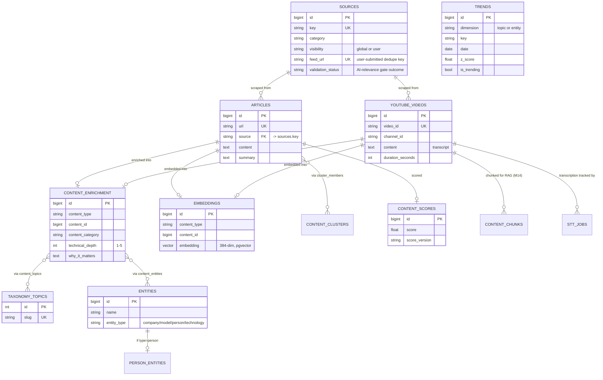
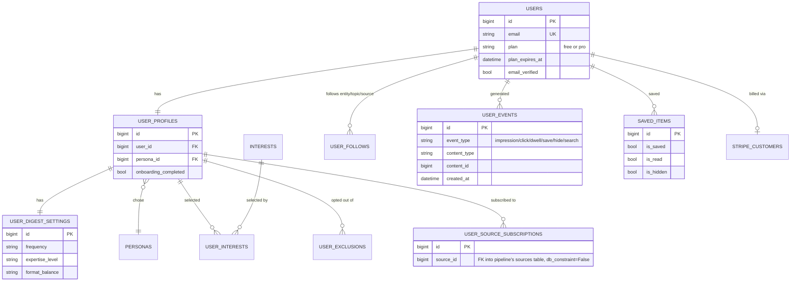
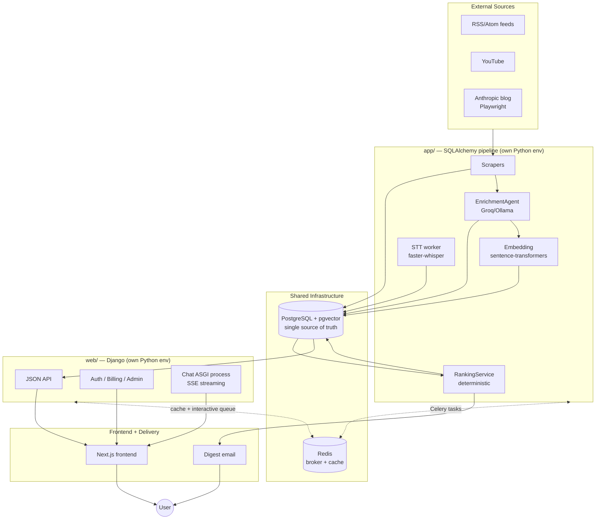

# AI Compass — Presentation Speaker Content

Grounded in the actual repository: `docs/ROADMAP.md`, `.wolf/cerebrum.md` (decision log), source code across `app/` (pipeline) and `web/` (Django), and this project's real build history (M1–M15). Every claim below is either a direct file/module citation or explicitly flagged as uncertain/not implemented. Nothing here is invented.

---

## SECTION 1 — Engineering Concepts

Source: the 20 concepts from your printed cheat sheet, grouped exactly as you grouped them (Architecture / Product Thinking / AI System Design / Machine Learning).

---

### ARCHITECTURE

#### 1. Separation of Concerns

**What it means.** Each part of a system does exactly one job, and nothing else knows how that job gets done internally — only what it produces. A layer can be rewritten completely as long as it keeps its contract with its neighbors.

**Why it exists.** Without it, a change to how content is scraped would ripple into how it's displayed, which would ripple into how it's billed. Coupling is what makes systems expensive to change. Separation is what keeps the cost of change roughly constant as the system grows.

**Why real companies use it.** It's the single most load-bearing idea in software architecture — it's why "microservices," "layered architecture," and "hexagonal architecture" all exist as named patterns. Any company running more than one team on one codebase enforces it by necessity, or pays for not doing so in the form of a codebase nobody can touch safely.

**Companies:** This is foundational enough that it isn't attributable to one company — it predates all of them (it's a 1970s software-engineering idea, formalized by David Parnas). Every major tech company's engineering culture assumes it (Google's monorepo still enforces strict module boundaries; Amazon's "two-pizza team" model is organizational separation of concerns).

**Did we implement it? Yes.** This is the literal top-level shape of the repository:
- `app/` — the SQLAlchemy pipeline: scraping, LLM enrichment, embeddings, clustering, scoring, ranking computation. It never renders HTML or handles an HTTP request.
- `web/` — the Django web app: registration, sessions, billing, templates/API, admin. It never scrapes a feed or calls an LLM to enrich content.
- PostgreSQL — the single shared store both sides read/write, but never the same tables (see Ownership Boundary below).

Concretely: `app/services/ranking_service.py` computes a ranking with zero knowledge that Django exists. `web/apps/news/views.py::FeedView` reads that ranking with zero knowledge of how it was computed. Neither file imports the other's stack.

We implemented it this way because the project runs two genuinely different runtime concerns (a scheduled batch/ML pipeline vs. a request/response web app) that would otherwise force one dependency set (torch, sentence-transformers, playwright, faster-whisper) into a process that never needs it (the web server). Section 3 (Technology Stack) goes into why that specific split mattered enough to justify two separate Python environments and two separate Docker images in production.

---

#### 2. Single Source of Truth

**What it means.** For any given fact, there is exactly one place that computes and owns it. Every other part of the system that needs that fact reads it from there — nobody recomputes it independently, and nobody keeps a second copy that can drift out of sync with the first.

**Why it exists.** The moment two places can each independently "know" the same fact, they can disagree, and now you have a bug that only shows up as "why does the feed show something different from the digest email" — the worst kind of bug, because neither side is technically wrong on its own.

**Why real companies use it.** It's the entire justification for a "system of record" in enterprise data architecture, and the core idea behind CQRS (Command Query Responsibility Segregation) systems, where a write model produces one authoritative result and every read path defers to it rather than recomputing.

**Companies:** This is a standard enterprise data-architecture term (system of record). It's not something attributable to a single company's invention, but it's the explicit design language used in, e.g., Amazon's internal service architecture guidance and any company running event-sourced systems (Stripe's ledger design is a well-known public example of "one source of truth for money movement").

**Did we implement it? Yes**, in two concrete places:

1. **`user_rankings`** (pipeline-owned table). `app/services/ranking_service.py` computes a user's ranked feed **once**, on its own schedule (every 3 hours, decoupled from the digest cadence). Both `web/apps/news/views.py::FeedView` (the live "My Feed" page) and the digest-email pipeline (`app/services/digest_service.py`) read this **same** persisted ranking — neither one recomputes a ranking independently. Before this existed, a user could plausibly see one ranking on the website and a different one in their inbox for the same moment in time.

2. **The Source Registry** (`sources` table, `app/database/models/source.py`). Before M4, each scraper's configuration (which feeds, which channels, which categories) lived hardcoded inside that scraper's own Python class — the same underlying fact ("what should we scrape and how often") was scattered across 6+ files. `seed_sources.py` + the `sources` table made this one row per source, read by `run_pipeline.py`'s dispatcher, single source for "is this source active, what's its schedule, what's its config."

---

#### 3. Ownership Boundary

**What it means.** Even when two systems share the same physical database, each one is the *exclusive writer* of a defined subset of tables. The other system may read those tables, but creating, migrating, or writing to them is off-limits.

**Why it exists.** Two ORMs (or two services) with write access to the same table will eventually disagree about that table's shape — one runs a migration the other doesn't know about, or one writes a value the other's business rules would have rejected. A hard ownership line prevents an entire category of bug before it can happen, rather than catching it in review.

**Why real companies use it.** This is the data-layer equivalent of microservice boundaries — "each service owns its own database" is one of the most repeated rules in distributed systems design, specifically because shared-write access to the same tables from independently-deployed code is one of the most common sources of production incidents.

**Companies:** This is the explicit architecture Amazon adopted internally after its early-2000s "big monolith, shared database" pain (documented in Amazon's own public retrospectives on the shift to service-oriented architecture) — "no service reaches into another service's database" became a hard internal rule. Netflix's microservices architecture follows the same principle.

**Did we implement it? Yes — this is Architecture Principle 2 in `docs/ROADMAP.md`, verbatim:** *"Django owns user-facing tables. SQLAlchemy owns pipeline tables. Each ORM CREATEs, migrates, and writes only its own tables."*

Enforced in code, not just convention, four separate ways:
- `managed=False` on every Django model that mirrors a pipeline table (`web/apps/catalog/models.py`) — Django will never generate a migration that touches these tables.
- `PipelineRouter.allow_migrate()` returning `False` for the catalog app — a second, independent guardrail even if the first were bypassed.
- A `ReadOnly` mixin on those same models that raises if `.save()` or `.delete()` is ever called.
- A read-only admin registration, so even a staff superuser can't edit a pipeline-owned row through Django's admin UI.

We implemented four layers instead of one specifically because this is exactly the kind of rule that's easy to violate by accident months later without realizing it (a well-intentioned Django `AddField` migration on a shared table would be a real, working, wrong migration) — the redundancy is deliberate, not defensive over-engineering.

---

#### 4. Cross-ORM Read Mirrors

**What it means.** When one side needs to *read* data owned by the other side, it doesn't query the other side's database connection live — it maintains its own local, read-only "mirror" model pointed at the same physical table, mapped through its own ORM.

**Why it exists.** Without a mirror, you'd either need cross-service network calls for every read (slow, adds a failure mode) or you'd let one ORM instantiate models it doesn't own the schema for (fragile — a schema change on the writing side silently breaks the reading side with no compile-time warning). A mirror keeps the read fast (still a local SQL query) while keeping the write boundary absolute.

**Why real companies use it.** This is the data-layer version of an API contract: the reading side depends on a *stable read shape*, not on the writing side's internal implementation. It's the same idea behind database read-replicas and materialized views used broadly in industry, adapted here to a same-database, two-ORM situation rather than a physically separate replica.

**Companies:** Read-replica/mirror patterns for cross-team data access are standard at any company with more than one internal data-owning team (this is a described pattern in Google's own internal "shared data, single owner" guidance for Bigtable/Spanner-backed services) — not attributable to one specific public case study, but a widely used pattern.

**Did we implement it? Yes, in both directions:**
- **Pipeline → Django direction:** `web/apps/catalog/models.py` — `Article`, `YoutubeVideo`, `Embedding`, `Source` are all `managed=False` mirrors of the SQLAlchemy-owned tables. Django reads them for the news feed, search, and the ops dashboard, but never writes.
- **Django → pipeline direction:** `app/database/models/django_readmodels.py` — `DjangoUser`, `DjangoUserProfile`, `DjangoUserEvent`, etc. are read-only SQLAlchemy mirrors of Django-owned tables. The nightly affinity-aggregation job and the digest-recipient lookup both read real user data this way, without the pipeline ever writing to `auth_user` or `user_profiles`.

**One real violation we caught ourselves** (Architecture Principle 3 explicitly references this): early in the project, the digest pipeline almost wrote directly into a Django-owned settings table to record "a digest was sent." We caught it before implementing it and instead created a new, pipeline-owned `digest_log` table (one row per actual send) — the profile page reads *that* table read-only instead. It's cited in the roadmap itself as the reason this rule exists in writing, not just in habit.

---

#### 5. Parking Lot

**What it means.** A written, dated list of ideas that were seriously considered and explicitly rejected or postponed — along with *why* — so that six months later, nobody re-opens the same debate from scratch, and nobody "rediscovers" an idea that was already tried and found wanting.

**Why it exists.** Without it, a solo developer (or a team) re-litigates the same decisions repeatedly, because the reasoning lived only in someone's head at the time and evaporated. Writing the rejection down is cheaper than re-having the argument.

**Why real companies use it.** This is the same function an ADR (Architecture Decision Record) rejected-alternatives section serves, and the same idea behind Amazon's internal "why not X" appendices in six-page design docs — the point isn't to record what was built, it's to record what was *deliberately not* built and why, which is the harder kind of institutional memory to preserve.

**Companies:** ADR-style decision recording is widely used and documented publicly by companies like Spotify (their engineering culture videos describe exactly this practice) and is a standard practice recommended in software architecture literature (Michael Nygard's ADR format, adopted internally at many companies).

**Did we implement it? Yes — literally, `docs/ROADMAP.md` Section 8, "Parking Lot (deliberately postponed — do not re-litigate without reading this)."** It's a real table with real rejected ideas, for example:
- *Per-user generated audio* — rejected as cost scales with users × items; reframed into a single shared daily public podcast instead.
- *Region/language preferences* — postponed because there's no geo-tagged content and the corpus is English-only, so the preference would control nothing (this ties directly to concept #10 below — "every knob must map to a real feature").
- *Real-time per-request LLM ranking* — rejected **permanently**, because it would violate Architecture Principle 6 (LLM out of the ranking hot path).
- *Email open-tracking as a signal* — rejected because Apple Mail Privacy Protection auto-fires open pixels, making the signal meaningless; we track digest link **clicks** instead (a real M7 feature).

---

#### 6. Decision Log

**What it means.** Unlike the Parking Lot (what we *didn't* do and why), a Decision Log records what we *did* build, dated, with the reasoning for choosing that approach over the alternatives that existed at the time.

**Why it exists.** Code shows *what* was built. It never shows *why* that approach was chosen over three other reasonable ones. Six months later, "why is it built this way" is either answered instantly by a decision log, or costs an hour of code archaeology (or gets answered wrong, from a guess).

**Why real companies use it.** Same justification as ADRs generally — this is standard practice at any engineering org mature enough to have survived a founder/lead engineer leaving and taking undocumented context with them.

**Companies:** Widely documented practice — Spotify, Google, and ThoughtWorks (who popularized the specific "ADR" term via Michael Nygard) all publicly describe using dated architecture decision records for exactly this reason.

**Did we implement it? Yes, in two complementary places:**
1. `docs/ROADMAP.md` Section 9 — a dated table of roadmap-level restructuring decisions (e.g., "2026-07-14: split old-M6 into M6+M7 because it mixed risky infra work with product features in one unit").
2. `.wolf/cerebrum.md`'s own "Decision Log" section — a much more granular, dated log of implementation-level decisions made *during* each milestone (e.g., why `content_category` was named that and not `content_type` to avoid colliding with an existing polymorphic-association meaning on the same table; why a new side-table was used for enrichment instead of adding columns directly to `articles`). This is the log actually used session-to-session while building the project — every non-obvious choice made while implementing gets a dated entry explaining the reasoning, specifically so a later session (human or AI-assisted) doesn't have to re-derive it from the diff alone.

---

### PRODUCT THINKING

#### 7. Feature Gates

**What it means.** A single, centralized check — `user_can(user, feature_name)` — that every Pro-only surface in the app calls before rendering or executing. The check reads the user's *current, effective* plan, not a cached label.

**Why it exists.** Without centralization, "is this user allowed to do X" logic gets copy-pasted across every view that needs it, and inevitably drifts — one view checks `user.plan == 'pro'` directly, forgets to check for an *expired* Pro plan, and a lapsed subscriber keeps a paid feature forever by accident.

**Why real companies use it.** This is exactly what feature-flagging/entitlement services (LaunchDarkly, Stripe's own entitlements API, or Netflix's internal feature-gating system) exist to centralize — one source of truth for "who gets what," decoupled from the billing event that granted it.

**Companies:** LaunchDarkly is a company built entirely around this pattern as a product. Stripe explicitly documents "Billing + Entitlements" as a recommended architecture in their own developer docs. Netflix's public engineering blog has described their internal feature-gating infrastructure for exactly this reason (safe rollout + plan-based access control from one system).

**Did we implement it? Yes** — `web/apps/accounts/entitlements.py`:
```python
FEATURE_PLANS: dict[str, set[str]] = {
    "unlimited_custom_sources": {User.Plan.PRO},
    "trend_narrative": {User.Plan.PRO},
    "deep_video_summaries": {User.Plan.PRO},
    "unlimited_follows": {User.Plan.PRO},
    "ai_assistant_unlimited": {User.Plan.PRO},
}

def user_can(user, feature): ...
```
Two design choices worth calling out on stage:
1. **Fail-closed by design.** If `feature` isn't a registered key at all (e.g., a typo), `user_can()` returns `False` for *everyone*, including Pro users. A typo can never accidentally unlock a paid feature — the safe failure direction for anything billing-adjacent is "locked," not "open."
2. **Built before it had any callers.** The scaffold (`entitlements.py` itself) shipped in M6 — the *infrastructure* milestone — with zero features actually gated yet. Every later milestone (M9's follows, M10's custom sources, M11's trend narrative, M12's deep video, M14's chat assistant) registered its own gate as it shipped, into infrastructure that already existed. This is itself an instance of Architecture Principle 12: *"Entitlements are designed in from the start; billing is integrated last"* — the gates existed for six milestones before Stripe billing (M13) ever collected a payment.

---

#### 8. Marginal Cost

**What it means.** Decide what's Pro-only by asking "what does it actually cost more, per user, to serve this?" — not "what feels premium" or "what would a user pay extra for regardless of our costs."

**Why it exists.** Gating on perceived value instead of real cost leads to gating things that cost nothing extra to give away (annoying free users for no financial reason) or under-gating things that are genuinely expensive to serve (a free tier that quietly bankrupts the compute budget).

**Why real companies use it.** This is standard SaaS pricing/product strategy — the entire "usage-based" or "consumption-based" pricing model (AWS, OpenAI's own API pricing, Twilio) is built on charging in proportion to what a request actually costs the provider to fulfill, not on an arbitrary feature wall.

**Companies:** OpenAI's own API pricing is a textbook example (charge per token, because tokens are the real compute-proportional cost). AWS's entire billing model is marginal-cost-based. Slack and Notion's free/paid splits (which gate storage/API-call volume, the things that cost them money at scale, rather than gating arbitrary UI features) follow the same logic.

**Did we implement it? Yes — every one of our 5 gates is a genuinely compute/cost-heavier feature, not an arbitrary wall:**
- `deep_video_summaries` — gates faster-whisper speech-to-text, which is CPU-bound and measured at ~1.76x real-time per video in this project's own benchmarking. This is the single most compute-expensive feature in the app.
- `trend_narrative` — a weekly LLM call over a large context (broader synthesis across an entire week's trending content), heavier than the routine per-item enrichment call.
- `unlimited_custom_sources` / `unlimited_follows` — each additional custom source is an ongoing, recurring scrape cost (bandwidth + storage + the AI-relevance-gate LLM call at submission time) — literally an ongoing marginal cost per source added, not a one-time toggle.
- `ai_assistant_unlimited` — gates the volume of a per-message LLM call (RAG chat), where free users get a real but numerically capped daily allowance rather than zero access.

Notably, semantic search, the full daily digest, and unlimited interests/topics all stay free — they run against infrastructure that's already paid for regardless of how many users use them (the embedding index and ranking pipeline exist either way), so gating them would be exactly the "arbitrary scarcity" this concept warns against.

---

#### 9. Stop-Anywhere Roadmap

**What it means.** The milestone order is deliberately sequenced so that stopping development after *any* milestone still leaves a coherent, demoable, real product — not a half-built feature with no working end-to-end story.

**Why it exists.** Named directly in `docs/ROADMAP.md`: *"Feature bloat is the #1 solo-dev risk — the milestone order is designed so the product is coherent and shippable after any milestone; stopping at M9 or M11 still leaves a strong product."* For a solo developer (or a small team on a deadline, like a graduation project), the realistic risk isn't "not enough features" — it's running out of time mid-milestone with nothing demoable.

**Why real companies use it.** This is the product-management discipline behind MVP-first, incremental-delivery methodology broadly (Agile's own core premise: ship a working increment every iteration, not a big-bang release at the end). It's also explicitly how staged rollouts work at any company shipping continuously rather than on fixed release trains.

**Companies:** This is core Agile/Scrum methodology as practiced broadly across the industry (Spotify's own widely-published "Spotify model" of squads shipping independently-valuable increments is a well-known public example) — not attributable to a single company's invention.

**Did we implement it? Yes, and it's been tested in practice, not just planned.** Every milestone from M6 through M15 was designed and built so that the PREVIOUS milestone's app was already a real, working product: after M6 (infrastructure) the pipeline still ran end-to-end exactly as before; after M9 (the recommender), the app had genuine personalized ranking, search, and follows even with zero monetization; after M13, it was a real billable SaaS even without the M14 chat assistant or M15 frontend rewrite. Each milestone's own "Success criteria" section in `docs/ROADMAP.md` is written specifically so it can be verified independently of any milestone that comes after it.

---

---

### AI SYSTEM DESIGN

#### 10. Ingest Once, Personalize Later

**What it means.** The expensive, shared work (fetching content, summarizing it, embedding it, scoring its quality) happens exactly once per item, globally, regardless of how many users will eventually see it. The cheap, per-user work (ranking, filtering, digest assembly) happens at read/serve time, on top of that shared pool.

**Why it exists.** If you flip this — personalize at ingest time (e.g., re-summarize an article differently per user) — your cost scales with **users × items**, which is unsustainable the moment you have more than a handful of users. Ingest-once scales with **items** alone; personalization at read-time is comparatively free (it's just filtering/scoring numbers you already computed).

**Why real companies use it.** This is exactly how large-scale recommendation systems are architected — YouTube's own published recommendation-system papers describe a two-stage design of expensive offline candidate generation/feature computation, with lightweight online ranking on top. It's the same reason a news aggregator, a video platform, or an e-commerce catalog all separate "index the catalog" from "rank the catalog for this visitor."

**Companies:** YouTube (published recommendation-system architecture papers describing this exact offline/online split), Netflix (their engineering blog describes precomputed content features + per-user ranking at request time), and Amazon's product-recommendation pipeline (offline feature computation, online ranking) all follow this pattern publicly.

**Did we implement it? Yes — this is Architecture Principle 1, verbatim: "Content is scraped, summarized, embedded, scored, and clustered exactly once — globally. Per-user work happens at read/serve time."**

Concretely: `run_pipeline.py`'s scrape → embed → enrich → cluster → score phases run **once**, on a 6-hourly schedule, touching the shared corpus. Nothing in that chain knows a specific user exists. Personalization only enters at `app/services/ranking_service.py`, which reads that already-computed shared pool and produces a per-user ordering — the heavy lifting (an LLM enrichment call, an embedding computation) is never repeated per user.

---

#### 11. One Enrichment Call per Item

**What it means.** All of an item's derived metadata — summary, topic classification, technical depth, key entities mentioned, "why this matters" — comes from a **single** structured LLM call per item, not one call per metadata field.

**Why it exists.** If summary, topic-tagging, entity-extraction, and depth-scoring were each their own LLM call, that's 4-5x the LLM cost and 4-5x the latency for the exact same underlying reasoning the model has to do anyway (it has to *read and understand* the article regardless of how many separate questions you ask about it). One call, one structured JSON schema, is both cheaper and more consistent (the model reasons about the whole article once, not in four disconnected contexts).

**Why real companies use it.** This is standard LLM-application cost engineering — batching multiple extraction tasks into one structured-output call instead of one call per field is a widely recommended pattern in production LLM system design (OpenAI's own function-calling/structured-output documentation explicitly recommends consolidating related extractions into one call).

**Companies:** This specific cost-optimization pattern is documented practice at companies running LLMs at scale for content processing — it's the standard recommendation in OpenAI's and Anthropic's own developer documentation for structured extraction tasks, adopted broadly by any team doing LLM-based content pipelines at nontrivial volume.

**Did we implement it? Yes — `app/agents/enrichment_agent.py`'s `EnrichmentAgent`.** One LLM call per item returns a single validated JSON object containing: `summary`, `content_category`, `technical_depth` (1-5), `key_points`, `technical_details`, `business_angle`, `why_it_matters`, `topics` (matched against a controlled ~27-term taxonomy), and `entities` (deduplicated against an existing entity table). This *replaced* an earlier `DigestAgent` that only produced a summary — consolidating into one call was a deliberate M8 redesign, not the original design.

Worth noting on stage: adding a *new* metadata field later (which happened — `technical_depth` didn't exist in the original design) means extending this one call's JSON schema, per Architecture Principle 4 — not writing a second pass over the whole corpus.

---

#### 12. Structured Metadata > Repeated Calls

**What it means.** Once a fact about an item is known (e.g., "this article's topic is `large-language-models`"), it's computed once and stored as a queryable database column/row — never re-derived by asking an LLM the same question again at serve time.

**Why it exists.** LLM calls are for *generation* (producing new text, reasoning about something novel) — they are not a database. Asking an LLM "what topic is this article about" every time a page renders is both slower (seconds vs. milliseconds for a DB read) and non-deterministic (the same article could get classified differently across requests) where a stored fact is instant and stable.

**Why real companies use it.** This is the general "compute once, cache/persist forever" principle applied specifically to LLM output — treat the LLM as a one-time enrichment step in an ETL pipeline, not as a live dependency of the read path. It's the same instinct behind materialized views and precomputed feature stores in any data system.

**Companies:** This is the standard architecture recommended for "LLM-as-ETL" content pipelines — it's explicitly how systems like Elasticsearch/Algolia-backed content platforms are designed (enrich at index time, query the index at read time, never re-run enrichment per query), and is standard cost-engineering guidance from every major LLM provider's production-deployment docs.

**Did we implement it? Yes — same mechanism as concept #11, viewed from the storage side.** `content_enrichment`, `content_topics`, `content_entities`, and `content_scores` are all real Postgres tables populated once by the pipeline. Every place that displays a topic badge, an entity chip, or a quality-weighted ranking (`web/apps/news/views.py`, `app/services/ranking_service.py`) reads these stored columns — none of them call an LLM at render or ranking time. The taxonomy vocabulary itself (~27 controlled topics) is shared between the pipeline's `taxonomy_topics` table and Django's onboarding `Interest` model via a foreign key, so a user's declared interests and a content item's computed topics use **one controlled vocabulary**, not two independently-drifting free-text label sets.

---

#### 13. Batch Compute, Read on Serve

**What it means.** All computationally heavy work (scraping, LLM enrichment, embedding, clustering, quality scoring, ranking) runs as scheduled, offline batch jobs. The live web-serving path (`web/`, answering an HTTP request) never triggers any of that work synchronously — it only ever reads already-computed results.

**Why it exists.** A user loading a webpage should get a response in milliseconds. An LLM call, an embedding computation, or a clustering pass takes seconds to minutes. If any of that sat in the request path, the site would be unusably slow (or would time out) under any real load. Separating "when the work happens" from "when the result is read" is what makes both fast page loads *and* expensive AI computation possible in the same system.

**Why real companies use it.** This is Architecture Principle 8 in spirit ("capture raw, serve aggregated") applied to compute rather than just data — it's the standard "offline batch layer + online serving layer" split described in the Lambda Architecture pattern (popularized publicly by companies building large-scale data systems), and is exactly how recommendation, search-indexing, and fraud-detection systems are built at any company operating at meaningful scale.

**Companies:** This offline/online split is explicitly documented in Netflix's and LinkedIn's public engineering blogs describing their recommendation infrastructure (offline model scoring/feature computation feeding a fast online serving layer), and is the foundational idea behind the "Lambda Architecture" pattern used broadly across the data-engineering industry.

**Did we implement it? Yes.** The entire Celery + Redis job queue (`app/celery_app.py`) exists specifically to run the pipeline's phases (scrape/embed/enrich/cluster/score/digest/rank) as scheduled background jobs, decoupled from any web request. Django's own request-handling code (`web/apps/news/views.py`, `web/apps/onboarding/views.py`) never imports the ML stack (sentence-transformers, faster-whisper) at all — it's a completely separate dependency set (see Section 3), enforced not just by convention but by the two codebases living in genuinely separate Python environments in production.

**One deliberate, disclosed exception:** two "interactive" tasks (semantic search's query embedding, and the AI-relevance gate for a newly-submitted source) *do* need a live answer within seconds, because a user is actively waiting on that specific request. These run on their own dedicated Celery queue (`interactive`), separate from the batch queue, with a bounded timeout and a graceful fallback (search degrades to keyword search; source submission returns a clear "try again" message) if the interactive worker is ever unavailable — the exception is scoped and documented, not a silent violation of the rule.

---

#### 14. LLM out of the Hot Path

**What it means.** The LLM is never a dependency of the live ranking decision itself. It's used to *generate content* (summaries, classifications) offline, and at most to *explain* a ranking result — never to *compute* the ranking in real time.

**Why it exists.** An LLM call is slow (seconds), non-deterministic (the same inputs can produce different outputs across calls), and expensive per-call. A ranking algorithm needs to be fast (sub-second, ideally instant), reproducible (the same signals should produce the same order), and cheap to run for every user, every few hours. Those requirements are close to opposite an LLM's strengths.

**Why real companies use it.** This is one of the most consistently repeated lessons in production recommendation-system engineering: use ML/statistical models (gradient-boosted trees, embeddings, learned-to-rank models) for the actual scoring, and reserve generative models for explanation or content generation. It's explicitly why "LLM-powered recommendations" as a literal per-request mechanism is rare in production systems at scale, despite being an obvious-sounding idea.

**Companies:** This is the architecture described in YouTube's and Netflix's own published recommendation papers (deterministic, learned scoring functions in the actual ranking path) — LLMs, where used at all in recommendation-adjacent surfaces at these companies, sit in explanation/summarization roles, not in the scoring loop itself.

**Did we implement it? Yes — this is Architecture Principle 6, and it's the most consequential rewrite in this project's history:** an earlier version of this app used an LLM-based `CuratorAgent` to rank content per user. It was **deleted entirely** and replaced with `app/services/ranking_service.py` — a fully deterministic two-stage ranker:
1. **Candidate generation**: a recency window ∪ pgvector similarity to the user's profile vector ∪ guaranteed inclusion for followed entities/topics/sources.
2. **Scoring**: a transparent weighted linear combination (interest/topic affinity, quality score, freshness, learned source affinity, novelty vs. recent history).
3. **MMR diversification** (see concept #18) so results aren't near-duplicates of each other.

The "why recommended" explanation shown to users is **templated from the actual winning scoring features**, not generated by an LLM — e.g., "recommended because you follow this topic and it's fresh," built from real numbers, not a model's guess. We verified this concretely by running the entire ranking pipeline with `GROQ_API_KEY`/`OPENAI_API_KEY` unset in the environment and confirming it still produced a complete, ranked, explained feed — direct proof the LLM is genuinely absent from this path, not just conceptually deprioritized.

The roadmap explicitly frames this as a *direction*, not a one-time fact: Principle 6 says ranking trends "toward deterministic and less LLM-dependent" over time, with the heuristic weighted-linear scorer as a stepping stone toward a learned (gradient-boosted) model once enough logged feature data exists (see Section 11, Future Work — this is the LightGBM upgrade path).

---

### MACHINE LEARNING

#### 15. Instrumentation Before Intelligence

**What it means.** You cannot build a system that learns from user behavior until you have first built the thing that *records* user behavior. Instrumentation (event logging) has to exist before any personalization or recommendation model that depends on it.

**Why it exists.** Interaction data compounds with calendar time and nothing else — a system that starts logging clicks today has zero historical data for a model trained tomorrow, but *90 days* of data for a model trained in 90 days. There's no way to backfill "what would a user have clicked six months ago" after the fact. This makes instrumentation the single most time-sensitive investment in any recommendation system's roadmap — every week without it is a week of training data that will never exist.

**Why real companies use it.** This is universally true of every recommendation system at every company that has one — it's why "event tracking" and "analytics instrumentation" are among the very first things added to any product that plans to eventually personalize, well before the personalization itself is built.

**Companies:** Documented explicitly in Netflix's, Spotify's, and Meta's public engineering writing about how their recommendation systems came to exist — in every case, behavioral logging infrastructure long preceded the recommendation models built on top of it, because the models are literally impossible to train without it.

**Did we implement it? Yes, and the sequencing was deliberate, not incidental — this is the actual reason our milestone order has instrumentation (M7) directly before the recommender (M9), with content intelligence (M8) in between.** `docs/ROADMAP.md`'s M7 objective is stated as: *"Start the data flywheel. Capture what users do... M8's quality score and M9's recommender both read what this milestone writes."*

Concretely: `web/apps/behavior` (Django app) owns `user_events` (append-only: impression/click/dwell/scroll/save/hide/search/digest_click) and `saved_items`, shipped in M7 — two full milestones **before** `app/services/ranking_service.py` (M9) existed to read any of it. By the time the recommender was built, there was already real behavioral history for it to learn user affinities from, rather than launching cold with nothing.

---

#### 16. Data Flywheel

**What it means.** A self-reinforcing loop: more usage produces more behavioral signal → more signal improves the ranking/recommendation quality → better recommendations drive more usage → which produces more signal. Each turn of the loop is supposed to make the next turn more valuable.

**Why it exists.** It's the mechanism by which a personalization system is supposed to get *better over time* without anyone manually re-tuning it — the data itself is the improving ingredient, not new code.

**Why real companies use it.** This is the explicit stated goal of virtually every consumer product with a feed or recommendation surface — it's the reason engagement instrumentation is treated as a first-class product investment rather than "just analytics," at Netflix, Spotify, YouTube, TikTok, and Amazon alike.

**Companies:** "Data flywheel" or "data network effect" is explicit, publicly-used language from Amazon (their well-known flywheel diagram, originally about selection/price/traffic, has been adapted by many teams internally for recommendation systems specifically) and is standard vocabulary in recommendation-system engineering writing broadly (Spotify, Netflix).

**Did we implement it? Partially — and it's important to be precise about which part.**

**What's real and built:** the actual mechanical loop exists end-to-end. `user_events` (M7) → nightly affinity aggregation + `user_profile_vectors` (M9) → `ranking_service.py`'s candidate generation and scoring, which reads those affinities/vectors directly. This is a real, working pipeline, not a diagram — a user's actual clicks/saves/dwell time measurably change what their feed and profile vector look like on the next ranking run.

**What's not yet measured:** whether the loop's *second half* — "better ranking → more usage → more signal" — is actually true and self-reinforcing in practice would require a live user base large enough to observe engagement changes over time, plus a controlled comparison (e.g., A/B testing ranked vs. unranked, or before/after a ranking change). At this project's current scale (a small number of real users), we have not measured that the loop *compounds* — we've verified that the *mechanism* is real and wired correctly (an offline eval harness, `app/eval/ranking_eval.py`, computes NDCG/MAP against held-out click/save events specifically to sanity-check the mechanism), not that the flywheel effect itself has been observed at scale. This is an honest limitation to state on stage rather than overclaim: the architecture for a data flywheel exists; proof that it flies at scale would need real usage volume this project doesn't yet have.

---

#### 17. Content-Based Recommendation

**What it means.** Recommendations are generated from an item's own features (its embedding, its topics, its entities, its quality score) and a user's own profile (their own affinity weights, their own engagement history) — never from *other users'* behavior ("users who liked X also liked Y").

**Why it exists.** The alternative — collaborative filtering — needs a large, dense user-item interaction matrix to work at all; it fails badly for new items (nothing has been rated yet) and new users (no history to match against), a problem known as the "cold start" problem. Content-based recommendation works from day one for any item, because an item's *own features* are known the moment it's ingested, independent of how many users have seen it.

**Why real companies use it.** Most production recommender systems at scale actually use a **hybrid** of both — but content-based signals are specifically what solves cold-start, which is why they're foundational even in systems that also use collaborative signals.

**Companies:** Spotify's own published engineering blog describes audio/content-feature-based recommendation as a core input alongside collaborative signals, specifically to handle new/niche content collaborative filtering can't reach. Netflix has publicly described using content metadata (genre, cast, themes) as a first-class recommendation input, not purely collaborative.

**Did we implement it? Yes — purely content-based, no collaborative signal at all currently.** `app/services/ranking_service.py`'s candidate generation uses pgvector cosine-similarity between the **item's own embedding** and the **user's own profile vector** (a decayed weighted mean of that same user's previously-engaged item embeddings — never another user's data). Scoring uses the item's own quality score, topic/entity match against the user's own declared and inferred affinities, and freshness. At no point does the system look at what *other* users engaged with to recommend to *this* user.

This was a deliberate scope decision, not an oversight: a genuine collaborative-filtering signal needs a meaningfully sized, dense user base to be worth the complexity, which this project doesn't have yet (see Section 11, Future Work, for where a hybrid approach could go later).

---

#### 18. Exploration vs. Exploitation

**What it means.** A ranking system that only ever shows the highest-scoring items ("pure exploitation") will keep showing the same kinds of content forever, because it never gets new signal about anything it hasn't already decided is good — this is the "filter bubble" problem. Deliberately reserving some fraction of results for lower-confidence, less-proven items ("exploration") is what lets the system discover that a user's taste has shifted, or that a new topic is worth surfacing.

**Why it exists.** Named explicitly in `docs/ROADMAP.md` as a **mandatory, not optional**, mitigation: "Filter bubble (mandatory exploration slice, M9)" is listed under the project's own risk register — this isn't a nice-to-have tuning knob, it's a deliberate defense against a named, anticipated failure mode.

**Why real companies use it.** This is the multi-armed bandit problem, one of the most well-studied problems in applied ML, and its application to recommendation ranking is extensively publicly documented.

**Companies:** Spotify's engineering blog has published detailed writing on using bandit algorithms and explicit explore/exploit tradeoffs in their recommendation surfaces (Discover Weekly and related features). Netflix has similarly published on avoiding recommendation staleness through deliberate diversity injection. YouTube's public recommendation papers also discuss diversity/exploration mechanisms to avoid narrow, self-reinforcing recommendation loops.

**Did we implement it? Yes, two distinct mechanisms, both live in `app/services/ranking_service.py`:**
1. **A reserved exploration slice** — roughly 12% of each ranked feed is deliberately set aside for less-proven items rather than pure top-score picks, flagged internally via an `exploration_slot` marker so its effect can be measured separately from the main ranking.
2. **MMR (Maximal Marginal Relevance) diversification** (λ=0.7) — even within the "exploit" portion of the feed, MMR actively penalizes near-duplicate items relative to what's already been selected, so a feed doesn't end up as ten near-identical articles about the same story just because they all scored well individually.

Verified concretely during M9: a real ranked feed for a test user showed non-monotonic score ordering (proof MMR is actively reordering, not just sorting by raw score) and exactly the expected ~1-in-10 items flagged as an exploration slot.

---

*(End of Section 1 — all 20 concepts covered.)*

---

## SECTION 2 — Project Story

### Where it actually started

This project did not begin as a graduation-project pitch. It began as a genuine personal tool with a real, narrow problem: the AI field moves faster than one person can manually track by checking YouTube channels and company blogs every day. The earliest working version of this codebase (confirmed directly from an architecture audit performed on the repository at that stage, and from the earliest git commits — `408a39f` "first commit" through the addition of arXiv scraping, Groq integration, and the CuratorAgent/EmailAgent) was:

- A single Python CLI script (`run_pipeline.py`), no web app, no frontend, no API.
- Hardcoded for **one person** — the `UserProfile` in `app/config.py` was a literal, named individual with a fixed interest list. The recipient of the digest email was configured by one environment variable.
- Two content sources total: 15 YouTube channels and two company blogs (OpenAI, Anthropic).
- Three sequential LLM calls per run — summarize, rank, compose — using Groq's free tier, delivering one email digest.
- No database migrations (`Base.metadata.create_all()`), no tests for the agent layer, no deployment story at all (the `Dockerfile` and `render.yaml` in the repo were literally empty, 0 bytes — placeholders for an intent that hadn't happened yet).

We're stating this plainly rather than glossing over it, because the *honest starting point* is what makes the engineering story credible: this was a real, working, useful, but genuinely single-user batch script with real technical debt (duplicated helper functions across files, dead code, an over-broad `delete_all()` method, weak default database credentials, no schema versioning). A full architecture review at that stage graded it "B+ for a graduation project" — solid fundamentals, real gaps.

### What problem we were actually trying to solve

There were, honestly, two separate problems layered on top of each other:

1. **The domain problem (real, personal):** staying current on a fast-moving field without spending an hour a day manually checking sources. This part never changed — it's still exactly what the app does today, just for many users instead of one.

2. **The engineering problem (the actual point of the project):** demonstrating that we understand *how real AI-powered products are actually engineered in production* — not "call an LLM API and put a chat box on a page," but the much less visible discipline that separates a demo from a system: background job orchestration or someone's laptop dying mid-cron-job, ownership boundaries so two data-owning systems don't corrupt each other, entitlement/billing logic that's cheap because it was designed in early rather than retrofitted, a recommendation system where the expensive AI computation happens once and the recommendation decision doesn't reinvent it per request, and a data flywheel that requires instrumentation to exist *before* the model that reads it.

### Why we didn't just build "another AI news website"

There are already dozens of AI-news products and newsletters (TLDR AI, Ben's Bites, The Batch, and many others) — building a better AI news aggregator, as a *product*, was never the differentiator available to us, and pretending otherwise would be the wrong story to tell a technical audience. The honest positioning is the opposite: **the AI-news domain is the vehicle, not the destination.** It was chosen because it's a domain that naturally requires almost every hard problem in applied AI engineering to exist somewhere in the system — ingestion from messy heterogeneous sources, LLM-based structured extraction at scale (which forces you to think about cost), embeddings and semantic search, a real recommendation/ranking problem (not just "sort by date"), and a genuine monetization surface (compute-heavy features like video transcription are naturally more expensive to serve, which makes Free/Pro gating a real design problem, not an arbitrary one).

In other words: we needed a domain complex enough that *skipping* the engineering discipline (batch/serve separation, ownership boundaries, entitlements) would visibly break something, so that the discipline being present is demonstrably load-bearing, not decorative.

### Why this architecture, specifically

The milestone-by-milestone build order (`docs/ROADMAP.md`, M6 through M13, later extended informally with M14's chat assistant and M15's frontend rewrite) wasn't arbitrary — every ordering decision is written down and justified in the roadmap itself, and several of them are *counterintuitive* in a way that's worth explaining on stage specifically because it shows engineering judgment rather than feature-checklist execution:

- **Infrastructure (M6) shipped before any user-visible feature.** Migrations, a job queue, and an entitlement scaffold, with the roadmap's own stated reasoning: "make everything after this safe to build." This produced *zero* visible improvement to the app the day it shipped — and that was the point.
- **Instrumentation (M7) shipped two full milestones before the recommender that would read it (M9)**, specifically because interaction data compounds with calendar time and nothing else — a recommender launched cold, with no behavioral history, would have nothing real to learn from on day one.
- **Billing (M13) shipped last, deliberately**, per Architecture Principle 12 — charging money before the product had anything worth charging for (a real recommender, real personalization, real content intelligence) would have meant billing for a bare aggregator, which is commodity work with zero engineering learning value.
- **Every architectural rule that exists (Section 1) was earned, not designed up front in a vacuum.** The cross-ORM read-mirror rule exists in writing specifically because we caught ourselves about to violate it once (the `digest_log` incident). The Parking Lot exists because re-litigating settled decisions costs real time on a solo/small-team timeline.

### The engineering thinking, in one sentence

We treated "build an AI news aggregator" as an excuse to build the same categories of infrastructure a real AI product team builds — and we made sure every non-obvious decision was written down, dated, and justified, so the project can be defended as a demonstration of engineering judgment, not just a list of features that happen to work.

---

---

## SECTION 3 — Technology Stack

Organized by concern. For each: why we chose it, what alternatives genuinely existed, and why this one won — citing the actual documented reasoning where it exists, and saying plainly where a choice predates detailed written justification.

### Language & core frameworks

**Python (two versions, deliberately different: 3.14 for the pipeline, 3.13 for Django).** Python was never really "chosen" against competitors for this project — it's the default for LLM-adjacent tooling (every major LLM SDK, `sentence-transformers`, `faster-whisper` all ship Python-first) and for a solo/small-team data pipeline. The more interesting decision is running **two separate Python versions in the same repo**: `app/` targets 3.14 (`pyproject.toml`), `web/` targets 3.13, because Django 5.2 LTS officially supports up to 3.13 at the time this was decided. Rather than downgrade the whole project to the lowest common denominator, the two runtimes were kept independent — matching Ownership Boundary (Section 1): if the two ORMs don't share tables, there's no reason to force them to share a Python interpreter either. This became directly relevant during production deployment: the Docker images for the two processes use different base images (`python:3.14-slim` vs `python:3.13-slim`) for exactly this reason.

**Two ORMs instead of one (SQLAlchemy for the pipeline, Django's ORM for the web app) — the question a reviewer will actually ask is "why not just use one?"** The honest answer: Django ships its own ORM, and using a second one (SQLAlchemy) for the pipeline side is the more unusual choice, not the obvious one. It was kept because the pipeline predates the Django app (see Section 2 — the CLI pipeline existed first) and SQLAlchemy 2.0's typed `Mapped[]` declarative style plus the Repository pattern were already a clean, working design; rewriting it onto Django's ORM to "have only one" would have meant coupling the batch pipeline's schema lifecycle to Django's migration system for zero functional benefit, and would have made the Ownership Boundary between the two systems *harder* to enforce, not easier (one shared ORM makes accidental cross-writes trivial; two separate ORMs make them require deliberate effort). The cost — Django needing `managed=False` read-only mirrors to see pipeline data — is real, but it's a cost paid once per new table, not a recurring one.

**Django (web app: auth, billing, admin, JSON API surface).** Chosen over Flask/FastAPI for the web layer specifically because this project needed several "batteries included" things fast and correctly: a real auth system (session-based login, password reset, email verification) without hand-rolling security-sensitive code, a free and genuinely useful admin interface for the ops dashboard, and a mature migrations system. FastAPI was a real alternative (and *is* used, narrowly — see the M14 ASGI note below), but it would have meant building auth, admin, and ORM migrations from smaller pieces; Django trades some flexibility for a huge amount of "already solved, already secure" surface area, which mattered more here than raw request throughput.

### Data & storage

**PostgreSQL.** The single shared database for both ORMs. Chosen over a lighter option (SQLite) because the project needs real concurrent writers (the pipeline and the web app, plus multiple Celery workers) and real extension support — specifically pgvector (below). Chosen over a different heavyweight RDBMS (MySQL) because pgvector is a Postgres-specific extension and there was never a reason to look elsewhere once vector similarity search became a requirement (M9).

**pgvector, instead of a dedicated vector database (Pinecone, Weaviate, Milvus).** The alternative — a separate vector DB — is extremely common in RAG-heavy systems, and was a real option, especially once M14 added passage-level RAG chunking. It was rejected for this project specifically because it would violate the Single Source of Truth idea from Section 1: content, its metadata, and its embedding would live in two different systems that both need to stay in sync (delete an article, remember to delete its vectors elsewhere too). Keeping vectors in the same Postgres instance as the content they describe means one transaction, one backup, one consistency story — at this project's actual data volume (a few thousand embedded items, confirmed via this project's own production migration: 3,567 embedding rows, 37MB total database size), a dedicated vector database would be solving a scale problem this project doesn't have, at the cost of a real architectural seam that didn't need to exist. `pgvector`'s HNSW index (added specifically for M14's passage-level RAG chunking, per the decision log) keeps similarity search fast at this scale without leaving Postgres at all.

**SQLAlchemy 2.0** (pipeline ORM) — typed, declarative `Mapped[]` models plus the Repository pattern (Section 1's design-pattern review flagged this as a genuine strength even in the project's earliest, roughest version). Chosen over raw `psycopg2`/SQL for the same reason any ORM is chosen: it keeps SQL out of business logic and makes the persistence layer testable in isolation.

**Redis** — the shared broker/cache backend for two unrelated concerns that happen to both want a fast key-value store: Celery's task queue (broker + result backend) and Django's rate-limiting cache. Chosen over alternatives (RabbitMQ for the queue side, Memcached for the cache side) because one well-understood piece of infrastructure covering both jobs is simpler to operate than two specialized ones, and Celery's Redis support is first-class and well documented. A real, hard-won lesson from this exact project (Section 9 will cover this in detail): Redis's *managed, pooled* connection strings (as offered by some free-tier hosts) are not always safe to use for this — see Neon's Postgres pooling issue, a directly analogous class of bug, in Section 9.

### Background processing

**Celery, over RQ** — this is a directly documented choice, not an assumption: `docs/ROADMAP.md`'s M6 section literally states the alternatives considered — *"Introduce Celery (or RQ; Celery preferred for scheduling maturity)."* RQ is simpler to set up, but Celery's built-in `beat` scheduler (cron-like recurring task scheduling) and its native support for multiple named queues (this project uses three: `default`, `interactive`, `stt` — see Section 5) were exactly the features this project's actual workload needed, not hypothetical future-proofing.

**uv**, not plain `pip`/`venv`, for the pipeline's dependency management — a fast, lockfile-based Python package/venv manager (`uv.lock`, `pyproject.toml`). Chosen for reproducible installs and speed; the web app's own dependencies are deliberately kept on plain `pip` + `requirements.txt` instead, mirroring the same "two independent environments" decision as the Python-version split above, rather than forcing one tool to manage both.

### AI / ML stack

**Groq, not OpenAI, as the primary LLM provider** — directly documented in this project's own history: the switch was made for Groq's free tier, and Groq exposes an **OpenAI-compatible** `chat.completions` API, so the switch didn't require rewriting the agent code, just repointing the client (the `openai` Python package is still a declared dependency for exactly this compatibility reason, and is reused again for the Ollama integration below). The real trade-off accepted: Groq doesn't support OpenAI's structured-outputs `.parse()` beta, so JSON responses are parsed manually with a fence-stripping fallback — a known, accepted piece of technical debt from the earliest version of the project, not something that snuck in unnoticed.

**Two Groq model tiers, chosen for cost/latency, not capability alone**: `llama-3.1-8b-instant` for cheap, high-volume tasks (per-item enrichment, digest intros), and `llama-3.3-70b-versatile` for tasks that need stronger reasoning (the M11 weekly trend narrative, and M14's RAG chat assistant — both reuse the same "reasoning" tier in `app/llm/client_factory.py` rather than inventing a third tier, on the reasoning that both are "synthesize across multiple sources, need to get it right" tasks).

**Ollama, as a documented, switchable local alternative — not a live default.** `app/llm/client_factory.py` routes "simple" tasks to a local Ollama server (via the same OpenAI-compatible client pattern used for Groq) when `LLM_PROVIDER=local`, specifically for zero-marginal-cost bulk operations like a full-corpus enrichment backfill, where hitting a metered API repeatedly would be the wrong default. This is a real, working code path, not aspirational — but it requires a local Ollama installation, so it's used situationally (backfills, offline development) rather than as the production default.

**sentence-transformers (`all-MiniLM-L6-v2`), for embeddings — run locally, not via an embeddings API.** Chosen because it's small (~90MB), fast enough on CPU, and free per-call, versus an API-based embeddings service (OpenAI's, Cohere's) which would add both cost and a network round-trip to every single content item ingested (thousands of calls) and every live search query. The one real operational cost this choice has was discovered directly during this project's own production deployment (Section 9): the model has to be downloaded from Hugging Face Hub the first time a fresh process needs it, which took ~90 seconds on a cold cache — solved with a startup pre-warm hook, not a provider change.

**faster-whisper (CTranslate2-based Whisper), for speech-to-text — not a cloud STT API.** Used only for the subset of YouTube videos with no existing captions (M12). Chosen over a cloud API (OpenAI's own Whisper API, AssemblyAI, Deepgram) for the same Marginal Cost reasoning as Section 1: STT is the single most compute-expensive feature in this app, and running it locally (CPU, `distil-large-v3` model, ~1.76x real-time measured in this project's own benchmarking) means the cost is fixed compute time, not a per-minute metered bill that scales directly with how many long, caption-less videos exist in the corpus — directly why this feature is the primary Pro-plan gate (Section 1, Marginal Cost).

**Playwright**, for exactly one scraping target (Anthropic's blog) — not used broadly. Anthropic's news page is a client-rendered (Next.js) page; a plain HTTP GET returns an empty shell with no article content in it. Playwright drives a real headless Chromium to let the page's JavaScript execute, then reads the rendered DOM. Every other source (OpenAI's blog, arXiv, GitHub releases, Reddit, government feeds) uses a plain RSS/Atom feed via `feedparser` instead, specifically because that's cheaper and more reliable when it's available — Playwright is the fallback for sources that structurally require it, not the default scraping method.

**yt-dlp**, for downloading a video's audio track ahead of STT — the standard, actively-maintained tool for this; there isn't a serious alternative for reliably pulling audio from YouTube specifically.

### Frontend

**Django server-rendered templates (M1–M13), then a Next.js rewrite (M15).** For the first ~13 milestones, the frontend was Django's own template engine — Bootstrap-styled server-rendered HTML, no separate frontend build step, no API layer needed because templates and views lived in the same process. M15 replaced this with a **Next.js 16 + React 19** application (`frontend/`), using the shadcn/ui component pattern (Radix UI primitives + `class-variance-authority` + `tailwind-merge`, not a pre-built component library dependency), Tailwind CSS v4, Zustand for client state, and TanStack React Query for server-state/data-fetching — talking to Django only through a JSON API surface, with Django itself retreating to owning auth, admin, billing, and the handful of email-linked pages (password reset, verification) that still make sense server-rendered. **Worth being precise on stage about what is and isn't documented here:** the specific *decision* to move from server-rendered templates to a separate Next.js frontend does not have the same kind of dated "X vs. Y, chose X because" entry in this project's own decision log that, say, the Groq-over-OpenAI or Celery-over-RQ choices do — the frontend was built with substantial AI-assisted UI generation ("Z.ai" per this project's own internal build notes) and then integrated against the real backend. The plausible, defensible reasoning (richer client-side interactivity for the M14 chat assistant's streaming UI, a modern component ecosystem, a more portfolio-representative UI) is reasonable to state as *our reasoning*, but it should be presented as that — not dressed up as a decision-log citation that doesn't exist.

**Server-Sent Events (SSE) streaming for the chat assistant, served from a dedicated ASGI process (`uvicorn` running Django's own `config.asgi:application`), separate from the main `gunicorn` (WSGI) web process.** This one *is* directly documented: Celery's request/response task pattern (used elsewhere for query embedding) fundamentally cannot stream tokens one at a time, and streaming was an explicit, deliberate product choice over a simpler non-streaming first cut. Rather than enabling streaming on the main web service (where a slow/stuck stream could pin one of only two gunicorn worker processes and effectively take down the rest of the site for other visitors), a second, isolated ASGI container handles only `/assistant/stream/*`, reusing the exact same Django codebase and settings — no new framework, just a second entrypoint into the same application for a request pattern WSGI can't serve well.

### DevOps & deployment

**Docker**, for both local development (`docker/docker-compose.yml`: Postgres+pgvector, Redis, pgAdmin) and production (`docker/docker-compose.prod.yml`: a 7-container stack — web, chat, frontend, three differently-queued Celery workers, beat, plus Redis and a Caddy reverse proxy). Chosen because it's the only realistic way to get "the same environment locally and in production" for a stack this heterogeneous (two Python versions, a Node.js frontend, faster-whisper's CPU-heavy native dependencies, Playwright's headless Chromium) without asking a deployment target to have all of that pre-installed correctly.

**GitHub Actions**, for two genuinely different jobs: (1) a CI test-gate on every push, and (2) — discovered as a real, live workaround during this project's own production deployment, not planned in advance — a way to migrate the production database when the developer's own network turned out to block outbound PostgreSQL connections entirely (Section 9 covers this in full). GitHub-hosted runners have unrestricted outbound network access, which made them usable as a one-off, disposable execution environment for exactly the task the local network couldn't perform.

**Caddy**, as the production reverse proxy — chosen over nginx specifically for automatic HTTPS certificate provisioning/renewal (Let's Encrypt) with a few lines of config, rather than a separate certbot setup; for a small, single-operator deployment, "correct HTTPS with minimal config" mattered more than nginx's larger ecosystem/tuning surface.

**Stripe**, for billing (M13) — hosted Checkout, not Stripe Elements, specifically to keep the application entirely out of PCI compliance scope (card data never touches this project's own servers at any point).

---

---

## SECTION 4 — System Architecture

### The end-to-end shape

```
Source (RSS/API/headless-browser) → Scraper (adapter per source) → Validation/Cleaning
    → Persistence (Postgres, dedup via unique constraints)
    → Enrichment (ONE structured LLM call: summary/topics/entities/depth)
    → Embedding (sentence-transformers, local)
    → Clustering + Quality Scoring (offline, corpus-wide)
    → Ranking (per-user, deterministic, reads the shared pool above)
    → Django (reads via mirror models, serves JSON API + auth/billing/admin)
    → Frontend (Next.js, renders the API, owns all interactive UI)
    → User (browser; also a parallel path straight to email for the digest)
```

Every arrow in that chain is a genuine **process or module boundary**, not just a code-organization convenience — the pipeline (`app/`) and the web app (`web/`) are separate Python processes with separate dependency sets, and the frontend (`frontend/`) is a separate Node.js process again. Nothing here is one big monolith with internal folders; it's several real processes that only talk to each other through a database and a JSON API.

### Component-by-component

**Source → Scraper.** Nine adapter types feed the same pipeline: RSS/Atom (`feedparser`, used for arXiv, GitHub releases, Reddit, government feeds, Crunchbase funding news, OpenAI's blog), a bespoke JSON-API client (Federal Register), a bespoke Hugging Face Hub API client, YouTube (RSS + `youtube-transcript-api` for captions), and headless-browser scraping via Playwright (Anthropic's JS-rendered blog only). All nine normalize into one shared shape (`ScrapedArticle`), so nothing downstream needs to know which adapter produced an item.

**Which sources run, and how often, is data — not code.** The `sources` table (Source Registry) holds one row per source: its category, its adapter type, its config blob, and its schedule. Adding, disabling, or reconfiguring a source is a database change, not a deploy. This is also the mechanism behind user-submitted custom sources (M10): a user adding their own blog's RSS feed writes a new row into the exact same table the 9 curated sources live in, gated by an AI-relevance check (embed the feed's recent items, compare to the corpus's own centroid) before it's trusted.

**Cleaning.** Each scraped item is validated before it's allowed into the database at all — non-empty title, a real URL, a minimum content length, a real publish date. This is cheap and happens before any LLM call, so a malformed scrape never wastes a paid enrichment call.

**Persistence (first pass).** Content lands in Postgres via `INSERT ... ON CONFLICT DO NOTHING` keyed on URL (articles) or video ID (videos) — this is the *entire* deduplication mechanism at ingest time: re-scraping the same feed twice, or two different sources surfacing the same URL, never produces a duplicate row.

**Enrichment (LLM).** One structured call per item (`EnrichmentAgent`) returns summary, topic classification (against a shared ~27-term controlled vocabulary), technical depth, key entities, and a "why this matters" note — all validated into a strict schema before being trusted (Section 1, concepts 11/12).

**Embedding.** A local `sentence-transformers` model turns each item's text into a 384-dimension vector, stored in the same Postgres database via `pgvector`. This vector is what both semantic search and the recommender's candidate generation lean on — the exact same embedding, computed once, serves two different features.

**Clustering + Quality Scoring.** Corpus-wide, offline, on the same schedule as the rest of the pipeline: near-duplicate stories across different sources get grouped (agglomerative clustering over the pgvector neighbor graph), and every item gets a heuristic quality score (a weighted formula over enrichment completeness, length, entity/topic richness, and freshness).

**Ranking (per-user, at read time).** This is the one step in the whole chain that's genuinely per-user rather than corpus-wide — and it's deliberately deterministic, not an LLM call (Section 1, concept 14). It reads the shared pool built by every step above it and produces one ordered list per user, on its own 3-hourly schedule, decoupled from the digest email's own cadence.

**Django.** Reads pipeline-owned tables through read-only mirror models (never writes to them), owns every Django-side table (users, billing, behavioral events, follows, saved items) outright, and exposes both a JSON API (consumed by the Next.js frontend) and a handful of still-server-rendered pages (admin, login, email-linked password reset/verification links, the Stripe billing portal redirect). It also hosts the one deliberate exception to "the web process never runs an LLM call": the M14 chat assistant's token-by-token generation, isolated onto its own ASGI process specifically so it can't degrade the rest of the site (Section 3).

**Frontend.** A Next.js/React application that owns essentially the entire interactive user experience — home, feed, search, article/video detail, sources, people, profile, preferences, billing, the chat assistant's UI — and talks to Django purely through the JSON API. It never talks to Postgres, Redis, or an LLM provider directly.

**User.** Reaches the app two ways: the live website (through the frontend), and the scheduled digest email (built and sent entirely by the pipeline side, with no web request involved at all — the two delivery paths for the same ranked content are genuinely independent).

### Where background jobs happen

Everything computationally heavy (scraping, enrichment, embedding, clustering, scoring, ranking, digest assembly, STT) runs as a Celery task, scheduled by Celery beat, never inside a web request. Three named queues separate work by latency sensitivity: `default` (the batch chain above, tolerant of running for minutes), `interactive` (query embedding for live search, and the AI-relevance gate for a newly-submitted source — a live user is waiting, bounded to 5–20 seconds with a graceful fallback if it times out), and `stt` (speech-to-text, the single most compute-heavy task, isolated so it never competes with anything time-sensitive). Section 5 covers this in full detail.

### Ownership boundaries, restated concretely for this diagram

- `app/` creates, migrates, and writes: `articles`, `youtube_videos`, `embeddings`, `sources`, `content_enrichment`, `content_topics`, `content_entities`, `content_clusters`, `content_scores`, `trends`, `user_profile_vectors`, `user_rankings`, `digest_log`, `stt_jobs`, `content_chunks` (M14 RAG passages).
- `web/` creates, migrates, and writes: `users`, `user_profiles`, `personas`, `interests`, `user_interests`, `user_digest_settings`, `user_exclusions`, `user_source_subscriptions`, `user_follows`, `user_events`, `saved_items`, Stripe customer records.
- Every arrow that crosses that line is a read-only mirror model, never a live cross-process call and never a shared-write table (Section 1, concepts 3–4).

---

## SECTION 5 — Pipeline (technical detail)

### The phase sequence (one full run, `run_pipeline.py` / `run_full_pipeline_task`)

1. **Scrape** — all active Source Registry rows are dispatched by adapter type; RSS-type rows are batched into one `RssFeedScraper` call (preserves rate-limit pacing across multiple feeds sharing one adapter), everything else gets its own scraper instance. **Enters:** nothing (pulls from the network). **Leaves:** `ScrapedArticle` objects, bulk-upserted into `articles`/`youtube_videos`.
2. **STT dispatch** — claims any `youtube_videos` rows with no caption track and enqueues them onto the dedicated `stt` queue. This phase only *enqueues*; it does not wait for transcription to finish (a caption-less video simply flows through enrichment on a later pass once its transcript lands).
3. **Embed** — any row with no embedding yet gets one. **Enters:** title/summary/content text. **Leaves:** a 384-dim vector in `embeddings`.
4. **Digest** — reads every active recipient's profile, ranks and composes a personalized email per user (this phase pre-dates the M9 recommender's own scheduled ranking job and still exists as its own send path).
5. **Deep video** (M12) — chunks and hierarchically summarizes long-form video transcripts for the Pro-gated deep-summary feature.
6. **Cluster** — agglomerative near-duplicate grouping over the pgvector neighbor graph, corpus-wide, rebuilt from scratch each run (cluster IDs are not stable across runs — a deliberate choice, since the whole point is "what's similar *right now*", not a stable identity to track over time).
7. **Score** — the heuristic quality-score formula, corpus-wide, versioned (`score_version` stored alongside the score itself, so a future formula change doesn't silently corrupt comparisons against old scores).
8. **Trend computation** (M11) — pure SQL/statistics burst detection (today's mention count vs. a 30-day trailing baseline's mean/stddev), no LLM involved at all for the detection step itself.

Separately, on their own schedules (not part of the chain above): **affinity aggregation** + **profile-vector computation** (nightly), **ranking** (every 3 hours), **monthly source re-validation**, and the **weekly grounded trend narrative** (the one LLM-heavy, citation-grounded synthesis job in the whole pipeline).

### Models used, by stage

| Stage | Model | Why this one |
|---|---|---|
| Enrichment | Groq `llama-3.1-8b-instant` (or local Ollama `llama3.1:8b` for bulk backfill) | Cheap, fast, sufficient for structured per-item extraction |
| Embedding | `sentence-transformers/all-MiniLM-L6-v2` | Small, local, free, fast enough on CPU |
| STT | `faster-whisper` `distil-large-v3` (CTranslate2) | Free (local CPU), only pays in wall-clock time, not per-minute billing |
| Weekly trend narrative | Groq `llama-3.3-70b-versatile` | The one job that needs real multi-source synthesis reasoning, not just extraction |
| Ranking | *(none — deterministic weighted scoring, no model at all)* | Section 1, concept 14 |

### Failure points and how retry actually works

- **Per-feed isolation:** the generic `RssFeedScraper` wraps each individual feed's fetch in its own try/except — one dead or slow feed logs a warning and the run continues with every other feed, rather than one bad source aborting the whole scrape phase. (This specific robustness gap was found and fixed live — see Section 9.)
- **Idempotency, not retry, for ingestion:** because inserts are `ON CONFLICT DO NOTHING` keyed on URL/video ID, simply re-running the scrape phase is always safe — there's no separate "retry logic" needed for a partially-failed scrape, the next scheduled run just picks up whatever wasn't captured.
- **Celery's own retry/backoff:** the LLM enrichment call wraps Groq/Ollama calls in exponential backoff specifically because Groq's rate limits were hit twice in this project's real history (`docs/ROADMAP.md`'s own risk register states this plainly) — a 429 doesn't crash the run, it waits and retries with increasing delay.
- **STT-specific cleanup on failure:** every transcription job's temp audio directory is removed in a `finally` block regardless of whether transcription succeeded — a real leak here (temp directories accumulating on the STT worker host) was found and fixed during M12's own verification (Section 9).
- **Graceful degradation on the interactive queue:** if the dedicated interactive worker isn't running or times out, semantic search falls back to plain keyword search, and source submission returns an honest "couldn't validate right now, try again" — neither one is a 500 error, both are designed-for-day-one fallback paths, not just error handling bolted on later.

### Scheduling

**In the primary/local model: Celery beat**, a single code-defined crontab (`app/celery_app.py`) — no database-backed schedule table, no external scheduler dependency. Six named jobs: the full scrape→embed→digest→cluster→score→trend chain every 6 hours, nightly affinity aggregation (3:00), nightly profile-vector computation (3:15, deliberately staggered 15 minutes after affinities since both read the same event window but produce different outputs), ranking every 3 hours, monthly source re-validation, and the weekly trend narrative.

**In production, this exact schedule was preserved unmodified** by choosing a compute host (Oracle Cloud's free-tier VM) that can run a real, persistent Celery beat process — a deliberate architectural decision made specifically to avoid redesigning a working scheduling mechanism just to fit a hosting constraint (Section 9 covers the reasoning and the real trade-offs that decision surfaced). A documented fallback exists for hosts that can't run persistent background processes: GitHub Actions scheduled workflows calling the exact same underlying phase functions directly, without needing Celery at all for scheduling — because every one of those Celery tasks is a thin wrapper around a plain, directly-callable Python function, the same business logic runs either way.

---

## SECTION 6 — Database

### Recommended diagramming approach

For a presentation, **Mermaid** is the right tool, for a specific reason: it renders natively in GitHub, in most modern Markdown viewers, and directly in many slide/documentation tools without needing an external renderer — you write text, it draws the diagram, and it's trivial to keep in version control alongside the code it documents. The alternatives are all reasonable but each add friction for this specific job:
- **dbdiagram.io** — excellent, very presentation-polished output, but requires re-entering the schema in its own DSL (or exporting SQL and importing it) and living outside the repo as a separate hosted artifact.
- **Graphviz** — more powerful for complex layouts but a heavier syntax for something this size, and needs a local renderer.
- **PlantUML** — similar trade-off to Graphviz; better suited to UML class diagrams than ER diagrams specifically.
- **Django's own `graph_models`** (via `django-extensions`) — would auto-generate a diagram of the Django-owned tables only, and isn't installed in this project; it also can't see the SQLAlchemy side at all, which is the more interesting half of this schema (two ORMs, one database).

**Recommendation: Mermaid `erDiagram`, two diagrams side by side** — one per ORM's owned tables — specifically because that visual split *is* the Ownership Boundary concept from Section 1, made visible. A single merged diagram would actually undersell the architecture by hiding the one thing worth showing: two independently-owned schemas in one physical database.

### Pipeline schema (SQLAlchemy, `app/database/models/`) — core entities



### Django schema (`web/apps/*/models.py`) — core entities



Note the one deliberately-broken-looking relationship in the second diagram: `USER_SOURCE_SUBSCRIPTIONS.source_id` points at a table (`sources`) that this schema doesn't own or migrate — it's a foreign key in the ORM-ergonomics sense (`db_constraint=False`), not a real database-enforced constraint, because the referenced table belongs to the *other* ORM. That's Cross-ORM Read Mirrors (Section 1) drawn as a literal line on the diagram.

### For dbdiagram.io

The same two schemas translate directly into dbdiagram's DSL (`Table sources { id bigint [pk] ... }` / `Ref: articles.source > sources.key`) — worth doing if you want an interactively-explorable version for the demo, but the Mermaid version above is what I'd put in the actual slides, since it can be embedded directly without a live link to an external site during the presentation.

---

## SECTION 7 — System Design

*(A consolidated, presentation-ready system design — pulling Sections 3–6 into one architecture diagram and narrative, the way a systems-design interview answer would be structured.)*



**Backend:** two independent Python services (pipeline + Django), never sharing a process, communicating only through Postgres and (for two narrow, latency-bound cases) Redis-brokered Celery tasks.

**Queue/Workers:** three Celery queues (`default`, `interactive`, `stt`) mapped to potentially three separate worker processes, so a slow batch job can never block a live user request, and heavy STT can never block search.

**Redis:** dual-purpose — Celery's broker/result backend, and Django's rate-limiting cache — kept on separate logical databases (index 0 vs. 1) specifically to avoid a real collision bug this project hit once (Section 9).

**LLMs:** Groq as primary (two model tiers by task cost), Ollama as a documented local fallback for zero-marginal-cost bulk work, entirely swappable via one environment variable through a single factory function.

**Embeddings:** one local model, one vector column type (`pgvector`), reused identically by search, ranking, and (at passage granularity) the RAG chat assistant.

**Database:** one Postgres instance, two ORMs, hard ownership boundaries enforced in code, not just convention.

**Frontend:** a separate Next.js application, talking to Django only over JSON, never touching infrastructure directly.

**Email:** built and sent entirely from the pipeline side, sharing the same ranked content the website shows but delivered through a completely independent channel.

**Recommendation:** deterministic, two-stage (candidate generation + weighted scoring + diversification), reading a shared, pre-computed content pool rather than doing any live inference at request time.

---

## SECTION 8 — User Journey

Each step below is the actual, current behavior — not an idealized description — with the engineering reason behind it.

**Register.** Email + password (Django's own auth, custom email-login `User` model chosen from the very first milestone specifically because swapping `AUTH_USER_MODEL` after real data exists is impractical). A verification email is sent using Django's own token machinery (the same mechanism `PasswordResetConfirmView` already relies on internally) — chosen over inventing a separate signing scheme.

**Login.** Rate-limited using the *same* Redis-backed rate limiter built for behavioral event ingestion (M7) — reused rather than adding a dedicated auth-throttling package, keyed on both IP and the submitted email so it blocks both distributed brute force and targeted account attacks.

**Onboarding.** Deliberately soft and skippable — a 3-step wizard (persona → interests → sources) that never blocks access to the rest of the app. A brand-new user gets sensible defaults (an auto-created profile and digest settings) the instant they register, whether or not they ever complete onboarding.

**Interest selection.** Chosen interests are stored against a **shared controlled vocabulary** (`taxonomy_topics`) — the exact same vocabulary content items get tagged with during enrichment (Section 1, concept 12). This is what makes topic-based ranking and topic filters on the feed actually work: a user's declared interest in "large-language-models" and an article's computed topic of "large-language-models" are the same row, not two independently-typed free-text strings that happen to look similar.

**Feed.** Reads a persisted, per-user ranking (recomputed every 3 hours) — never recomputed on page load. A brand-new user with no ranking yet gets a one-time, on-demand computation as a cold-start fallback, not a permanently-live recomputation path.

**Article / Video detail.** Shows the enriched summary, topic badges, entities, and a "why recommended" explanation (templated from real scoring features, not LLM-generated — Section 1). Cross-source "Related" content comes from the clustering step, not a live similarity query. Long-form videos show chaptered, hierarchical summaries (Pro-gated, M12) built entirely offline from the STT transcript.

**Search.** Semantic by default (embed the query, cosine-similarity against the shared `embeddings` table), with an honest fallback to keyword search if the interactive worker is unavailable or times out — the response tells the user which mode actually ran, rather than silently degrading.

**Recommendations.** The feed itself *is* the recommendation surface — there's no separate "recommended for you" page distinct from the main ranked feed; Section 1's exploration slice and MMR diversification apply directly to what a user sees on `/feed`.

**Source management.** A user can browse/opt out of the 9 curated sources (opt-out model — on by default) or submit their own custom feed (opt-in model — subscribed only by whoever added it or explicitly subscribes afterward), gated by the AI-relevance check and a Free-tier cap (3 custom sources).

**Profile / Preferences.** Preferences v2 (difficulty level, article/video format balance, research-vs-industry lean, a reading-time budget) are all real, consumed ranking inputs, not decorative settings (Section 1, concept 10 — "every knob maps to a real feature").

**Digest.** A personalized email, independent of the live website, built from the same underlying ranked/enriched content pool, with click-tracked links (a redirect token, not a raw URL) feeding back into the same behavioral-event table the website's own clicks populate.

**Chat assistant (M14).** A RAG-grounded conversational surface: retrieval (embedding the question, pgvector search over passage-level chunks) stays on the existing reuse path; only token-by-token generation is new, streamed over SSE from the isolated ASGI process. Free users get a real but capped daily message allowance; Pro is unlimited (Section 1, Feature Gates).

**Everything else (ops dashboard, billing/usage page, admin).** Staff-only surfaces (ops dashboard: source health, dead-feed detection) and account-management surfaces (billing/usage combining subscription status with real usage stats) round out the app — none of these are customer-facing discovery features, they're operational/account surfaces.

---

---

## SECTION 9 — Problems We Faced

This project keeps a real, dated bug log (`.wolf/buglog.json`) — over 50 entries from the very first week through this week's production deployment. What follows is a curated, chronological subset covering the categories you asked about, each with the actual problem/cause/debugging/fix/lesson. Every one of these is a real entry, not reconstructed from memory.

### Early foundation

**A "silent" duplicate class definition erased 15 YouTube channels.** `app/config.py` had **two** `class ScraperConfig` definitions — Python silently keeps only the second, so the first (real, 15-channel) definition was shadowed by a second, leftover-from-a-refactor definition whose channel list was an empty comment, not real data. Every pipeline run since that edit landed scraped **zero** YouTube videos, with no error at all (an empty list is valid input). **Debugged by** noticing while adding an unrelated field (`github_repos`) that the file had two class bodies at all. **Fixed** by merging both into one real definition; verified via a direct shell check (`len(config.scraper.youtube_channels) == 15`) and a live dry-run confirming real items scraped again. **Lesson:** a duplicate definition is one of the quietest possible bugs — it never raises, it just makes the first version disappear.

**Local Postgres port confusion.** `psycopg2.OperationalError` on the exact right credentials — turned out a *native* Windows PostgreSQL service was already bound to port 5432, silently intercepting every connection attempt meant for the Docker container. **Debugged by** proving the container's own credentials worked fine when tested *from inside the container itself*, isolating the problem to routing, not authentication. **Fixed** by moving the container's published port to 5433. **Lesson:** when the same credentials succeed one way and fail another, the difference is the network path, not the credentials.

### Schema ownership, the hard way

**An Alembic migration tried to drop every Django-owned table.** The very first real Alembic autogenerate run, reviewed line-by-line before applying (a mandated step, not optional), proposed **dropping** `users`, `user_profiles`, and every other Django table — because Alembic reflects *everything* physically present in the connected database, regardless of which ORM's metadata declared it. **Fixed** by adding an `include_object` filter to `alembic/env.py` that excludes any reflected table with no match in the pipeline's own SQLAlchemy metadata — now a permanent, structural requirement for this project, not a one-time fix. **Lesson:** two ORMs sharing one physical database means *every* migration tool needs to be told explicitly what it doesn't own — the tool has no way to infer that on its own.

**A hardcoded CHECK constraint became an existential blocker once users could add their own sources.** `articles.source` had a fixed 3-value (later 4, 10-value) whitelist enforced by a database CHECK constraint — fine when only curated sources existed, fatal the moment a user-submitted source needed a freshly-generated key no whitelist could ever have anticipated. **Fixed** by converting it to a real foreign key into the `sources` registry table instead of a fixed list — presented as a real trade-off decision to the person directing the work rather than silently decided, since it touched shared, pre-existing structure. **Lesson:** a constraint that encodes "today's known values" as a fixed list will eventually meet a feature that generates new values at runtime — and it'll fail in production the first time someone actually tries it, not in review.

### The AI layer has its own failure modes

**A LaTeX-heavy paper title broke the LLM's own JSON output.** An arXiv title containing `$\mathrm{E}(3)$`-style LaTeX produced raw, un-escaped backslashes in the model's JSON response, breaking `json.loads()` — a class of bug specific to LLM-adjacent systems (input content shaping how reliably the *model itself* can produce valid structured output), not a normal parsing bug.

**"Organization has been restricted" from Groq**, mid-run — an account-level provider restriction, not a code defect. Verified everything else in the same run (the actual feature being tested) still worked correctly up to that point, and reported honestly that this specific failure was external and unfixable from the code side.

**A rate-limit backoff and a full-corpus backfill were both needed** because Groq's free tier was hit hard enough, twice, that this project's own roadmap explicitly states the assumption going forward: *"Assume Groq's free tier will not survive the M8 backfill."* This is why the enrichment call is consolidated into one call per item (Principle 4) and why Ollama exists as a local, zero-cost fallback specifically for large backfills.

**A single-linkage clustering pass produced one 60-item mega-cluster of clearly unrelated items.** Hand-checking real pairwise similarities showed most genuine pairs scoring 0.55–0.69, but one outlier pair scored 0.95 and "chained" the whole set together transitively — traced to Hugging Face model-release articles having heavily templated, auto-generated summaries that dominate the embedding regardless of the model's actual domain. **Fixed** by excluding that specific source from the clustering candidate pool entirely, reasoning that clustering exists for cross-source story dedup, not for grouping one firehose's generically-similar catalog entries.

**A trending-topics feature silently reported zero for every topic, every run, with no error at all.** One code path keyed a lookup dictionary by an integer topic ID; a different code path looked values up by the topic's string slug. An int key never equals a string key, so every lookup silently returned the default (zero) — the entity-dimension version of the same feature worked purely by accident, because both its sides happened to already use integer keys. **Lesson, stated directly in this project's own decision log:** whenever a new feature pairs a producer and a consumer on "the same conceptual key," verify it with a case that has real, large, non-trivial data — a small or zero result looks identical whether the mechanism actually works or is silently broken.

### Production deployment (this week)

**A Docker build failed on `apt-get update` with a 403 — but only inside containers, never from the host directly.** Traced to this specific machine's Docker Desktop having an HTTP proxy configured that tunnels HTTPS fine but rejects plain-HTTP apt requests. **Fixed** by switching both Dockerfiles' apt sources to HTTPS.

**A first `docker compose up` silently replaced the developer's own running local Redis container.** Two separate compose files (a pre-existing dev one, a new production one) happened to live in the same directory and both defined a service named `redis` — Docker Compose defaults a project's identity to its containing directory, so the new file's `up` was interpreted as *updating the same project* as the old one, and recreated the dev container as an anonymous one. **Caught within seconds** via `docker ps -a`, the dev container restored immediately, and the production compose file given its own explicit project name so this class of collision can't recur.

**The Neon database migration wouldn't run at all from the development machine — outbound PostgreSQL (port 5432) was blocked by the network,** confirmed by testing from both inside Docker and directly from Python, with regular HTTPS traffic working fine the whole time. **The fix was architectural, not a code change:** GitHub-hosted Actions runners have unrestricted outbound network access, so the local database export was pushed to a disposable git branch, and a one-off GitHub Actions workflow ran the actual restore from *there* instead — sidestepping the local network limitation entirely rather than fighting it. **A second, more subtle bug showed up inside that same workflow:** the restore step reported success, but the database came back completely empty — because the connection string in use was Neon's *pooled* endpoint, and Postgres connection poolers running in transaction-pooling mode don't reliably support the kind of multi-statement session a full database restore needs. Switching to Neon's *direct* (non-pooled) connection string fixed it immediately, verified by re-running the exact same row-count checks used to characterize the original local database (articles, videos, embeddings, users, events — all matched).

**An embedding model's first-ever load, on a freshly-started production worker, took roughly 90 seconds** (downloading the model from Hugging Face Hub) — long enough to blow past the 5–20 second timeout the live search/source-submission features depend on, even though the underlying task itself succeeded moments later. **Fixed** by pre-loading the model once at worker startup, before the worker accepts any real task — confirmed live: the very first real request on a freshly restarted worker dropped from a timeout to under 2 seconds.

### Frontend/backend integration (the Next.js rewrite)

**A dev-only API proxy silently dropped trailing slashes**, causing Django's own `APPEND_SLASH` redirect behavior to loop against Next.js's rewrite rules — fixed by adding a slash-preserving rewrite rule ahead of the general one.

**Every POST from the new frontend failed CSRF verification**, even with a valid token — because the browser's real `Origin` header (the frontend's own dev port) never matched Django's `Host` (the backend's separate dev port) once requests were proxied server-to-server. This is a dev-only artifact of running frontend and backend on different ports locally; in production, one shared domain behind the reverse proxy means this exact mismatch structurally cannot occur.

**A logged-in user was bounced to the login page on a fresh page load**, alongside a React warning about updating one component while rendering another — root cause: a pre-existing "redirect to login if not logged in" check ran synchronously on the very first render, before the async session check had resolved, so a genuinely logged-in user's session status still read `false` for one frame. Fixed by gating the redirect on the session check actually finishing first, converting a definite race condition into an explicit loading state.

### What all of this shows about how we actually built this

None of these bugs were caught by "hoping it works" — they were caught by a stated project discipline of live-verifying every milestone's actual success criteria (not just that code runs, but that the *specific claimed behavior* is genuinely true), reviewing every autogenerated migration line-by-line before applying it, and treating "the mechanism looks like it should work" as insufficient proof on its own — several of the most dangerous bugs above (the silent config duplication, the silent int/string key mismatch, the migration that would have dropped Django's tables) produced *zero errors* and would have shipped invisibly without that discipline.

---

## SECTION 10 — Business Perspective

**Target users.** Two concentric groups: (1) the original, real use case — a single technical practitioner who needs to stay current on AI without manually monitoring a dozen scattered sources; (2) the product the architecture actually supports today — any AI-adjacent professional, researcher, or enthusiast who wants a personalized, ranked digest instead of an undifferentiated firehose. This is explicitly a **prosumer** product, not an enterprise one — there's no team/org account model, no seat-based pricing, no admin console beyond the operator's own ops dashboard.

**What problem AI Compass solves.** Not "more AI news" — there's no shortage of that. The actual problem is **signal extraction and personalization** over an already-overwhelming stream: turning "every AI-related item published anywhere we track" into "the ~10 items that actually matter to *this* person, today," plus the ability to go deep on demand (semantic search, chat with the corpus, long-video summaries) without re-reading or re-watching everything yourself.

**Competitive advantage — stated honestly.** This is not a claim of beating TLDR AI, Ben's Bites, or The Batch as newsletters — those are well-established, well-run products in the same domain. The differentiator this project can honestly claim is **owned personalization**: those products are largely one-size-fits-all editorial digests; this system computes a genuinely per-user ranking from that user's own behavior (Section 1's Content-Based Recommendation + Data Flywheel), which a static newsletter structurally cannot do.

**Why personalization matters here specifically.** The AI field's breadth is part of the problem — "AI news" spans research papers, funding, open-source releases, product launches, and policy, and any two users' actual interests inside that span diverge heavily (a researcher and a founder want almost entirely different subsets of the same corpus). A single ranked list for everyone under-serves both.

**Cost optimization decisions, as a business lever, not just an engineering one.** Every cost-saving architecture choice in Sections 1 and 3 (one enrichment call per item, local embeddings instead of an API, local STT instead of a metered API, batch compute instead of per-request inference) directly determines the **unit economics per user** — the marginal cost to serve one more free user is close to zero for everything except the features already Pro-gated (STT, deep summaries, the weekly narrative, the chat assistant's message volume). That's not incidental; it's what makes a real Free tier financially sustainable at all.

**Free vs. Pro strategy.** Deliberately built to gate on real, per-user marginal cost (Section 1) rather than perceived value — this matters for a defense because it's a *defensible, explainable* pricing logic ("here's what actually costs us more to serve you"), not an arbitrary feature wall a reviewer could poke holes in. The current gates: unlimited custom sources, unlimited follows, deep video summaries, the weekly trend narrative, and unlimited daily chat-assistant messages. Everything that runs on infrastructure that exists regardless of usage volume (search, the core digest, unlimited interests) stays free, because gating it would only frustrate users without saving any real cost.

**Scalability.** The architecture separates "cost that scales with corpus size" (ingestion, enrichment, embedding — all offline, batch, and already the main documented cost risk) from "cost that scales with user count" (ranking, serving, digest assembly — comparatively cheap per user, since they read already-computed results rather than triggering new AI calls). This split is exactly why the free tier can plausibly support real user growth without a proportional AI-spend increase per new signup.

**Operational costs, honestly.** At current scale (a handful of real users, ~38MB of actual data), the entire stack runs at **$0/month** — free-tier Postgres (Neon), a free-tier compute VM (Oracle Cloud Always Free), free CI/CD (GitHub Actions), and LLM calls kept within Groq's free tier via the cost-reduction architecture above. This is a real, current fact, not a projection — verified through this project's own actual production deployment this week. The honest caveat: free-tier ceilings (Groq's rate limits, Oracle's ARM capacity availability, free compute/storage limits) are real constraints that a genuine growth curve would eventually hit, at which point the cost model shifts from "$0" to "cost scales with the same two levers described above" — which is the correct, expected shape for a SaaS cost curve, not a flaw.

**Why certain premium features are paid — restated as a business answer, not just an engineering one.** A Free user who never pays still receives the full core value proposition (personalized ranking, the daily digest, semantic search, unlimited topics) — nothing core is held hostage to force an upgrade. What's gated is specifically the set of features whose cost genuinely scales with usage in a way the rest of the product doesn't, which is the version of "freemium" that survives contact with a real bill.

**Future business opportunities** (see Section 11 for the technical detail behind each): a public, metered developer API (a classic B2B SaaS expansion path already reserved as a named Pro feature in this project's own roadmap, not yet built); the shared daily public podcast, explicitly reframed in this project's own planning from "a per-user feature" (which doesn't scale, cost-wise) into "a marketing/acquisition channel" instead; and a learned (gradient-boosted) ranking model once usage volume justifies it, which would improve the core product's quality directly rather than opening a new revenue line.

---

## SECTION 11 — Future Work

Strictly roadmap-based — every item below is either explicitly deferred in `docs/ROADMAP.md`'s own Free/Pro table or risk register, or is a documented "floating" upgrade path. Nothing here is a generic idea invented for this presentation.

**Real-time alerts (`alert_rules`).** Listed in the roadmap's own Free/Pro table as a Pro feature ("Real-time alerts... Premium value, notification cost") but explicitly deferred during M10 rather than built — the roadmap notes this matches the project's own established precedent for postponing features with zero success-criteria linkage to the milestone actually shipping. **Dependencies:** the entity-following and behavioral-instrumentation infrastructure it would sit on top of (`user_follows`, `user_events`) already exists; what's missing is the evaluation job itself (checking each user's alert rules against new content) and a notification-delivery mechanism.

**Public developer API.** Listed in the Free/Pro table as a classic Pro gate, explicitly deferred with "zero success-criteria linkage" to any shipped milestone. **Important distinction to make on stage:** this is *not* the same thing as the internal JSON API the Next.js frontend already consumes (M15) — a public API would need API-key issuance, per-key rate limiting, and real external-developer documentation, none of which exist. **Dependencies:** authentication/authorization for third-party consumers (distinct from the existing session-based user auth), and a rate-limiting layer scoped per API key rather than per user session.

**LightGBM (learned-to-rank) upgrade to the recommender.** Explicitly documented as a **floating** upgrade, not a fixed milestone — the project's own decision log states it plainly: *"Can't schedule a data-dependent model by calendar; promote when the data exists, evaluate offline first."* **Dependency:** roughly 20,000–50,000 logged interaction events (the roadmap's own stated threshold) — the feature-vector logging this would train on (Architecture Principle 7) has been in place since M9, specifically so this upgrade is *possible* the moment enough real usage exists, without needing to retrofit logging after the fact.

**Collaborative / behavior-based recommendation signal**, as a complement to the current pure content-based approach (Section 1, concept 17). Not yet built, and not yet warranted — a real collaborative signal needs a meaningfully sized, dense user-interaction base to outperform content-based recommendation, which this project doesn't have yet. This is explicitly a "wait for the data, then build" item, the same reasoning as the LightGBM upgrade above.

**Region/language preferences — a genuine Parking Lot item, distinct from the items above.** This one is not "future work" in the same sense as the others — it's **postponed, bordering on rejected**, because there is currently no geo-tagged content and the corpus is English-only, meaning a region/language preference toggle would control nothing that actually exists yet (a direct violation of Architecture Principle 10: "every user-facing knob maps to a real ranking feature or filter"). It only becomes real future work *after* a multilingual/geo-tagged content expansion — worth stating precisely so it isn't confused with a simple missing feature.

**Per-item audio / broader TTS**, reframed rather than simply deferred. The roadmap explicitly rejected "per-user generated audio" as a feature (cost scales with users × items, the same marginal-cost logic as Section 1) and replaced it with a shared daily public podcast instead (already built, M12) — meaning the *general* per-item audio idea remains parking-lot material unless a future cost model changes that math (e.g., much cheaper local TTS).

**Insight/trend-narrative expansion.** The weekly grounded trend narrative (M11) is built and shipped; the roadmap's own risk register names "insight hallucination" as an ongoing, never-fully-closed risk category for this feature specifically — meaning further grounding/citation robustness work here is implicitly ongoing future work, not a one-time completed feature, even though a first, verified version exists today.

---

## SECTION 12 — Models

| Model | Purpose | Input | Output | Why chosen | Alternatives considered | Where used |
|---|---|---|---|---|---|---|
| **Groq `llama-3.1-8b-instant`** | Cheap, high-volume structured extraction | Article/video text | JSON: summary, topics, entities, depth, why-it-matters | Fast + free-tier-friendly for high call volume | OpenAI equivalent-tier models (rejected: cost, no free tier) | `EnrichmentAgent` (every scraped item) |
| **Groq `llama-3.3-70b-versatile`** | Harder reasoning: multi-source synthesis | A week's worth of trending topics/entities + their source articles; user chat messages + retrieved passages | Grounded narrative text with citation handles; conversational chat responses | Needs real synthesis-quality reasoning the 8B tier isn't intended for | The 8B tier itself (rejected for these two tasks specifically — reasoning quality insufficient) | Weekly trend narrative (M11); RAG chat assistant (M14) |
| **Ollama `llama3.1:8b` (local)** | Zero-marginal-cost bulk enrichment | Same shape as the Groq 8B path | Same JSON shape | Free, no rate limit, for large backfills | Groq (rejected for bulk specifically: rate limits, real API cost at volume) | Full-corpus enrichment backfill; optional dev-time default |
| **`sentence-transformers/all-MiniLM-L6-v2`** | Semantic embeddings | Any text (article/summary, query, passage chunk) | 384-dim float vector | Small, fast on CPU, free, no network call per item | OpenAI/Cohere embeddings APIs (rejected: per-call cost at ingest-time + query-time volume) | Corpus embedding, semantic search, ranking candidate generation, RAG retrieval |
| **`faster-whisper` `distil-large-v3` (CTranslate2)** | Speech-to-text for caption-less videos | Downloaded audio track | Timestamped transcript segments | Free (local CPU), no per-minute billing | Cloud STT APIs — OpenAI Whisper API, AssemblyAI, Deepgram (rejected: cost scales directly with video-minutes, the single most expensive class of API cost this app could incur) | M12 deep-video pipeline, STT-dispatched Celery queue |

**Where each model's output gets used downstream**, briefly: enrichment output feeds ranking (topic/entity affinity match) and the frontend (badges, why-it-matters); embeddings feed both search and ranking's candidate generation *and* clustering; STT output feeds back into the same enrichment call (a transcript is just text once STT produces it — no separate enrichment path exists for video vs. article content); the trend narrative and chat assistant are the only two surfaces where an LLM's raw generated prose reaches the user directly, rather than being reduced to structured, stored facts first (Section 1, concepts 12/14).

---

## SECTION 13 — Presentation Advice

**Should be diagrams, not prose slides:**
- The end-to-end architecture flow (Section 4/7) — this is the single most important visual in the whole talk; it should probably appear at least twice (once early, simplified; once late, fully labeled).
- The two ER diagrams (Section 6) — specifically shown *side by side*, since the visual separation is the point (Ownership Boundary made literal).
- The pipeline phase sequence (Section 5) as a left-to-right flowchart, with the three Celery queues visually distinguished by color/lane.

**Should be a live demo, not a slide:**
- Registration → onboarding → a personalized feed appearing → clicking into an article and seeing the topic badges/why-recommended box. This is the single strongest "show, don't tell" sequence available, since it's the actual product working, not a screenshot.
- Semantic search returning genuinely relevant results for a natural-language query the keyword index wouldn't have matched well.
- The chat assistant streaming a response token-by-token — this is a visceral, hard-to-fake demonstration that the RAG pipeline (Section 1, concept 14's carve-out) genuinely works live.

**Should be screenshots, not a live demo:** the ops dashboard (staff-only, awkward to demo live without a prepared "unhealthy source" state already staged), and the billing/Stripe checkout flow (real payment flows are risky to demo live; a screenshot of the pricing page + a screen-recorded checkout is safer).

**Should be animated/highlighted, not static:** the "one enrichment call" diagram (Section 1, concept 11) benefits from an animation showing 4-5 separate LLM-call boxes collapsing into one — the *contrast* with the naive approach is the actual point being made, and a static diagram of just the final design undersells it.

**Should be spoken only, not slide content:** the honest caveats — that the Data Flywheel's second half (better ranking → more usage) hasn't been measured at this project's current scale, that the Next.js migration's reasoning isn't as rigorously decision-logged as other choices, that free-tier ceilings are a real constraint at higher scale. These are exactly the kind of nuance that strengthens a defense when *said* confidently and honestly, but would look like a hedge or a weakness if put in writing on a slide next to everything else stated as fact.

**Should NOT become its own slide at all:** a full recitation of every one of the 50+ real bugs in Section 9 — pick 4–6 for the actual talk (I'd suggest: the silent duplicate-config bug, the Alembic-almost-dropped-Django's-tables bug, the int/string key mismatch, and the Neon pooled-connection bug, since together they cover "silent failures," "cross-ORM discipline," "ML/data correctness," and "this week's real production work" in four stories instead of fifty).

**One structural suggestion for the talk overall:** open with the 30-second "what does it do" pitch (Section 2 has the honest origin story for this), spend the bulk of the time on Sections 1/4/5/9 (the actual engineering substance), and close with Section 10/11 (business framing + what's next) — mirroring how a real engineering case study is usually told: what it is, how it's built, what went wrong and what that taught us, why it matters, what's next.

---

*(All 13 sections complete. Let me know what you'd like revised, expanded, or cut.)*
